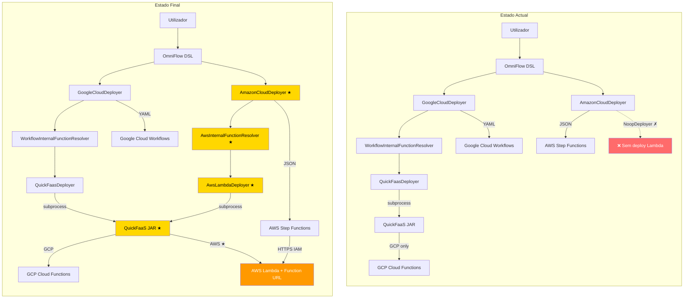
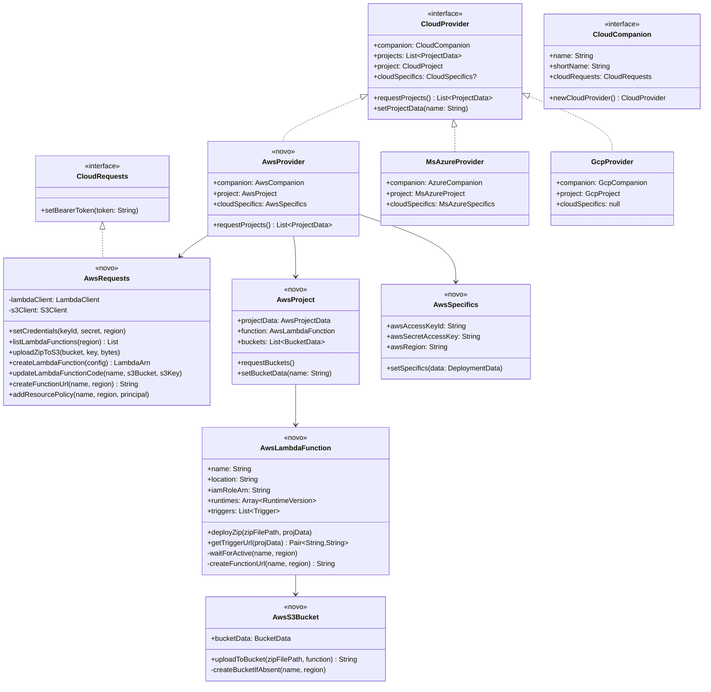
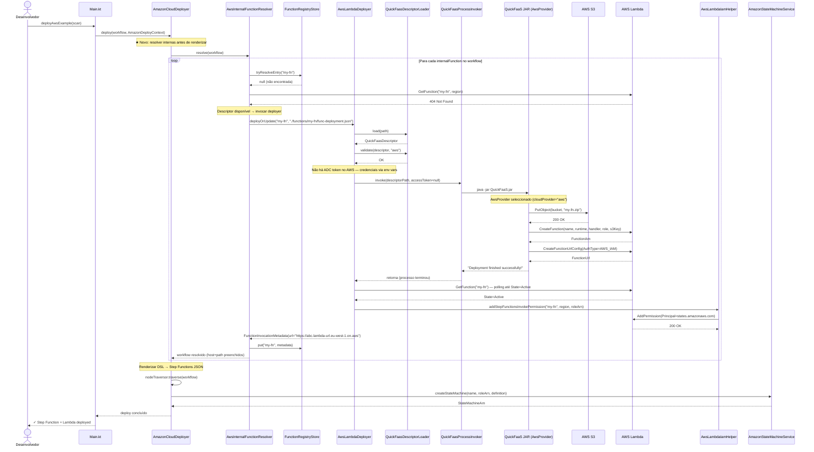
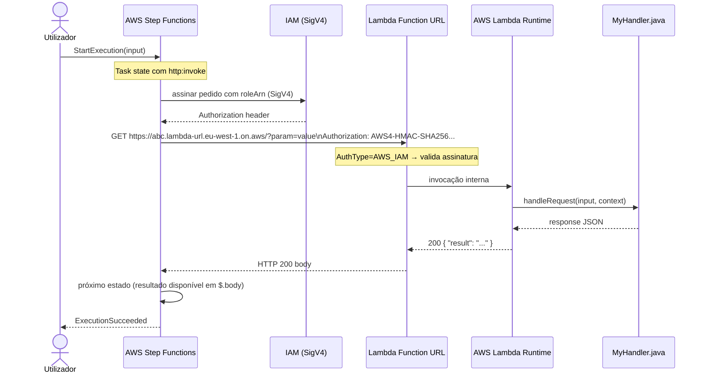
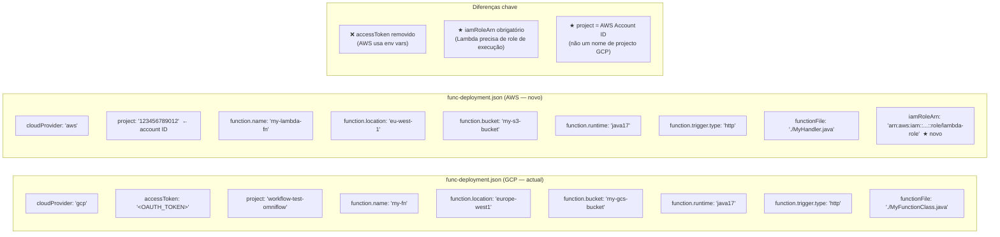
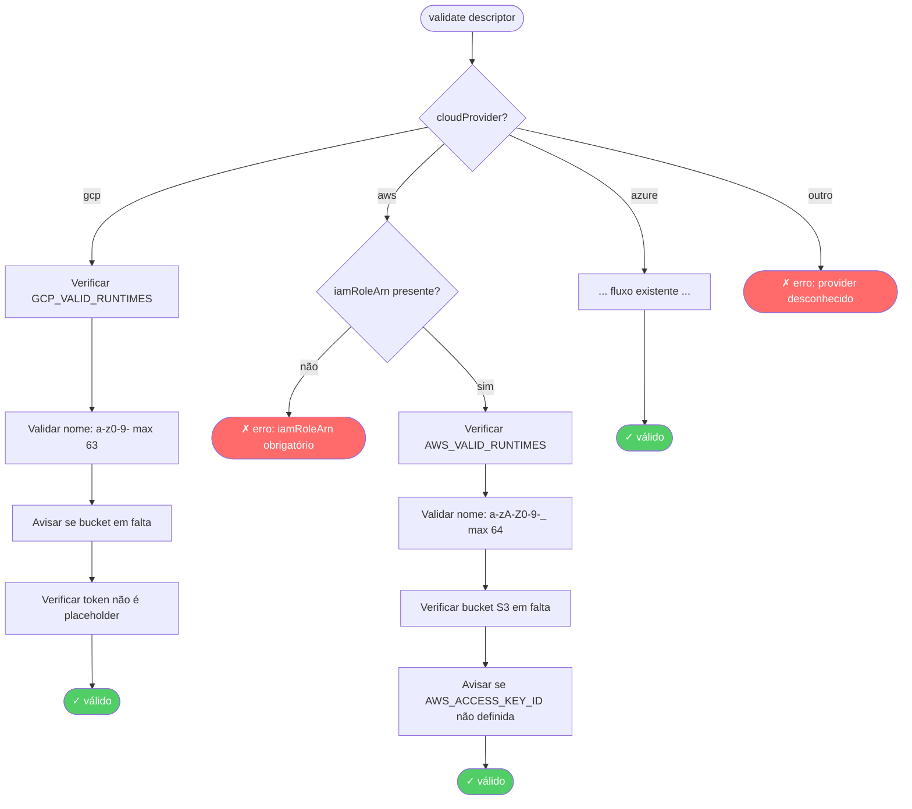
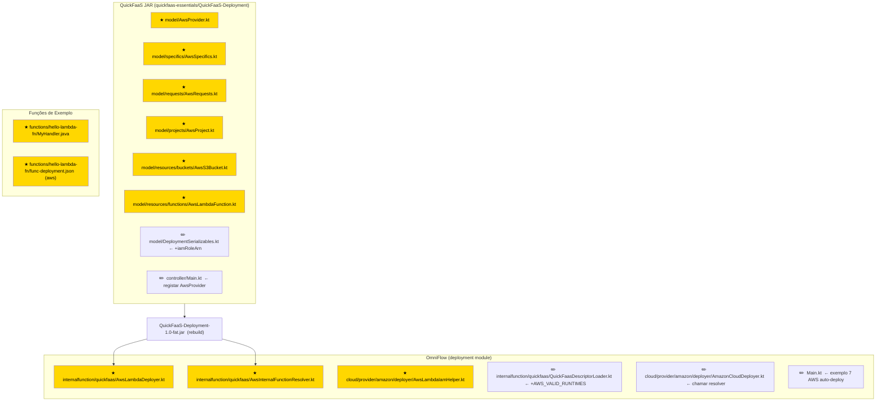

# Diagramas de Implementação — AWS Lambda no QuickFaaS + OmniFlow

---

## 1. Arquitectura Geral (antes vs depois)



---

## 2. Hierarquia de Classes — QuickFaaS JAR (novos artefactos)



---

## 3. Hierarquia de Classes — OmniFlow (novos artefactos)

```mermaid
classDiagram
    class InternalFunctionDeployer {
        <<interface>>
        +deployOrUpdate(name, descriptorPath) FunctionInvocationMetadata
    }

    class NoopInternalFunctionDeployer {
        +deployOrUpdate() ← lança UnsupportedOperationException
    }

    class QuickFaasDeployer {
        -quickFaasJarPath: Path
        -projectId: String
        -region: String
        -invokerServiceAccount: String?
        +deployOrUpdate(name, path) FunctionInvocationMetadata
        -waitForFunctionReady(project, region, name)
        -grantInvokerPermission(...)
    }

    class AwsLambdaDeployer {
        <<novo>>
        -quickFaasJarPath: Path
        -region: String
        -iamRoleArn: String
        -readinessTimeoutSeconds: Long
        +deployOrUpdate(name, path) FunctionInvocationMetadata
        -waitForLambdaActive(name, region)
        -addStepFunctionsPermission(name, region)
        -buildLambdaFunctionUrl(name, region) String
    }

    class QuickFaasDescriptorLoader {
        +load(path) QuickFaasDescriptor
        +validate(descriptor, expectedProvider)
        -GCP_VALID_RUNTIMES: Set
        -AWS_VALID_RUNTIMES: Set ★novo
    }

    class QuickFaasProcessInvoker {
        -quickFaasJarPath: Path
        +invoke(descriptorPath, accessToken?)
    }

    class WorkflowInternalFunctionResolver {
        -projectId: String
        -preferredRegion: String?
        -registry: FunctionRegistryStore
        -inspector: CloudRunV2ServiceInspector
        -internalFunctionDeployer: InternalFunctionDeployer
        +resolve(workflow) Workflow
        -resolveOrDiscoverInternal(ref, internal) String
    }

    class AwsInternalFunctionResolver {
        <<novo>>
        -region: String
        -registry: FunctionRegistryStore
        -lambdaClient: LambdaClient
        -internalFunctionDeployer: InternalFunctionDeployer
        +resolve(workflow) Workflow
        -resolveOrDeploy(ref, internal) String
        -checkLambdaExists(name, region) String?
        -buildFunctionUrl(name, region) String
    }

    class AmazonCloudDeployer {
        -internalFunctionDeployer: InternalFunctionDeployer
        -registryPath: Path
        +deploy(workflow, context)
        class Builder {
            +internalFunctionDeployer(InternalFunctionDeployer)
            +build()
        }
    }

    class AwsLambdaIamHelper {
        <<novo>>
        +addStepFunctionsInvokePermission(functionName, region, roleArn)
        -buildPolicyDocument(roleArn) String
    }

    InternalFunctionDeployer <|.. NoopInternalFunctionDeployer
    InternalFunctionDeployer <|.. QuickFaasDeployer
    InternalFunctionDeployer <|.. AwsLambdaDeployer
    QuickFaasDeployer --> QuickFaasProcessInvoker
    QuickFaasDeployer --> QuickFaasDescriptorLoader
    AwsLambdaDeployer --> QuickFaasProcessInvoker
    AwsLambdaDeployer --> QuickFaasDescriptorLoader
    AwsLambdaDeployer --> AwsLambdaIamHelper
    AmazonCloudDeployer --> AwsInternalFunctionResolver
    AmazonCloudDeployer --> InternalFunctionDeployer
    AwsInternalFunctionResolver --> InternalFunctionDeployer
```

---

## 4. Sequência de Deploy — AWS Workflow com funções internas



---

## 5. Sequência de Invocação em Runtime (Step Functions → Lambda)



---

## 6. Estrutura do Descriptor — Comparação GCP vs AWS



---

## 7. Fluxo de Validação do Descriptor por Provider



---

## 8. Mapa de Ficheiros — O que criar e o que modificar



---

**Legenda:** `★` = ficheiro novo &nbsp;|&nbsp; `✏️` = ficheiro modificado
