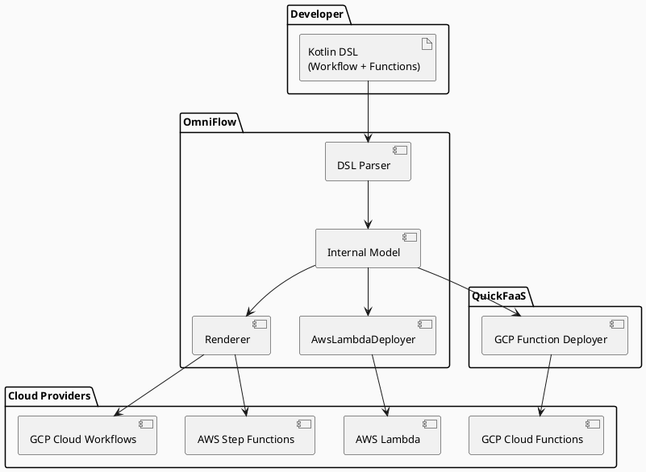
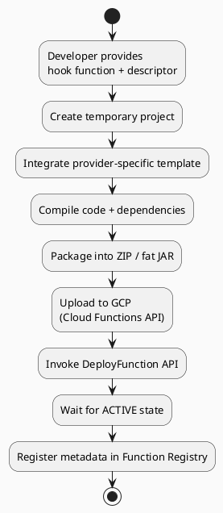
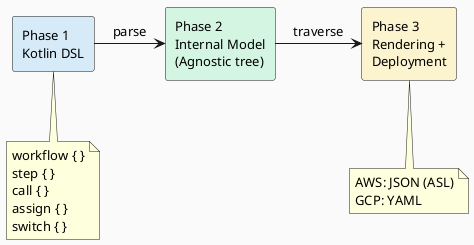
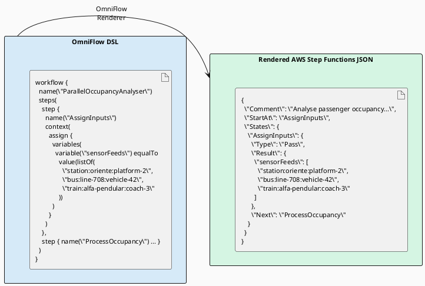
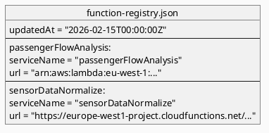
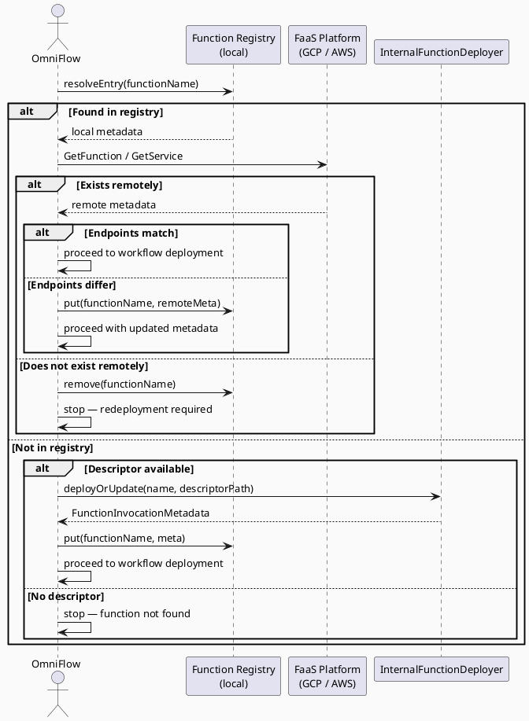

# Towards Cloud-Agnostic Serverless Applications
## Unifying Function Deployment and Workflow Orchestration

**Pedro Carvalho, José Simão, Filipe Freitas**
Instituto Superior de Engenharia de Lisboa (ISEL), Politécnico de Lisboa

---

## Slide 1 — Motivation

The current serverless ecosystem is significantly fragmented: function definition, deployment, and workflow orchestration are managed by separate tools that are often specific to a single cloud provider. This fragmentation complicates reasoning about execution semantics, state management, and portability, increasing vendor lock-in in applications that span multiple cloud platforms.

The problem extends across the entire development lifecycle: teams describe functions in one toolchain, deploy provider-specific artefacts in another, and orchestrate workflows in a third model with different assumptions about retries, data flow, and error handling. Over time, these mismatches increase maintenance effort and make cross-cloud migration costly, because invocation metadata and orchestration logic must be manually synchronised.

Concrete use cases that motivate this work include smart city applications analysing traffic flows or environmental readings, batch processing of mobility data for ride-sharing optimisation, and predictive maintenance for urban infrastructure. These scenarios demand scalable, multi-stage orchestration across heterogeneous cloud services.

A concrete example of this problem: when a developer wants to define a workflow that calls a function that has not yet been deployed, they must first deploy the function to discover its endpoint, and only then return to the workflow to complete it. This manual synchronisation is a recurring source of errors and rework.

The goal of this work is to simplify the development, deployment, and migration of serverless applications across heterogeneous cloud environments while preserving predictable execution semantics. Functions are deployed and tracked through a registry-backed mechanism, while workflows reference stable logical names instead of hard-coded endpoints — supporting reproducible deployments and enabling direct deployment to mainstream managed orchestrators without introducing an additional execution middleware.

---

## Slide 2 — Solution Overview

The proposed solution is a unified framework that combines two existing tools developed within the ISEL research group: **QuickFaaS**, for portable serverless function deployment on GCP, and **OmniFlow**, a Kotlin-based DSL for workflow orchestration. Their integration allows developers to describe the entire pipeline — functions and workflow — in a single definition, with automatic and coordinated deployment to the target cloud platform.

The architecture follows a layered model: the Kotlin workflow definition is transformed by provider-specific renderers into native platform artefacts (Amazon States Language for AWS, YAML for GCP). Internal functions are deployed before the workflow is created — via QuickFaaS for GCP Cloud Functions, and via OmniFlow's `AwsLambdaDeployer` for AWS Lambda.

---

## Slide 3 — QuickFaaS: Portable Function Deployment

QuickFaaS is a desktop tool that addresses function portability by allowing developers to implement function logic once and deploy it across multiple FaaS providers with minimal code changes. Its purpose is to reduce code-level vendor lock-in while preserving deployment to provider-native platforms. Currently, QuickFaaS supports deployment to **GCP Cloud Functions** and **Azure Functions**.

Conceptually, QuickFaaS separates cloud-agnostic business logic from provider-specific integration logic. Developers implement a *hook function* using generic request/response abstractions, while provider-specific templates serve as entry points that adapt native event formats and invocation contracts to the hook interface. This template-plus-hook structure offers a uniform programming model across providers and trigger types.

The deployment pipeline works as follows: it creates a temporary project, integrates the user's hook function, compiles the code and required libraries, and bundles everything into a deployable ZIP archive. This artefact is then uploaded and deployed using the provider's API. A function deployment requires: (i) provider authentication setup, (ii) a deployment descriptor with runtime, location, trigger, and project metadata, and (iii) the hook function source file.

---

## Slide 4 — OmniFlow: Portable Workflow Orchestration

OmniFlow is a Kotlin library and DSL for defining workflows independently of provider-specific workflow schemas. Developers specify workflow logic once in a provider-agnostic form, and OmniFlow renders and deploys the corresponding artefact for the target platform.

The framework follows a three-stage pipeline: first, the DSL captures the workflow structure (metadata, inputs, steps, and output); second, the DSL constructs are converted into a provider-agnostic internal model organised as a hierarchical tree; third, a rendering layer traverses that model and generates provider-specific artefacts, which are then submitted through deployment adapters.

The workflow model supports execution and control-flow steps — HTTP calls, variable assignments, conditionals, loops, and parallel branches — allowing developers to combine external service invocations with internal data transformations in a single definition. In practice, OmniFlow workflows commonly implement *step chaining*, where outputs from earlier steps are stored in variables and reused by subsequent steps, preserving explicit and reproducible data flow.

The diagram below illustrates how the same workflow intent is expressed in the OmniFlow DSL and rendered as an AWS Step Functions JSON artefact:

---

## Slide 5 — Related Work

This work is positioned at the intersection of workflow portability and function portability, a space that existing solutions cover only partially.

Deployment-oriented Infrastructure-as-Code tools such as AWS CloudFormation, Terraform, Serverless Framework, and Pulumi reduce operational effort, but function configuration and triggers remain strongly provider-shaped. They do not generate native workflow artefacts for managed orchestrators. CODE further improves cross-target deployment reuse, but remains mostly deployment-oriented.

Portable execution layer and transformation approaches tackle a different point in the design space. OpenFaaS provides a portable function platform on top of container infrastructure. Code-transformation approaches such as Python-to-FaaS and Java-to-Lambda reduce migration effort but are often platform-constrained in practice. SEAPORT is complementary in that it measures portability rather than directly enabling it.

For workflow composition, FaaSFlow and Triggerflow emphasise orchestration efficiency and runtime control. The Serverless Workflow Specification and Synapse advance workflow portability, usually through a dedicated runtime model. Temporal provides mature reliability semantics with a workflow runtime layer. FaaSr targets scientific workflows with storage-based coordination, and Serverless Multicloud focuses on API-level abstraction across providers.

Taken together, these works address important subsets of the problem, but not the full combination targeted here: translating portable workflow definitions into provider-specific workflow artefacts while resolving referenced functions through a provider-agnostic function deployment model.

---

## Slide 6 — Unified Model: Internal and External Functions

The central contribution of this work is the extension of OmniFlow's call model to distinguish between two types of functions:

An **internal function** is a serverless function owned and maintained by the workflow developer, who controls its source code and is responsible for its deployment and evolution. Internal functions on GCP are deployed via QuickFaaS; on AWS, deployment is handled by OmniFlow's `AwsLambdaDeployer`. In both cases, OmniFlow resolves the invocation metadata automatically during workflow generation.

An **external function** is a function not owned by the workflow developer — for example, a third-party API or a managed cloud service. The developer cannot deploy, update, or otherwise manage its lifecycle. External functions are treated as unmanaged HTTP dependencies, and their invocation parameters must be defined manually.

```plantuml
@startuml
skinparam backgroundColor #FAFAFA
skinparam defaultFontSize 13

rectangle "call { internalFunction(\"passengerFlowAnalysis\") }" as A #D5F5E3
note right of A : Internal function — already in the registry.\nOmniFlow resolves the endpoint automatically.

rectangle "call { internalFunction(\"occupancyPredictor\", \"/path/descriptor.json\") }" as B #D5F5E3
note right of B : Internal function — not yet deployed.\nOmniFlow triggers deployment before generating the workflow.

rectangle "call { host(\"gtfs-broker\"); path(\"/v1/realtime-feed\") }" as C #FADBD8
note right of C : External function — third-party API.\nEndpoint defined manually by the developer.

@enduml
```

This distinction is enforced by a mutual exclusion rule: a call step cannot simultaneously contain `internalFunction` and `host`/`path`, preventing conflicts about the origin of the invoked function. Both modes of `internalFunction` — name only and name with descriptor path — are fully implemented and functional for both GCP and AWS.

---

## Slide 7 — Function Registry

The Function Registry is a local JSON file (`function-registry.json`) that serves as the source of truth for the invocation metadata of all deployed internal functions. It is automatically populated by the framework after each successful deployment, and is consulted during workflow generation to resolve the endpoints of referenced functions.

The registry decouples workflow authoring from endpoint management: instead of hard-coding invocation URLs in each call step, the workflow references stable logical names, while the registry maps those names to the currently deployed endpoints. This indirection reduces manual edits when functions are redeployed, renamed at the platform layer, or moved across providers.

The implementation uses `serviceName` and `url` per entry rather than separate `host` and `path` fields. This design unifies the invocation reference into a single URL, which accommodates both HTTP endpoints (GCP Cloud Functions) and non-HTTP identifiers such as Lambda ARNs (AWS), without requiring the caller to know how to compose the two fields. It also simplifies resolution logic and makes the registry entries self-contained and directly usable by the deployer.

The `updatedAt` field supports freshness checks and synchronisation policies — for example, validating entries only when a configurable staleness threshold is exceeded. To mitigate the risks of the registry becoming outdated or being accidentally deleted, integrity checks are proposed. Integrity validation can run in two modes: **(i) pre-deployment validation** during workflow generation, and **(ii) background reconciliation** for periodic drift detection. Mismatches are handled deterministically: when endpoint metadata differs, the registry is updated; when a function no longer exists remotely, the stale entry is removed and deployment stops with an explicit diagnostic.

---

## Slide 8 — Internal Function Resolution Flow

The process of resolving an internal function during workflow deployment follows a deterministic validation logic with fail-fast behaviour: deployment only proceeds when metadata is consistent between the local registry and the remote state on the cloud platform.

This mechanism preserves fail-fast behaviour: deployment proceeds only when invocation metadata is consistent across the local and remote views. As a result, the rendered workflow remains reproducible, and operational errors caused by stale endpoints are detected before runtime.

---

## Slide 9 — Next Steps

The work identifies three main directions for future development, all motivated by limitations observed in the current implementation.

**Selective redeployment.** Currently, any change to a workflow or function triggers a full redeployment, introducing unnecessary overhead for small updates. The planned solution is to use content hashing at the function and workflow levels to detect modified components and redeploy only what has changed.

**Locality-aware placement.** In multi-cloud workflows, cross-provider data movement increases latency and transfer cost. The plan is to add placement hints so developers can express co-location constraints (e.g., keeping functions close to data). The renderer can then optimise deployment decisions while balancing portability and performance. Cross-cloud state management remains an open issue.

**Cross-provider benchmarking and ML inference.** Comparative benchmarks of workflow engines using identical workloads (latency, cost, cold-start) are planned, as well as support for adaptive scheduling for serverless ML model inference, where variable model loading and request patterns create optimisation challenges.

---

## Slide 10 — Conclusion

This work presents a unified framework that addresses serverless ecosystem fragmentation at the level of the complete lifecycle: from function definition to deployment, workflow composition, and execution on native managed orchestrators.

The main contributions are: the integration between QuickFaaS and OmniFlow that eliminates manual synchronisation between deployment and workflow definition; the extended call model distinguishing internal and external functions; the Function Registry as a decoupling mechanism between logical names and physical endpoints; and full support for AWS Lambda and Step Functions through OmniFlow's `AwsLambdaDeployer`, including automatic IAM management.

The framework advances cloud portability by decoupling serverless application development from vendor-specific orchestration services, while preserving execution on each platform's native managed orchestrators without introducing an intermediate runtime layer.
