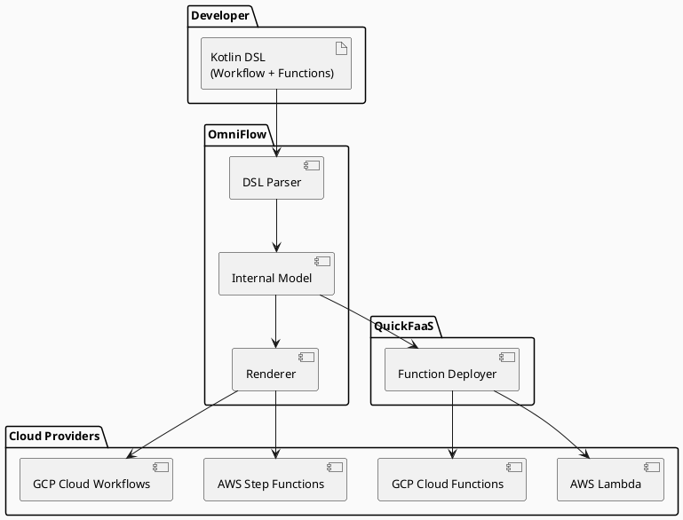
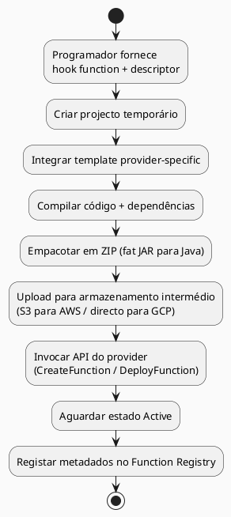
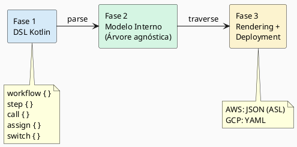
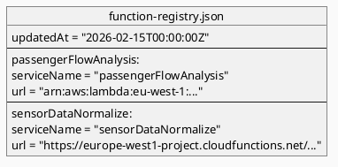
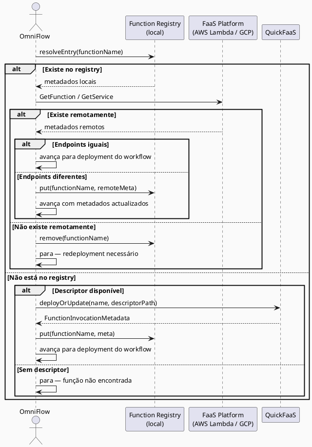
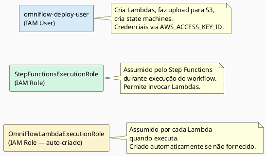
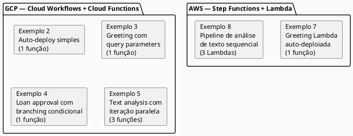

# Towards Cloud-Agnostic Serverless Applications
## Unifying Function Deployment and Workflow Orchestration

**Pedro Carvalho, José Simão, Filipe Freitas**
Instituto Superior de Engenharia de Lisboa (ISEL), Politécnico de Lisboa

---

## Slide 1 — Motivação

O ecossistema serverless actual apresenta uma fragmentação significativa: a definição de funções, o seu deployment e a orquestração de workflows são geridos por ferramentas separadas, frequentemente específicas de cada cloud provider. Esta fragmentação complica o raciocínio sobre semântica de execução, gestão de estado e portabilidade, aumentando o vendor lock-in em aplicações que abrangem múltiplas plataformas cloud.

O problema percorre todo o ciclo de vida de desenvolvimento: as equipas descrevem funções numa toolchain, fazem o deployment de artefactos provider-specific noutra, e orquestram workflows num terceiro modelo com pressupostos diferentes sobre retries, fluxo de dados e erros. Com o tempo, estas incompatibilidades aumentam o esforço de manutenção e tornam a migração cross-cloud dispendiosa, porque os metadados de invocação e a lógica de orquestração têm de ser sincronizados manualmente.

Um exemplo concreto deste problema: quando um programador quer definir um workflow que chama uma função que ainda não foi deploiada, tem de primeiro fazer o deployment da função para descobrir o seu endpoint, e só depois voltar ao workflow para o completar. Esta sincronização manual é uma fonte recorrente de erros e de retrabalho.

---

## Slide 2 — Visão Geral da Solução

A solução proposta é um framework unificado que combina duas ferramentas existentes, desenvolvidas no contexto do grupo de investigação do ISEL: o **QuickFaaS**, para deployment portátil de funções serverless, e o **OmniFlow**, um DSL em Kotlin para orquestração de workflows. A integração destas duas ferramentas permite ao programador descrever todo o pipeline — funções e workflow — numa única definição, e fazer o deployment automático e coordenado para a plataforma cloud escolhida.

A arquitectura segue um modelo em camadas: a definição do workflow em Kotlin é transformada por renderers provider-specific nos artefactos nativos de cada plataforma (Amazon States Language para AWS, YAML para GCP). As funções referenciadas no workflow são deploiadas automaticamente pelo QuickFaaS antes da criação do workflow.

---

## Slide 3 — QuickFaaS: Deployment Portátil de Funções

O QuickFaaS é uma ferramenta que aborda a portabilidade de funções serverless, permitindo ao programador implementar a lógica da função uma única vez e deploiá-la em múltiplos providers FaaS com alterações mínimas de código.

Conceptualmente, o QuickFaaS separa a lógica de negócio cloud-agnóstica da lógica de integração provider-specific. O programador implementa uma *hook function* usando abstrações genéricas de request/response, enquanto templates provider-specific servem como pontos de entrada que adaptam os formatos nativos de eventos e contratos de invocação à interface da hook.

O pipeline de deployment funciona da seguinte forma: cria um projecto temporário, integra a hook function do utilizador, compila o código e as bibliotecas necessárias, e empacota tudo num arquivo ZIP deployável. Este artefacto é depois uploaded e deployado usando as APIs do provider.

---

## Slide 4 — OmniFlow: Orquestração Portátil de Workflows

O OmniFlow é uma biblioteca e DSL em Kotlin para definir workflows de forma independente dos schemas de workflow provider-specific. O programador especifica a lógica do workflow uma vez numa forma cloud-agnóstica, e o OmniFlow renderiza e deploiaa o artefacto correspondente para a plataforma alvo.

O framework segue um pipeline de três fases: primeiro, o DSL captura a estrutura do workflow (metadados, inputs, steps, output); segundo, as construções do DSL são convertidas num modelo interno agnóstico organizado como uma árvore hierárquica; terceiro, uma camada de rendering percorre esse modelo e gera artefactos provider-specific, que são depois submetidos através de deployment adapters.

O modelo de workflow suporta steps de execução e controlo de fluxo — chamadas HTTP, atribuições de variáveis, condicionais, ciclos e ramos paralelos — permitindo combinar invocações de serviços externos com transformações internas de dados numa única definição.

---

## Slide 5 — Trabalho Relacionado

O trabalho posiciona-se na intersecção da portabilidade de workflows e da portabilidade de funções, um espaço que as soluções existentes cobrem apenas parcialmente.

As ferramentas de Infrastructure-as-Code orientadas ao deployment, como AWS CloudFormation, Terraform, Serverless Framework e Pulumi, reduzem o esforço operacional, mas a configuração de funções e triggers continua fortemente moldada pelo provider. Não geram workflows nativos para orquestradores geridos.

As abordagens de execução portátil, como o OpenFaaS e transformações de código (Python-to-FaaS, Java-to-Lambda), reduzem o esforço de migração mas são frequentemente limitadas a plataformas específicas ou requerem uma camada de runtime adicional.

Para composição de workflows, soluções como FaaSFlow, Triggerflow, Serverless Workflow Specification, Synapse e Temporal avançam a portabilidade de orquestração, mas normalmente através de um modelo de runtime dedicado — não delegam a execução aos orquestradores geridos nativos de cada provider (Step Functions, Cloud Workflows).

A lacuna que este trabalho preenche é a combinação de deployment portátil de funções com geração de artefactos nativos para orquestradores geridos, sem introduzir uma camada de execução intermédia.

---

## Slide 6 — Modelo Unificado: Funções Internas e Externas

A contribuição central do trabalho é a extensão do modelo de chamada do OmniFlow para distinguir dois tipos de funções:

Uma **função interna** é uma função serverless desenvolvida e mantida pelo próprio programador do workflow. O programador controla o código-fonte e é responsável pelo seu deployment. As funções internas são deploiadas com o QuickFaaS e o OmniFlow resolve os seus metadados de invocação automaticamente durante a geração do workflow.

Uma **função externa** é uma função que não pertence ao programador — por exemplo, uma API de terceiros ou um serviço cloud gerido. O programador não pode deployar, actualizar ou gerir o seu ciclo de vida. As funções externas são tratadas como dependências HTTP não geridas e os seus parâmetros de invocação têm de ser definidos manualmente.

```plantuml
@startuml
skinparam backgroundColor #FAFAFA
skinparam defaultFontSize 13

rectangle "call { internalFunction(\"passengerFlowAnalysis\") }" as A #D5F5E3
note right of A : Função interna — já existe no registry.\nOmniFlow resolve o endpoint automaticamente.

rectangle "call { internalFunction(\"occupancyPredictor\", \"/path/descriptor.json\") }" as B #D5F5E3
note right of B : Função interna — não existe ainda.\nOmniFlow faz deployment via QuickFaaS.

rectangle "call { host(\"gtfs-broker\"); path(\"/v1/realtime-feed\") }" as C #FADBD8
note right of C : Função externa — API de terceiros.\nEndpoint definido manualmente pelo programador.

@enduml
```

Esta distinção é aplicada com uma regra de exclusividade: um call step não pode conter simultaneamente `internalFunction` e `host`/`path`, evitando conflitos sobre a origem da função invocada. Ambos os modos do `internalFunction` — com nome apenas e com caminho para o deployment descriptor — estão implementados e funcionais para GCP e AWS.

---

## Slide 7 — Function Registry

O Function Registry é um ficheiro JSON local (`function-registry.json`) que serve como fonte de verdade para os metadados de todas as funções internas deploiadas. É populado automaticamente pelo framework após cada deployment bem-sucedido, e é consultado durante a geração de cada workflow para resolver os endpoints das funções referenciadas.

O registry desacopla a autoria do workflow da gestão de endpoints: em vez de hardcodar URLs de invocação em cada call step, o workflow referencia nomes lógicos estáveis, enquanto o registry mapeia esses nomes para os endpoints actualmente deploiados. Esta indireção reduz as edições manuais quando as funções são redesploiadas, renomeadas ao nível da plataforma, ou movidas entre providers.

O registry suporta resolução por nome exacto e por sufixo (por exemplo, `região/nomeFunção`), e expõe operações de `put`, `remove`, `readAll`, `resolveEntry` e `resolveUrl`. O campo `updatedAt` suporta verificações de freshness e políticas de sincronização, por exemplo, validar entradas apenas quando um limiar de staleness configurável é excedido.

---

## Slide 8 — Fluxo de Resolução de Funções Internas

O processo de resolução de uma função interna durante o deployment do workflow segue uma lógica de validação determinística com comportamento fail-fast: o deployment só avança quando os metadados são consistentes entre o registo local e o estado remoto na plataforma cloud.

Este mecanismo preserva um comportamento fail-fast: o deployment prossegue apenas quando os metadados de invocação são consistentes entre a vista local e a vista remota. Como resultado, o workflow renderizado mantém-se reprodutível e os erros operacionais causados por endpoints desactualizados são detectados antes de runtime.

---

## Slide 9 — Suporte AWS: Gestão Automática de IAM

Uma das contribuições técnicas específicas para o suporte AWS é a gestão automática de identidades IAM, necessária porque a AWS exige que cada Lambda tenha um execution role explícito — um campo obrigatório na API `CreateFunction` — e que o Step Functions tenha permissão explícita para invocar cada Lambda.

O componente `AwsLambdaIamHelper` implementa esta gestão: se o campo `iamRoleArn` do deployment descriptor estiver vazio, cria automaticamente o role `OmniFlowLambdaExecutionRole` com a trust policy correcta (`lambda.amazonaws.com`) e anexa a política gerida `AWSLambdaBasicExecutionRole`. Após o deployment de cada Lambda, concede automaticamente ao Step Functions execution role permissão de invocação via `AddPermission`.

---

## Slide 10 — Exemplos Demonstrados

O framework foi validado com seis exemplos funcionais, cobrindo os dois providers suportados e diferentes padrões de composição de workflows.

O Exemplo 8 é o mais completo do lado AWS: deploiaa automaticamente três Lambdas em sequência (`aws-preprocess-fn`, `aws-char-stats-fn`, `aws-summary-fn`), aguarda que cada uma fique no estado `Active`, obtém os ARNs, configura as permissões IAM, e cria a state machine no Step Functions referenciando as funções directamente pelo ARN — sem API Gateway.

---

## Slide 11 — Próximos Passos

O trabalho identifica três direcções principais para desenvolvimento futuro, todas motivadas por limitações observadas na implementação actual.

**Redeployment selectivo.** Actualmente, qualquer alteração num workflow ou função desencadeia um redeployment completo, o que introduz overhead desnecessário para pequenas actualizações. A solução planeada é usar content hashing ao nível da função e do workflow para detectar componentes modificados e redesploiar apenas o que mudou.

**Locality-aware placement.** Em workflows multi-cloud, o movimento de dados cross-provider aumenta a latência e o custo de transferência. O plano é adicionar hints de placement para que os programadores possam expressar restrições de co-localização (por exemplo, manter funções junto aos dados). O renderer pode então optimizar as decisões de deployment.

**Benchmarking cross-provider e ML inference.** Estão planeados benchmarks comparativos dos motores de workflow com workloads idênticos (latência, custo, cold-start), e suporte a scheduling adaptativo para inferência serverless de modelos de ML, onde padrões variáveis de carregamento de modelos e de pedidos criam desafios de optimização.

---

## Slide 12 — Conclusão

Este trabalho apresenta um framework unificado que aborda a fragmentação do ecossistema serverless ao nível do ciclo de vida completo: da definição das funções ao deployment, à composição de workflows e à execução em orquestradores geridos nativos.

As contribuições principais são: a integração entre QuickFaaS e OmniFlow que elimina a sincronização manual entre deployment e workflow; o modelo de chamada estendido com a distinção entre funções internas e externas; o Function Registry como mecanismo de desacoplamento entre nomes lógicos e endpoints físicos; e o suporte completo a AWS Lambda e Step Functions, incluindo gestão automática de IAM.

O framework avança a portabilidade cloud ao desacoplar o desenvolvimento de aplicações serverless dos serviços de orquestração específicos de cada vendor, mantendo a execução nos orquestradores nativos de cada plataforma sem introduzir uma camada de runtime intermédia.
