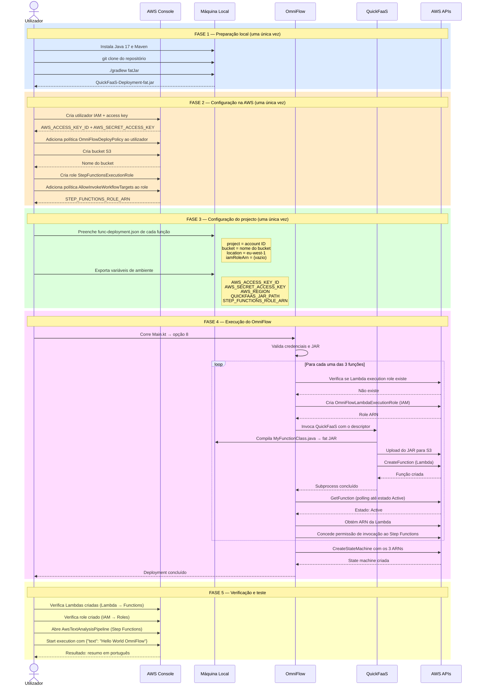

# Diagrama Sequencial — Primeiro Deployment (Exemplo 8)

---

## Legenda das fases

| Fase | Quem executa | Frequência |
|---|---|---|
| 1 — Preparação local | Utilizador | Uma única vez por máquina |
| 2 — Configuração AWS | Utilizador (consola AWS) | Uma única vez por conta AWS |
| 3 — Configuração do projecto | Utilizador | Uma única vez por projecto |
| 4 — Execução do OmniFlow | OmniFlow + QuickFaaS (automático) | Cada vez que se faz deployment |
| 5 — Verificação | Utilizador (consola AWS) | Cada vez que se faz deployment |

> As fases 1, 2 e 3 são pré-requisitos que só precisam de ser feitos uma vez. A fase 4 é o que o OmniFlow automatiza — sem ela, o utilizador teria de criar manualmente cada Lambda, fazer o upload do código, configurar os roles e criar a state machine à mão.
