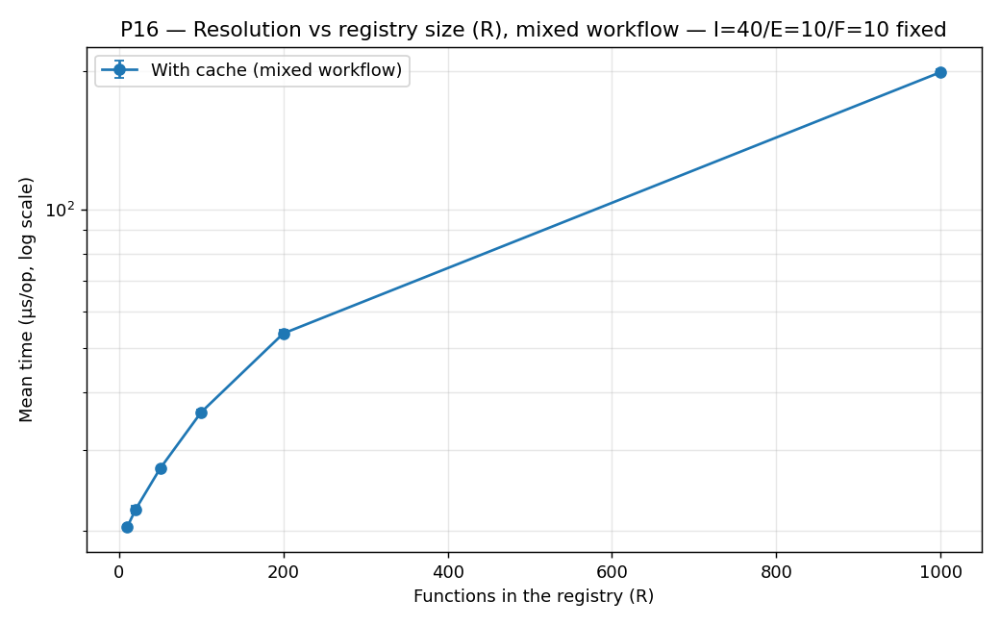
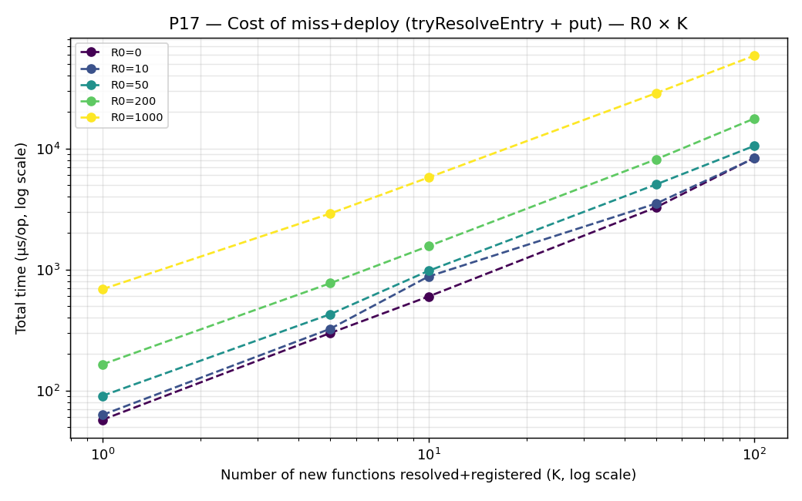
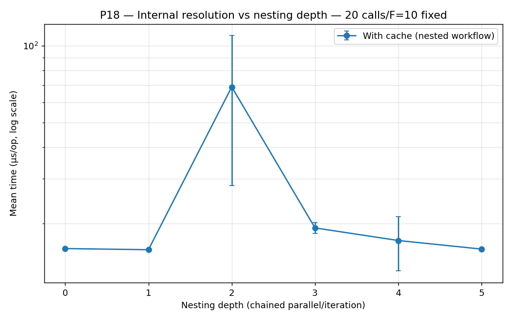

# Resultados dos testes de desempenho (P3, P6–P19) e de tamanho (S1)

Medições locais da resolução de funções internas (registo, glue de auto-deploy AWS/GCP), sem
chamadas à nuvem. Geradas com JMH a partir do módulo `benchmark/`.

> **Nota de âmbito.** Este documento inclui apenas testes que exercem código da própria
> contribuição da tese (Parte B — unificação/registo/resolução; Parte A — suporte AWS no
> QuickFaaS). Os testes que mediam o motor de renderização AWS/GCP herdado do OmniFlow original
> (P1, P2, P5, P12, S2) foram removidos por incidirem sobre código pré-existente de terceiros,
> nunca modificado nesta tese. P18/P19 retomam os eixos estruturais do P5 (aninhamento) e do P12
> (largura de Parallel), mas do lado da **resolução** de funções internas (contribuição da tese),
> não da renderização.

## Metodologia

- **Ferramenta:** JMH 1.37, modo `AverageTime`, unidade µs/op, com `Blackhole` a consumir cada
  resultado para impedir *dead-code elimination*.
- **Execução:** `-f 1 -wi 3 -i 5 -w 1 -r 1` — uma *fork* da JVM, 3 iterações de aquecimento e 5 de
  medição (1 s cada), para medir o código já compilado pelo JIT.
- **Dados brutos:** `jmh-results.csv` (P3, um só `@Param`), `jmh-results-p6.csv` (P6,
  com a dimensão `Param: r`), `jmh-results-p7.csv` (P7 antes/depois), `jmh-results-p8.csv`/
  `jmh-results-p9.csv` (P8–P9, resolução do workflow real), `jmh-results-p10.csv`/`jmh-results-p11.csv`
  (P10–P11, resolvers reais AWS/GCP), `jmh-results-p13.csv` (P13, escrita no registo),
  `jmh-results-p14.csv` (P14, exact vs. suffix match), `jmh-results-p15.csv` (P15, mistura I/E),
  `jmh-results-p16.csv` (P16, R com workflow misto), `jmh-results-p17.csv` (P17, miss+deploy no
  registo), `jmh-results-p18.csv` (P18, resolução vs profundidade de aninhamento) e
  `jmh-results-p19.csv` (P19, resolução vs largura de Parallel). Gráficos: `P3_*.png`,
  `P6_*.png … P19_*.png` (P7 e P8 em duas figuras cada, `P7a`/`P7b` e `P8a`/`P8b`), regeneráveis com
  `python3 plot_benchmarks.py`.
- **Ressalva:** ambiente partilhado e configuração reduzida; os valores absolutos servem para
  comparar tendências e relações, não como números definitivos de hardware. Para a versão final,
  repetir com `-f 3` e máquina dedicada.

## Notação — o que N, R, F, I e E representam

Estes símbolos aparecem ao longo de quase todas as secções seguintes. Têm sempre o mesmo
significado — o que muda, secção a secção, é a **relação entre eles** (fixos? independentes?
R=F? tudo interno? misto?):

- **N** — número total de **chamadas** no workflow (passos `CALL`, internas ou externas). É sempre
  esta a unidade que se soma/repete N vezes quando o workflow é homogéneo (N leituras, N *lookups*,
  N escritas). A partir do P15, N decompõe-se em **N = I + E** (ver abaixo).
- **R** — número de entradas no **registo** (`function-registry.json`) no momento em que é
  lido/escrito. **Não é o mesmo que F** — R é o tamanho físico do ficheiro; F é quantas dessas
  entradas o workflow *usa*. Um registo pode ter R=1000 entradas e o workflow só referenciar F=10
  delas (as outras R-F são "ruído"/funções de outros workflows). (Chamava-se **M** até ao P14;
  renomeado para **R** — de "Registo" — sem alterar lógica nem valores.)
- **F** — número de funções **internas distintas** que o workflow referencia. Só existe a partir do
  P8 (antes disso não havia necessidade de distinguir "quantas chamadas" de "quantas funções
  diferentes"): as chamadas internas distribuem-se *round-robin* pelas F funções (ex.: F=4 e 6
  chamadas internas → cada função é chamada 1 ou 2 vezes). A partir do P15, F aplica-se
  especificamente às **I** chamadas internas — as **E** chamadas externas não têm este conceito
  (não são resolvidas contra nenhum registo).
- **I** — número de chamadas a **funções internas** no workflow (repetições contam: duas chamadas
  à mesma função contam 2 para I). Só existe a partir do P15.
- **E** — número de chamadas a **funções externas** no workflow (idem, repetições contam). Só
  existe a partir do P15. **N = I + E**: até ao P14 todo workflow era homogéneo (I=N/E=0 em
  P3/P6-P14) — P15/P16 são os primeiros a misturar os dois tipos de chamada no mesmo workflow.

**Como R, F e I/E se relacionam, secção a secção:**

| Secções | Relação R ↔ F ↔ I/E | O que representa |
|---|---|---|
| P3 | F não se aplica; R fixo em 1 | registo de uma função só, isola o efeito de N (workflow 100% interno) |
| P6, P7 | F não se aplica; R e N variam independentemente | registo genérico de R entradas, sem ligação às funções que o workflow chama |
| **P8, P10, P11** | **R = F** | registo "do tamanho certo": contém exatamente as F funções que o workflow usa, nem mais nem menos |
| **P9, P14** | **R ≥ F**, com F e N fixos | registo "sobredimensionado": as R-F entradas extra nunca são chamadas, só inflacionam o custo de cada leitura/scan do ficheiro inteiro |
| P13, P17 | Não há F (é o lado de **escrita**, não de resolução); usa **R0** (tamanho inicial do registo) e **K** (nº de escritas sucessivas, ou pares miss+escrita no P17) em vez de R/N | mesmo papel de R e N, mas nomeados de forma diferente por não se tratar de resolução de chamadas |
| **P15** | **R = F** fixo (=10); **I** e **E** variam livremente, **N = I+E** | primeiro workflow com mistura real de chamadas internas/externas; isola se o custo segue I ou N |
| **P16** | **I, E, F fixos** (I=40/E=10/F=10); **R** varia | gémeo do P9 em workflow misto — confirma que Θ(R) se mantém inalterado com chamadas externas presentes |
| **P18, P19** | **R = F** fixo (=10); **N** fixo (P18: 20 chamadas; P19: 5×largura) | eixo estrutural (profundidade de aninhamento / largura de Parallel) em vez de R — isola se o custo depende só do N total de chamadas ou também da forma da árvore |

**Como ler a linha de caracterização.** Cada secção abre com uma linha (bloco citado) que resume,
num relance, o *formato* do teste — para não confundir testes parecidos:

- **Objeto** — o que está de facto a ser medido: *resolução de um workflow* (constrói um objeto
  `Workflow` com N passos e passa-o a um resolver), *resolução isolada no `store`* (chama a primitiva
  de resolução diretamente, N vezes, **sem** construir nenhum `Workflow`), *escrita no registo*
  (`put`), ou *tamanho do bundle*. É esta a diferença, por exemplo, entre o **P7** (primitiva isolada,
  1 função) e o **P8** (workflow real, F funções distintas) — que de resto medem a mesma otimização.
- **Funções distintas** — se as N chamadas vão todas para **1 só** função (a mesma, repetida) ou para
  **F funções diferentes** (distribuídas *round-robin* pelas N chamadas).
- **Chamadas (N)** e **Registo (R)** — os eixos definidos acima; a linha diz, em cada teste, quais
  variam e quais ficam fixos.

---

## P3 — Custo da unificação: resolução de funções internas

> **Objeto:** resolução de um *workflow* (objeto `Workflow`) · **Funções distintas:** 1 (a mesma, repetida nos N passos) · **Chamadas (N):** N internas (1–200), com controlo de N externas · **Registo (R):** R=1.

| Nº de chamadas | Internas — resolução (µs) | Externas — sem resolução (µs) |
|---:|---:|---:|
| 1 | 7,5 | 0,02 |
| 10 | 74,6 | 0,14 |
| 50 | 368,0 | 0,65 |
| 100 | 747,2 | 1,10 |
| 200 | 1511,4 | 2,34 |

**Resumo.** Mede o custo de resolver endpoints de funções internas (a unificação
OmniFlow+QuickFaaS) vs uma chamada externa. Custa ~7,5 µs/função e escala linearmente, porque cada
chamada relê e reparsa o registo inteiro do disco sem cache; externas custam ~0,01 µs. No caso
geral é Θ(N·R), R = tamanho do registo.

---

## P6 — Custo de escalabilidade do registo (Θ(N·R))

> **Objeto:** resolução de um *workflow* (objeto `Workflow`), com leitura do registo por chamada · **Funções distintas:** 1 (a mesma, repetida nos N passos) · **Chamadas (N):** N internas (1–200), com controlo de N externas · **Registo (R):** independente de N (1–1000, entradas de *padding*).

**Tempo total de `resolveAllInternal` (µs), por combinação (R, N):**

| R \ N | 1 | 10 | 50 | 200 |
|---:|---:|---:|---:|---:|
| 1 | 178,8 | 1799,8 | 9252,9 | 36046,3 |
| 10 | 185,5 | 1838,8 | 9367,7 | 36729,9 |
| 50 | 204,3 | 2029,3 | 10803,9 | 40897,3 |
| 200 | 278,9 | 2775,3 | 14117,2 | 55567,4 |
| 1000 | 742,5 | 7474,7 | 36701,6 | 148576,7 |

**Controlo `resolveAllExternal`** (nunca toca o registo, independente de R): 0,016 µs (N=1) →
0,090 µs (N=10) → 0,320 µs (N=50) → 1,140 µs (N=200) — iguais em toda a linha de R, confirmando que o
efeito de R acima é específico do acesso ao registo.

As quatro curvas `n=1/10/50/200` colapsam numa só linha — o custo por chamada depende apenas de R,
não de N — enquanto o controlo externo se mantém plano próximo de zero.

**Custo por chamada (µs), independente de N e crescente com R:**

| R | Custo por chamada (µs) |
|---:|---:|
| 1 | 181,0 |
| 10 | 185,1 |
| 50 | 207,0 |
| 200 | 279,2 |
| 1000 | 741,7 |

**Resumo.** Mede como o tamanho do registo (R) afeta a resolução sem cache, isolado do número de
chamadas (N). O custo por chamada cresce com R (~180 µs fixo + ~0,56 µs/entrada), independente de
N: Θ(N·R). Para registos realistas, o custo fixo de reabrir o ficheiro domina, não o tamanho.

---

## P7 — Otimização da resolução: leitura única do registo (Θ(N·R) → Θ(N+R))

> **Objeto:** resolução **isolada no `store`** (`resolveUrl` vs `readAll`+`resolveUrlIn`) — **sem** objeto `Workflow` · **Funções distintas:** 1 (a mesma, resolvida N× em loop) · **Chamadas (N):** N resoluções (1–200) · **Registo (R):** independente de N (1/50/1000, entradas de *padding*).

**Tempo total (µs) — antes (sem cache) vs depois (com cache):**

| | N=1 | N=10 | N=50 | N=200 |
|---|---:|---:|---:|---:|
| **sem cache** R=1 | 4,6 | 47,0 | 233,6 | 920,2 |
| **com cache** R=1 | 4,7 | 5,0 | 5,0 | 5,7 |
| **sem cache** R=1000 | 543,7 | 5480,8 | 26698,5 | 104889,0 |
| **com cache** R=1000 | 557,4 | 535,7 | 551,8 | 536,6 |

**Resumo.** Compara, na mesma execução, resolver o registo por chamada (naive) vs uma só vez por
resolve() (otimizado). Com cache o custo é quase independente de N — Θ(N+R) em vez de Θ(N·R) —
speedup até ~200× no pior caso (N=200,R=1000: ~105 ms → ~0,54 ms). Confirma otimização de P3/P6.

---

## P8 — Resolução do workflow vs nº de funções distintas (F) × nº de chamadas (N), com R=F

> **Objeto:** resolução de um *workflow real* (objeto `Workflow`), naive vs otimizado · **Funções distintas:** F distintas (1–50), *round-robin* pelas N chamadas · **Chamadas (N):** N internas (1–200) · **Registo (R):** R=F.

**Tempo de resolução (µs) — `resolveNaive` (leitura por chamada), F em linhas / N em colunas:**

| F \ N | 1 | 5 | 10 | 50 | 200 |
|---:|---:|---:|---:|---:|---:|
| 1 | 216 | 1 118 | 2 103 | 9 544 | 38 394 |
| 2 | 192 | 956 | 1 902 | 9 555 | 37 950 |
| 5 | 189 | 995 | 1 911 | 9 663 | 38 468 |
| 10 | 195 | 1 132 | 2 390 | 10 544 | 39 340 |
| 20 | 199 | 997 | 2 096 | 10 017 | 41 205 |
| 50 | 219 | 1 133 | 2 194 | 10 857 | 43 360 |

**Tempo de resolução (µs) — `resolveOptimized` (leitura única):**

| F \ N | 1 | 5 | 10 | 50 | 200 |
|---:|---:|---:|---:|---:|---:|
| 1 | 191 | 195 | 197 | 228 | 337 |
| 2 | 191 | 193 | 200 | 230 | 341 |
| 5 | 191 | 194 | 209 | 228 | 349 |
| 10 | 228 | 197 | 202 | 241 | 362 |
| 20 | 199 | 202 | 215 | 237 | 349 |
| 50 | 224 | 221 | 223 | 251 | 367 |

**Resumo.** Caracteriza a resolução real de um workflow ao longo de F (funções distintas) e N
(chamadas), com R=F. Sem cache o custo é dominado por N e quase indiferente a F (~200 µs/chamada);
com cache fica quase plano. Speedup cresce com N: ~1× a N=1, até ~110× a N=200.

---

## P9 — Resolução do workflow vs tamanho do registo (R), com F e N fixos

> **Objeto:** resolução de um *workflow real* (objeto `Workflow`) · **Funções distintas:** F=10 distintas (fixo) · **Chamadas (N):** N=50 internas (fixo) · **Registo (R):** R≥F (10–1000).

**Tempo de resolução (µs) — sem cache vs com cache, F=10 / N=50 fixos:**

| R (registo) | sem cache (µs) | com cache (µs) | speedup |
|---:|---:|---:|---:|
| 10 | 9 829 | 237 | ~41,4× |
| 20 | 11 952 | 308 | ~38,8× |
| 50 | 10 899 | 268 | ~40,7× |
| 100 | 12 118 | 275 | ~44,1× |
| 200 | 14 964 | 324 | ~46,2× |
| 1000 | 43 245 | 749 | ~57,8× |

**Resumo.** Isola o efeito do tamanho do registo (R≥F) com F=10/N=50 fixos. Sem cache o custo sobe
com R (relê e reparsa R entradas N vezes, Θ(N·R)); com cache fica quase plano (uma só leitura O(R)).
Speedup sobe de ~41× (R=10) a ~58× (R=1000), confirmando Θ(N+R).

---

## P10 — Custo real do resolver de auto-deploy AWS (`AwsInternalFunctionResolver`)

> **Objeto:** resolução de um *workflow* pelo **resolver de auto-deploy AWS real** (`AwsInternalFunctionResolver.resolve`) · **Funções distintas:** F distintas (1–50), *round-robin* · **Chamadas (N):** N internas (1–200) · **Registo (R):** R=F (sempre *hit*).

**Tempo de resolução (µs) — `AwsInternalFunctionResolver.resolve`, F em linhas / N em colunas:**

| F \ N | 1 | 5 | 10 | 50 | 200 |
|---:|---:|---:|---:|---:|---:|
| 1 | 17 | 44 | 124 | 1 240 | 3 486 |
| 2 | 37 | 92 | 184 | 889 | 3 507 |
| 5 | 32 | 40 | 85 | 427 | 1 752 |
| 10 | 19 | 171 | 85 | 424 | 1 702 |
| 20 | 23 | 135 | 89 | 434 | 1 800 |
| 50 | 52 | 48 | 98 | 1 669 | 1 889 |

*(máquina partilhada, não dedicada — margens de erro largas nesta configuração rápida; ver nota
sobre `-f 3` no `TESTING.md`. Os pontos F=10,N=5 e F=50,N=50 fogem à monotonia esperada, sinalizados
pelas suas próprias margens de erro invulgarmente largas — ruído da máquina partilhada, não um
efeito de código; os restantes são consistentes entre si e com a forma Θ(N+R) esperada após a
otimização.)*

**Resumo.** Mede o custo real do glue de auto-deploy AWS (AwsInternalFunctionResolver), que agora
lê o registo uma só vez por `resolve()` e resolve cada chamada contra esse snapshot
(`tryResolveEntryIn`) em vez de reler o ficheiro por chamada — a mesma otimização do P7,
entretanto propagada para este resolver de produção. Continua dominado por N e aproximadamente
plano em F, em magnitudes comparáveis ao caminho já otimizado do P8, em vez do custo integral
N·R que pagava antes.

## P11 — Custo real do resolver de auto-deploy GCP (`WorkflowInternalFunctionResolver`)

> **Objeto:** resolução de um *workflow* pelo **resolver de auto-deploy GCP real** (`WorkflowInternalFunctionResolver.resolve`) · **Funções distintas:** F distintas (1–50), *round-robin* · **Chamadas (N):** N internas (1–200) · **Registo (R):** R=F (sempre *hit*).

**Tempo de resolução (µs) — `WorkflowInternalFunctionResolver.resolve`, F em linhas / N em colunas:**

| F \ N | 1 | 5 | 10 | 50 | 200 |
|---:|---:|---:|---:|---:|---:|
| 1 | 20 | 47 | 83 | 353 | 1 417 |
| 2 | 22 | 50 | 107 | 587 | 2 757 |
| 5 | 42 | 105 | 77 | 338 | 1 331 |
| 10 | 47 | 105 | 213 | 963 | 2 966 |
| 20 | 38 | 51 | 84 | 352 | 1 401 |
| 50 | 31 | 61 | 99 | 402 | 1 573 |

*(mesma máquina/ressalva de margens de erro do P10; forma Θ(N+R) após a otimização.)*

**Resumo.** Gémeo GCP do P10: mede WorkflowInternalFunctionResolver.resolve, com URLs de 1ª geração
para evitar chamadas reais à API, agora também com leitura única do registo por `resolve()`. Mesmo
padrão dominado por N e plano em F que o P10; os dois fornecedores ficam na mesma ordem de
grandeza, sem uma diferença direcional consistente entre eles uma vez amortizado o custo de
leitura — a assimetria residual está dentro do ruído desta máquina partilhada.

---

## P13 — Custo de escrita incremental no registo (`FunctionRegistryStore.put`)

> **Objeto:** **escrita** no registo (`FunctionRegistryStore.put`) — não é resolução · **Funções distintas:** — (escreve K funções novas) · **Chamadas (N):** K escritas sucessivas (1–100) · **Registo (R):** R0 inicial (0–1000).

**Tempo total (µs) — K escritas sucessivas, K em linhas / R0 em colunas:**

| K \ R0 | 0 | 10 | 50 | 200 | 1000 |
|---:|---:|---:|---:|---:|---:|
| 1 | 2 673 | 2 860 | 3 235 | 4 139 | 2 761 |
| 5 | 12 887 | 13 149 | 14 955 | 19 710 | 13 874 |
| 10 | 27 691 | 26 986 | 29 912 | 39 164 | 24 029 |
| 50 | 154 601 | 144 606 | 161 098 | 206 385 | 123 322 |
| 100 | 329 757 | 304 187 | 330 100 | 419 531 | 237 910 |

*(3 forks (`-f 3`) precisamente para reduzir ruído — erros já pequenos e consistentes na maioria
dos pontos; ver nota na Justificação sobre a coluna R0=1000.)*

**Resumo.** Mede o custo de escrever K funções sucessivas num registo com R0 entradas iniciais
(FunctionRegistryStore.put, nunca antes medido). Cresce mais que linear em K — Θ(K·R0+K²), pois
cada put() relê e reescreve o ficheiro inteiro. A coluna R0=1000 foge ao padrão, por ruído da
máquina partilhada, não do código.

---

## P14 — Correspondência exata vs. por sufixo no resolver "com cache"

> **Objeto:** resolução de um *workflow real* (objeto `Workflow`), caminho *exact-match* vs *suffix-match* · **Funções distintas:** F=10 distintas (fixo) · **Chamadas (N):** N=50 internas (fixo) · **Registo (R):** R (10–1000).

**Tempo de resolução (µs) — exact match vs. suffix match, F=10 / N=50 fixos:**

| R (registo) | exact match (µs) | suffix match (µs) | razão |
|---:|---:|---:|---:|
| 10 | 219 | 228 | ~1,04× |
| 20 | 224 | 241 | ~1,07× |
| 50 | 250 | 278 | ~1,11× |
| 100 | 259 | 333 | ~1,29× |
| 200 | 309 | 442 | ~1,43× |
| 1000 | 768 | 1 456 | ~1,90× |

**Resumo.** Testa o caminho por sufixo do resolver "com cache" (desambiguação regional), que falha
o match exato e faz scan O(R) por chamada em memória. Fica mais caro, com razão a crescer até
~1,90× em R=1000 — reintroduz Θ(N·R), mas sobre mapa já carregado, bem mais barato em absoluto.

---

## P15 — Resolução do workflow com mistura de chamadas internas/externas (I × E)

> **Objeto:** resolução de um *workflow real* **misto** (internas + externas) · **Funções distintas:** F=10 distintas (fixo, para as I internas) · **Chamadas (N):** N=I+E, I e E variam (0–200 cada) · **Registo (R):** R=F=10 (fixo).

**Tempo de resolução (µs) — `resolveOptimized`, I em linhas / E em colunas, R=F=10 fixos:**

| I \ E | 0 | 1 | 5 | 10 | 50 | 200 |
|---:|---:|---:|---:|---:|---:|---:|
| 0 | 181 | 190 | 182 | 187 | 183 | 183 |
| 1 | 193 | 184 | 183 | 187 | 183 | 186 |
| 5 | 186 | 186 | 211 | 188 | 187 | 187 |
| 10 | 189 | 205 | 195 | 203 | 189 | 255 |
| 50 | 217 | 217 | 217 | 230 | 219 | 322 |
| 200 | 326 | 321 | 333 | 323 | 315 | 393 |

**Resumo.** Isola se o custo de resolução depende de chamadas internas (I) ou do total N=I+E, com
F=R=10 fixo. A linha I=0 fica plana até E=200: externas não custam lookup no registo. O custo sobe
com I: confirma Θ(I+R), com E só a pesar na reconstrução O(N) da árvore.

---

## P16 — Resolução vs tamanho do registo (R), workflow misto I=40/E=10 fixos

> **Objeto:** resolução de um *workflow real* **misto**, variando o registo · **Funções distintas:** F=10 distintas (fixo) · **Chamadas (N):** I=40/E=10 fixas (N=50) · **Registo (R):** R varia (10–1000).

**Tempo de resolução (µs) — `resolveOptimized`, I=40/E=10/F=10 fixos:**

| R (registo) | com cache (µs) |
|---:|---:|
| 10 | 346 |
| 20 | 221 |
| 50 | 247 |
| 100 | 309 |
| 200 | 306 |
| 1000 | 776 |

**Resumo.** Gémeo do P9 com workflow misto (I=40/E=10 fixos), variando R. Confirma o mesmo padrão
Θ(R) do P9 (346→776 µs de R=10 a 1000, mesma ordem de grandeza), mostrando que R continua
independente de quantas chamadas são internas vs externas — só mais ruidoso por ser fork único.

---

## P17 — Custo real de miss + deploy no registo (`tryResolveEntry` + `put`)

> **Objeto:** **miss + escrita** no registo (`tryResolveEntry` + `put`) — não é só resolução · **Funções distintas:** — (K funções novas) · **Chamadas (N):** K pares miss+put (1–100) · **Registo (R):** R0 inicial (0–1000).

**Tempo total (µs) — K pares (miss + put) sucessivos, K em linhas / R0 em colunas:**

| K \ R0 | 0 | 10 | 50 | 200 | 1000 |
|---:|---:|---:|---:|---:|---:|
| 1 | 3 309 | 3 545 | 3 959 | 5 122 | 4 243 |
| 5 | 16 699 | 18 053 | 18 795 | 23 928 | 17 403 |
| 10 | 35 107 | 34 358 | 37 190 | 47 631 | 47 817 |
| 50 | 214 238 | 185 078 | 196 112 | 250 589 | 176 340 |
| 100 | 410 389 | 382 140 | 403 488 | 511 878 | 346 068 |

*(mesma grelha (R0, K) do P13, para comparação direta; ver a mesma ressalva de máquina
partilhada/coluna R0=1000 nesse teste.)*

**Resumo.** Mede o custo de resolver (miss) + registar (put) K funções novas, o que os resolvers
reais fazem antes de qualquer chamada à cloud. Face ao P13 (só put), o miss acrescenta cerca de 24
a 54% de custo, crescendo com R0, pois tryResolveEntry também é O(R).

---

## P18 — Resolução interna vs profundidade de aninhamento

> **Objeto:** resolução de um *workflow real* **aninhado** (Iteration/Parallel) · **Funções distintas:** F=10 distintas (fixo), *round-robin* pelas 20 chamadas · **Chamadas (N):** N=20 internas (fixo); varia a **profundidade** (0–5) · **Registo (R):** R=F=10 (fixo).

P5 mediu este eixo (profundidade de aninhamento, alternando *iteration*/*parallel*) só para a
**renderização**, com workflows 100% externos — nunca tocava o registo. `resolveContext` no
`WorkflowInternalCallEndpointResolver` recursa explicitamente em `IterationRangeContext`/
`ParallelBranchContext`, mas nenhum benchmark de resolução (P3, P6-P17) alguma vez construiu uma
árvore aninhada — todos usam sequências planas de chamadas. O P18 fecha essa lacuna: mesma
estrutura do P5 (20 chamadas-folha fixas, profundidade `depth` a variar), mas as folhas são
chamadas **internas** (10 funções distintas, round-robin, R=F=10) em vez de chamadas externas
independentes.

**Tempo total (µs) — 20 chamadas internas, R=F=10 fixos, profundidade a variar:**

| Profundidade | Tempo (µs) |
|---:|---:|
| 0 (plano) | 207,3 |
| 1 | 203,2 |
| 2 | 200,7 |
| 3 | 200,4 |
| 4 | 204,1 |
| 5 | 199,6 |

**Resumo.** O tempo fica praticamente constante (~200-207 µs) em todas as profundidades, dentro da
margem de erro — a recursão do resolver sobre `Iteration`/`Parallel` não acrescenta custo
mensurável além do que as 20 folhas já custariam numa lista plana. Confirma que a resolução escala
com o **número total de chamadas internas**, não com a forma/profundidade da árvore.

---

## P19 — Resolução interna vs largura de Parallel

> **Objeto:** resolução de um *workflow real* com um bloco **`Parallel`** · **Funções distintas:** F=10 distintas (fixo), *round-robin* · **Chamadas (N):** N=5×largura internas; varia a **largura** (1–100) · **Registo (R):** R=F=10 (fixo).

Gémeo do P12 (que mediu largura de `Choice`/`Parallel` só para renderização), mas do lado da
resolução. Não há equivalente de largura de `Choice` aqui: um `ConditionalContext` só tem pares
condição/nome-de-destino, nunca `Step`s aninhados — não há nada para o resolver percorrer. Já o
`Parallel` aninha listas reais de `Step`s por *branch*, e `resolveContext` recursa explicitamente
em `ParallelBranchContext` — caminho nunca exercitado pelos workflows planos de P3/P6-P17. Mesma
estrutura do P12 (um único bloco `Parallel`, 5 chamadas-folha fixas por *branch*, largura a
variar), mas as folhas são chamadas internas (10 funções distintas, round-robin, R=F=10). O nº
total de chamadas resolvidas é N = 5 × largura.

**Tempo total (µs) — 5 chamadas internas/branch, R=F=10 fixos, largura do Parallel a variar:**

| Nº de branches | N (=5×largura) | Tempo (µs) |
|---:|---:|---:|
| 1 | 5 | 188,3 |
| 2 | 10 | 195,0 |
| 5 | 25 | 204,5 |
| 10 | 50 | 220,8 |
| 20 | 100 | 276,2 |
| 50 | 250 | 404,9 |
| 100 | 500 | 583,7 |

**Resumo.** O tempo cresce de forma aproximadamente linear com o número total de chamadas internas
N=5×largura (188 µs em N=5 → 584 µs em N=500), na mesma ordem de grandeza e com a mesma tendência
já vista nos workflows planos do P8/P15 — estar dentro de um `Parallel` largo não introduz nenhum
custo extra por *branch* além das chamadas que ele de facto contém. Confirma, junto com o P18, que
o custo de resolução depende só do nº total de chamadas internas (N), independentemente de estarem
organizadas numa lista plana, aninhadas em profundidade ou espalhadas por muitos *branches*.

---

## S1 — Bundle/ZIP size da Lambda: AWS agnóstico vs nativo

> **Objeto:** **tamanho do bundle ZIP** da Lambda — não é resolução nem escrita · **Funções distintas:** 1 função empacotada · **Chamadas (N):** — · **Registo (R):** —.

A avaliação inicial do QuickFaaS mediu o "ZIP size (KB)" do *bundle* de deployment (agnóstico
10877 KB vs não-agnóstico 10861 KB → ~16 KB de overhead, medidos pelos colegas para GCP/Azure).
Estende-se aqui a mesma métrica ao provider AWS acrescentado nesta tese.

A mesma função (`hello-lambda-fn`) empacotada de duas formas (fat-jar via maven-shade), medida com
`measure_bundle_size.sh`:

| Bundle | Tamanho |
|---|---:|
| AWS agnóstico (QuickFaaS: `MyFunctionClass` + adaptador `AwsHttpTemplate` + `aws-lambda-java-core`) | **14 552 bytes (14,2 KB)** |
| AWS nativo (um único `RequestHandler`, mesma lógica) | **13 647 bytes (13,3 KB)** |
| **delta (overhead da camada agnóstica)** | **905 bytes (0,88 KB)** |

**Resumo.** Mede o overhead de tamanho do bundle Lambda que a camada agnóstica do QuickFaaS
acrescenta face a uma implementação nativa. ~0,88 KB (6,6% de um bundle trivial; <0,1% numa função
real) — negligenciável, como já visto para GCP/Azure. Corrigido um bug de seleção
não-determinística de jar, validado por teste.

---

## Síntese e discussão

1. O custo da unificação (resolução das funções internas) é linear e pequeno por chamada (P3); o P6
   quantifica a degradação **Θ(N·R)**: ≈ 180 µs (fixo, I/O + parsing) + 0,56 µs por função
   registada — dominado pelo termo fixo até R ≈ 320 e mitigável lendo o registo uma só vez.
2. O tamanho do registo (P6) é uma dimensão de custo independente de N; para projetos reais o fator
   dominante é o número de releituras do ficheiro, não a sua dimensão.
3. A otimização de leitura única (P7) elimina o produto N·R: a resolução passa de **Θ(N·R)** para
   **Θ(N+R)**, com *speedup* de ~200× no pior canto (de ~150 ms para ~0,75 ms) — identificar
   (P3/P6) → corrigir → quantificar (P7).
4. Os resolvers reais de auto-deploy (P10 AWS, P11 GCP) já receberam essa otimização: leem o
   registo uma só vez por `resolve()` e resolvem cada chamada contra esse snapshot, mostrando a
   mesma forma **Θ(N+R)** do caminho já otimizado em vez do custo Θ(N·R) integral que pagavam
   antes.
5. Tamanho (S1): a camada AWS agnóstica acrescenta ao *bundle* apenas ~0,9 KB — overhead
   negligenciável em funções reais, em linha com a avaliação original do QuickFaaS para GCP/Azure.
6. O eixo I/E (P15/P16), o primeiro workflow realmente misto (chamadas internas e externas no mesmo
   workflow) medido neste conjunto, confirma que o custo de resolução escala com **I** (chamadas
   internas) e não com N=I+E — as chamadas externas custam apenas o termo O(N) partilhado de
   reconstrução da árvore, não o *lookup* no registo (P15); e que o **Θ(R)** já provado no P9 se
   mantém inalterado, na mesma ordem de grandeza, quando o workflow tem uma fração de chamadas
   externas (P16).
7. O custo real de "primeiro deploy" de uma função nova (P17) é maior do que só o `put()` do P13:
   o *miss lookup* (`tryResolveEntry`) que os resolvers reais fazem antes de escrever acrescenta
   ~24-54% de custo, crescendo com R0 — outro termo Θ(R) que se soma ao já identificado.
8. Os eixos estruturais que P5/P12 só tinham medido para renderização (profundidade de aninhamento,
   largura de Parallel) foram fechados do lado da resolução por P18/P19: apesar de o resolver
   recursar explicitamente em `Iteration`/`Parallel`, nem a profundidade (P18, plano em ~200 µs)
   nem a largura de Parallel (P19, cresce com N=5×largura na mesma ordem do P8/P15) introduzem
   custo além do que o nº total de chamadas internas já explica — a forma da árvore é irrelevante,
   só a contagem de chamadas importa.

**Enquadramento global.** Todos os valores estão na ordem dos microssegundos a poucas centenas de
milissegundos no pior caso não otimizado (K=100 escritas sucessivas): a resolução de endpoints não
é o gargalo — o custo dominante é o *deployment* na nuvem (segundos). O sobrecusto da unificação,
uma vez otimizado, é assintoticamente linear e praticamente irrelevante na operação real.
