# Resultados dos testes de desempenho (T1–T14) e de tamanho (S1)

Medições locais da resolução de funções internas (registo, glue de auto-deploy AWS/GCP), sem
chamadas à nuvem. Geradas com JMH a partir do módulo `benchmark/`.

> **Nota de âmbito.** Este documento inclui apenas testes que exercem código da própria
> contribuição da tese (Parte B — unificação/registo/resolução; Parte A — suporte AWS no
> QuickFaaS). Os testes que mediam o motor de renderização AWS/GCP herdado do OmniFlow original
> (T15, T16, T17, T18, S2) foram removidos por incidirem sobre código pré-existente de terceiros,
> nunca modificado nesta tese. T13/T14 retomam os eixos estruturais do T17 (aninhamento) e do T18
> (largura de Parallel), mas do lado da **resolução** de funções internas (contribuição da tese),
> não da renderização.

> **Proveniência dos números (2026-09-12).** Todos os valores abaixo vêm da execução de
> `jmh-results-f3.csv` — toda a suite numa só sessão, com `-f 3` — exceto T6 e T7, re-medidos na
> mesma noite e na mesma máquina depois de os resolvers de produção deixarem de escrever na consola
> por chamada (ver a secção do T6). Substituem as execuções de agosto de 2026, feitas em várias
> sessões com `-f 1`, que estavam contaminadas por carga da máquina: davam valores uma a duas ordens
> de grandeza maiores e chegavam a ser incoerentes entre si (o T9, que é o T8 mais uma pesquisa
> falhada, saía mais barato que o T8). A mesma análise, em inglês, está no Capítulo 7 da
> dissertação.

## Metodologia

- **Ferramenta:** JMH 1.37, modo `AverageTime`, unidade µs/op, com `Blackhole` a consumir cada
  resultado para impedir *dead-code elimination*.
- **Execução:** `-f 3 -wi 3 -i 5 -w 1 -r 1` — 3 *forks* da JVM, 3 iterações de aquecimento e 5 de
  medição (1 s cada), para medir o código já compilado pelo JIT. Cada valor é a média de 15
  iterações em 3 JVMs.
- **Margens de erro:** o intervalo de confiança a 99,9% fica abaixo de 1% do valor em metade das
  medições e abaixo de 6% em nove em cada dez. Os poucos pontos ruidosos estão assinalados na
  secção respetiva; não sustentam nenhuma conclusão.
- **Dados brutos:** `jmh-results-f3.csv` (a execução completa; o T1 lê-se daqui) e os ficheiros
  `jmh-results-p*.csv`, derivados dela por experiência. Gráficos: `T1_*.png`, `T2_*.png … T14_*.png`
  (T3 e T4 em duas figuras cada, `P7a`/`P7b` e `P8a`/`P8b`), regeneráveis com
  `python3 plot_benchmarks.py jmh-results-f3.csv .`.
- **Máquina:** portátil Apple Silicon com macOS, ocioso mas não dedicado a benchmarking. Várias
  destas experiências são dominadas por I/O de ficheiro, por isso o fator de hardware a que os
  valores são mais sensíveis é a velocidade do disco, não a do processador.
- **Reprodução:** nunca correr a suite sem a lista de inclusão das 14 classes (ver `../../../TODO.md`):
  `BenchmarkAmazonDeployment` e `BenchmarkGoogleDeployment` criam recursos reais na AWS/GCP.

## Notação — o que N, R, F, I e E representam

Estes símbolos aparecem ao longo de quase todas as secções seguintes. Têm sempre o mesmo
significado — o que muda, secção a secção, é a **relação entre eles** (fixos? independentes?
R=F? tudo interno? misto?):

- **N** — número total de **chamadas** no workflow (passos `CALL`, internas ou externas). É sempre
  esta a unidade que se soma/repete N vezes quando o workflow é homogéneo (N leituras, N *lookups*,
  N escritas). A partir do T11, N decompõe-se em **N = I + E** (ver abaixo).
- **R** — número de entradas no **registo** (`function-registry.json`) no momento em que é
  lido/escrito. **Não é o mesmo que F** — R é o tamanho físico do ficheiro; F é quantas dessas
  entradas o workflow *usa*. Um registo pode ter R=1000 entradas e o workflow só referenciar F=10
  delas (as outras R-F são "ruído"/funções de outros workflows). (Chamava-se **M** até ao T10;
  renomeado para **R** — de "Registo" — sem alterar lógica nem valores.)
- **F** — número de funções **internas distintas** que o workflow referencia. Só existe a partir do
  T4 (antes disso não havia necessidade de distinguir "quantas chamadas" de "quantas funções
  diferentes"): as chamadas internas distribuem-se *round-robin* pelas F funções (ex.: F=4 e 6
  chamadas internas → cada função é chamada 1 ou 2 vezes). A partir do T11, F aplica-se
  especificamente às **I** chamadas internas — as **E** chamadas externas não têm este conceito
  (não são resolvidas contra nenhum registo).
- **I** — número de chamadas a **funções internas** no workflow (repetições contam: duas chamadas
  à mesma função contam 2 para I). Só existe a partir do T11.
- **E** — número de chamadas a **funções externas** no workflow (idem, repetições contam). Só
  existe a partir do T11. **N = I + E**: até ao T10 todo workflow era homogéneo (I=N/E=0 em
  T1-T8/T10) — T11/T12 são os primeiros a misturar os dois tipos de chamada no mesmo workflow.

**Como R, F e I/E se relacionam, secção a secção:**

| Secções | Relação R ↔ F ↔ I/E | O que representa |
|---|---|---|
| T1 | F não se aplica; R fixo em 1 | registo de uma função só, isola o efeito de N (workflow 100% interno) |
| T2, T3 | F não se aplica; R e N variam independentemente | registo genérico de R entradas, sem ligação às funções que o workflow chama |
| **T4, T6, T7** | **R = F** | registo "do tamanho certo": contém exatamente as F funções que o workflow usa, nem mais nem menos |
| **T5, T10** | **R ≥ F**, com F e N fixos | registo "sobredimensionado": as R-F entradas extra nunca são chamadas, só inflacionam o custo de cada leitura/scan do ficheiro inteiro |
| T8, T9 | Não há F (é o lado de **escrita**, não de resolução); usa **R0** (tamanho inicial do registo) e **K** (nº de escritas sucessivas, ou pares miss+escrita no T9) em vez de R/N | mesmo papel de R e N, mas nomeados de forma diferente por não se tratar de resolução de chamadas |
| **T11** | **R = F** fixo (=10); **I** e **E** variam livremente, **N = I+E** | primeiro workflow com mistura real de chamadas internas/externas; isola se o custo segue I ou N |
| **T12** | **I, E, F fixos** (I=40/E=10/F=10); **R** varia | gémeo do T5 em workflow misto — confirma que Θ(R) se mantém inalterado com chamadas externas presentes |
| **T13, T14** | **R = F** fixo (=10); **N** fixo (T13: 20 chamadas; T14: 5×largura) | eixo estrutural (profundidade de aninhamento / largura de Parallel) em vez de R — isola se o custo depende só do N total de chamadas ou também da forma da árvore |

**Como ler a linha de caracterização.** Cada secção abre com uma linha (bloco citado) que resume,
num relance, o *formato* do teste — para não confundir testes parecidos:

- **Objeto** — o que está de facto a ser medido: *resolução de um workflow* (constrói um objeto
  `Workflow` com N passos e passa-o a um resolver), *resolução isolada no `store`* (chama a primitiva
  de resolução diretamente, N vezes, **sem** construir nenhum `Workflow`), *escrita no registo*
  (`put`), ou *tamanho do bundle*. É esta a diferença, por exemplo, entre o **T3** (primitiva isolada,
  1 função) e o **T4** (workflow real, F funções distintas) — que de resto medem a mesma otimização.
- **Funções distintas** — se as N chamadas vão todas para **1 só** função (a mesma, repetida) ou para
  **F funções diferentes** (distribuídas *round-robin* pelas N chamadas).
- **Chamadas (N)** e **Registo (R)** — os eixos definidos acima; a linha diz, em cada teste, quais
  variam e quais ficam fixos.

---

## T1 — Custo da unificação: resolução de funções internas

> **Objeto:** resolução de um *workflow* (objeto `Workflow`) · **Funções distintas:** 1 (a mesma, repetida nos N passos) · **Chamadas (N):** N internas (1–200), com controlo de N externas · **Registo (R):** R=1.

| Nº de chamadas | Internas — resolução (µs) | Externas — sem resolução (µs) |
|---:|---:|---:|
| 1 | 10,1 | 9,8 |
| 2 | 10,4 | 9,8 |
| 5 | 11,1 | 9,8 |
| 10 | 16,9 | 9,8 |
| 20 | 14,5 | 9,8 |
| 50 | 21,3 | 10,0 |
| 100 | 32,2 | 10,3 |
| 200 | 54,9 | 10,9 |

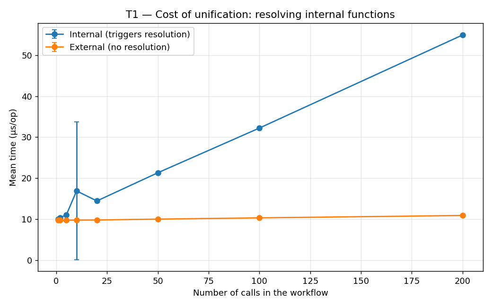

**Resumo.** Mede o custo de resolver endpoints de funções internas (a unificação
OmniFlow+QuickFaaS) contra o de uma chamada que não precisa de resolução. As duas variantes pagam
**uma** leitura do registo — o resolver de referência lê o ficheiro antes de percorrer a árvore,
haja ou não o que resolver — e é isso que a linha N=1 mede: ~9,8 µs. O que separa as duas colunas é
o trabalho por chamada: ~0,22 µs para uma chamada interna (*lookup* no snapshot, divisão do URL em
host/path, reconstrução do nó) contra ~0,006 µs para uma externa, que é copiada tal como está.
Resolver um workflow de 200 chamadas custa 54,9 µs, dos quais a leitura é cerca de um quinto. O ponto
N=10 é ruído: o seu intervalo de confiança (±16,8 µs) é maior que o próprio valor.

---

## T2 — Custo de escalabilidade do registo (Θ(N·R))

> **Objeto:** resolução de um *workflow* (objeto `Workflow`), com leitura do registo por chamada · **Funções distintas:** 1 (a mesma, repetida nos N passos) · **Chamadas (N):** N internas (1–200), com controlo de N externas · **Registo (R):** independente de N (1–1000, entradas de *padding*).

**Tempo total de `resolveAllInternal` (µs), por combinação (R, N):**

| R \ N | 1 | 10 | 50 | 200 |
|---:|---:|---:|---:|---:|
| 1 | 11,5 | 101 | 509 | 2 018 |
| 10 | 12,8 | 116 | 579 | 2 322 |
| 50 | 18,2 | 184 | 917 | 3 668 |
| 200 | 44,3 | 446 | 2 227 | 8 886 |
| 1000 | 183 | 1 838 | 9 172 | 36 552 |

**Controlo `resolveAllExternal`** (nunca toca o registo, independente de R): 0,01 µs (N=1) → 0,06 µs (N=10) → 0,14 µs (N=50) → 0,82 µs (N=200) — igual
em toda a linha de R, confirmando que o efeito de R acima é específico do acesso ao registo.

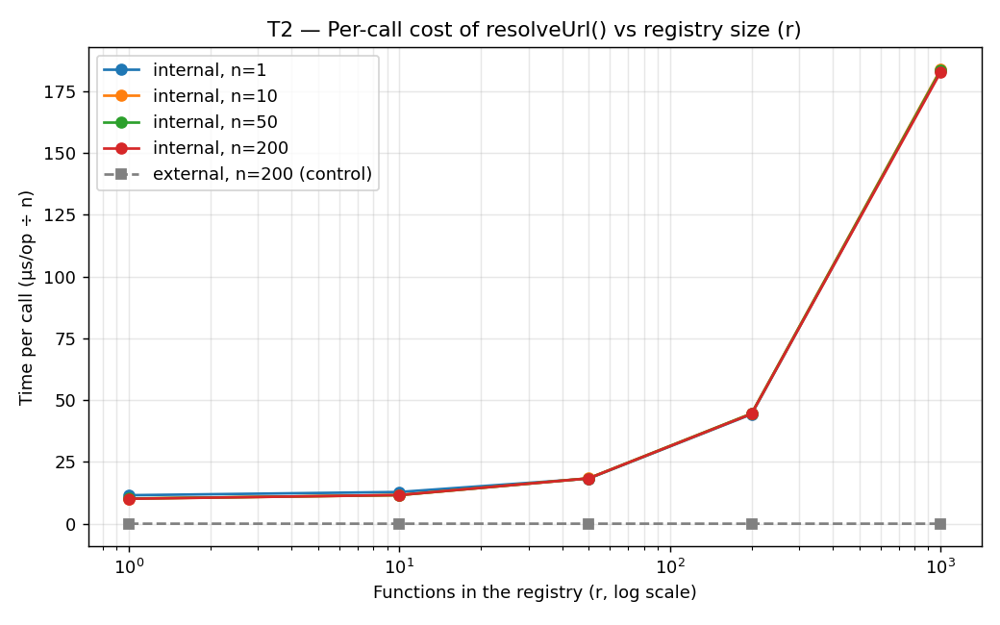

As quatro curvas `n=1/10/50/200` colapsam numa só linha — o custo por chamada depende apenas de R,
não de N — enquanto o controlo externo se mantém plano próximo de zero.

**Custo por chamada (µs), independente de N e crescente com R:**

| R | Custo por chamada (µs) |
|---:|---:|
| 1 | 10,5 |
| 10 | 11,9 |
| 50 | 18,3 |
| 200 | 44,5 |
| 1000 | 183 |

**Resumo.** Mede como o tamanho do registo (R) afeta a resolução sem cache, isolado do número de
chamadas (N). O custo por chamada cresce com R (~10,5 µs fixos de I/O e parsing + ~0,17 µs por
entrada registada), independente de N: Θ(N·R). Os dois termos igualam-se em R ≈ 60; abaixo disso
domina o custo fixo de abrir e parsear o ficheiro. Um registo com as poucas dezenas de funções de um
sistema real fica em torno ou abaixo desse ponto, que é o que torna vantajoso ler o registo uma vez
por workflow em vez de uma vez por chamada.

---

## T3 — Otimização da resolução: leitura única do registo (Θ(N·R) → Θ(N+R))

> **Objeto:** resolução **isolada no `store`** (`resolveUrl` vs `readAll`+`resolveUrlIn`) — **sem** objeto `Workflow` · **Funções distintas:** 1 (a mesma, resolvida N× em loop) · **Chamadas (N):** N resoluções (1–200) · **Registo (R):** independente de N (1/50/1000, entradas de *padding*).

**Tempo total (µs) — antes (sem cache) vs depois (com cache):**

| | N=1 | N=10 | N=50 | N=200 |
|---|---:|---:|---:|---:|
| **sem cache** R=1 | 9,8 | 98,0 | 492 | 1 999 |
| **com cache** R=1 | 10,0 | 10,0 | 10,1 | 10,3 |
| **sem cache** R=50 | 17,9 | 180 | 901 | 3 630 |
| **com cache** R=50 | 18,4 | 18,3 | 18,5 | 18,5 |
| **sem cache** R=1000 | 183 | 1 839 | 9 239 | 36 670 |
| **com cache** R=1000 | 182 | 183 | 182 | 184 |

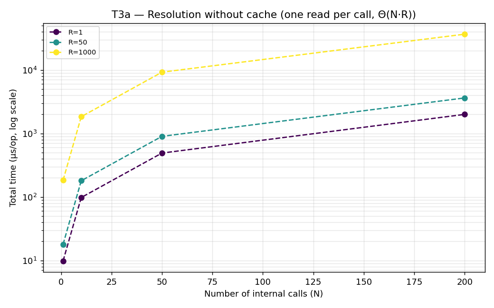

**Resumo.** Compara resolver o registo por chamada (naive) com uma só leitura por `resolve()`
(otimizado). Com cache o custo é quase independente de N — cada linha fica plana ao longo de um
aumento de 200× no número de chamadas — e reduz-se ao custo de uma leitura de um ficheiro de R
entradas: Θ(N+R) em vez de Θ(N·R). O *speedup* cresce com o produto N·R e chega a 200× no pior
canto (N=200, R=1000: 36,7 ms → 0,18 ms).

---

## T4 — Resolução do workflow vs nº de funções distintas (F) × nº de chamadas (N), com R=F

> **Objeto:** resolução de um *workflow real* (objeto `Workflow`), naive vs otimizado · **Funções distintas:** F distintas (1–50), *round-robin* pelas N chamadas · **Chamadas (N):** N internas (1–200) · **Registo (R):** R=F.

**Tempo de resolução (µs) — `resolveNaive` (leitura por chamada), F em linhas / N em colunas:**

| F \ N | 1 | 5 | 10 | 50 | 200 |
|---:|---:|---:|---:|---:|---:|
| 1 | 10,4 | 52,3 | 105 | 525 | 2 069 |
| 2 | 10,8 | 53,0 | 106 | 534 | 2 142 |
| 5 | 11,1 | 53,9 | 108 | 543 | 2 150 |
| 10 | 11,6 | 58,5 | 116 | 582 | 2 333 |
| 20 | 13,3 | 66,6 | 133 | 665 | 2 650 |
| 50 | 18,7 | 92,5 | 185 | 929 | 3 694 |

**Tempo de resolução (µs) — `resolveOptimized` (leitura única):**

| F \ N | 1 | 5 | 10 | 50 | 200 |
|---:|---:|---:|---:|---:|---:|
| 1 | 10,2 | 11,1 | 12,2 | 20,7 | 54,7 |
| 2 | 10,4 | 11,2 | 12,2 | 21,1 | 54,1 |
| 5 | 10,7 | 11,6 | 12,7 | 21,5 | 54,1 |
| 10 | 11,5 | 12,7 | 13,8 | 22,5 | 55,8 |
| 20 | 13,4 | 14,2 | 15,2 | 24,0 | 57,9 |
| 50 | 18,5 | 19,4 | 20,8 | 29,4 | 63,3 |

**Resumo.** Caracteriza a resolução real de um workflow ao longo de F (funções distintas) e N
(chamadas), com R=F. O caminho naive é dominado por N, a ~10 µs por chamada — uma leitura inteira
do registo cada — e cresce suavemente com F, porque um F maior é um ficheiro maior para reler. O
caminho otimizado paga essa leitura uma vez e depois ~0,22 µs por chamada, pelo que cresce mais com F
(o tamanho da leitura única) do que com N. O *speedup* é ~1× em N=1, onde ambos leem o ficheiro
exatamente uma vez, e chega a ~38× (F=1) e ~58× (F=50) em N=200.

---

## T5 — Resolução do workflow vs tamanho do registo (R), com F e N fixos

> **Objeto:** resolução de um *workflow real* (objeto `Workflow`) · **Funções distintas:** F=10 distintas (fixo) · **Chamadas (N):** N=50 internas (fixo) · **Registo (R):** R≥F (10–1000).

**Tempo de resolução (µs) — sem cache vs com cache, F=10 / N=50 fixos:**

| R (registo) | sem cache (µs) | com cache (µs) | speedup |
|---:|---:|---:|---:|
| 10 | 589 | 22,6 | ~26,1× |
| 20 | 666 | 23,9 | ~27,9× |
| 50 | 930 | 29,3 | ~31,8× |
| 100 | 1 378 | 37,8 | ~36,5× |
| 200 | 2 246 | 54,9 | ~40,9× |
| 1000 | 9 487 | 205 | ~46,3× |

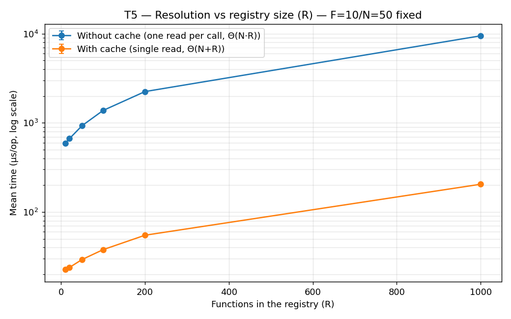

**Resumo.** Isola o efeito do tamanho do registo (R≥F) com F=10/N=50 fixos. Os dois caminhos
crescem com R, mas por razões diferentes: o naive relê o ficheiro em cada uma das 50 chamadas, o
otimizado lê-o uma vez. A distância entre eles alarga de ~26,1× (R=10) a ~46,3× (R=1000). A coluna
"com cache" é o custo de uma leitura mais 50 *lookups* (22,6 µs a R=10, 205 µs a R=1000) e acompanha
o custo por leitura medido no T2.

---

## T6 — Custo real do resolver de auto-deploy AWS (`AwsInternalFunctionResolver`)

> **Objeto:** resolução de um *workflow* pelo **resolver de auto-deploy AWS real** (`AwsInternalFunctionResolver.resolve`) · **Funções distintas:** F distintas (1–50), *round-robin* · **Chamadas (N):** N internas (1–200) · **Registo (R):** R=F (sempre *hit*).

**Tempo de resolução (µs) — `AwsInternalFunctionResolver.resolve`, F em linhas / N em colunas:**

| F \ N | 1 | 5 | 10 | 50 | 200 |
|---:|---:|---:|---:|---:|---:|
| 1 | 9,9 | 10,3 | 10,9 | 13,8 | 24,6 |
| 2 | 10,2 | 11,0 | 11,4 | 14,7 | 26,3 |
| 5 | 11,0 | 11,2 | 11,7 | 15,3 | 27,6 |
| 10 | 11,7 | 12,2 | 12,7 | 16,3 | 29,1 |
| 20 | 14,4 | 14,8 | 14,4 | 19,7 | 34,5 |
| 50 | 20,0 | 20,3 | 20,3 | 26,6 | 47,5 |

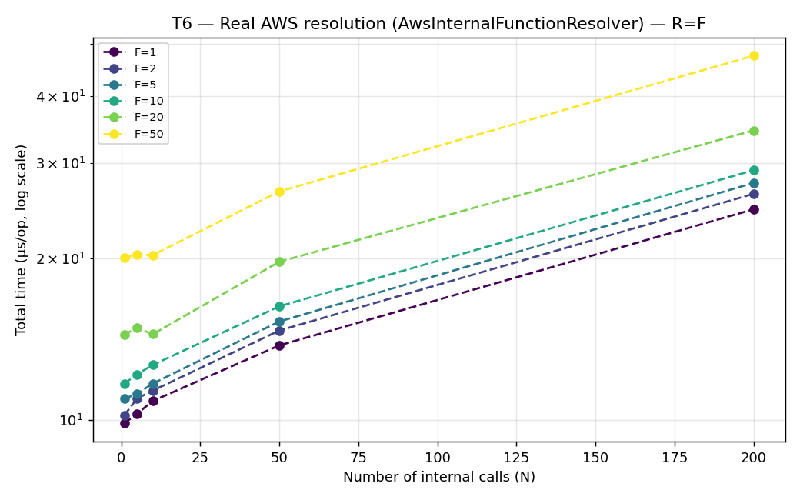

> **Nota de medição (2026-09-12).** Até esta data os dois resolvers de produção escreviam duas ou
> três linhas de progresso na consola por cada chamada resolvida, dentro do método medido — dois
> `println` mais um `logger.info`, que a configuração logback por omissão também imprime. Essa
> escrita era ~95% do tempo reportado: os mesmos pontos custavam 1 006 µs (AWS) e 1 344 µs (GCP) em
> F=10/N=200. As mensagens por chamada passaram para `logger.debug`, que ao nível por omissão não é
> impresso (e cujo lambda nem chega a ser avaliado), e T6/T7 foram re-medidos. As mensagens raras
> — varrimento de regiões, deployment QuickFaaS, *drift*, erros — continuam a ser impressas. Fica o
> aviso: um método instrumentado mede a sua instrumentação.

**Resumo.** Mede o custo real do glue de auto-deploy AWS, que lê o registo uma só vez por
`resolve()` e resolve cada chamada contra esse snapshot (`tryResolveEntryIn`). A forma é a mesma do
caminho de referência já otimizado: uma leitura mais uma constante por chamada. A coluna N=1 dá a
leitura (cresce com F porque R=F, de 9,9 µs em F=1 a 20,0 µs em F=50); a linha dá o trabalho por
chamada, ~0,09 µs. Resolver 200 chamadas contra um registo de 10 funções custa 29,1 µs.

---

## T7 — Custo real do resolver de auto-deploy GCP (`WorkflowInternalFunctionResolver`)

> **Objeto:** resolução de um *workflow* pelo **resolver de auto-deploy GCP real** (`WorkflowInternalFunctionResolver.resolve`) · **Funções distintas:** F distintas (1–50), *round-robin* · **Chamadas (N):** N internas (1–200) · **Registo (R):** R=F (sempre *hit*).

**Tempo de resolução (µs) — `WorkflowInternalFunctionResolver.resolve`, F em linhas / N em colunas:**

| F \ N | 1 | 5 | 10 | 50 | 200 |
|---:|---:|---:|---:|---:|---:|
| 1 | 10,4 | 12,1 | 13,9 | 27,9 | 83,3 |
| 2 | 10,6 | 11,9 | 13,8 | 27,5 | 78,8 |
| 5 | 11,3 | 12,7 | 14,1 | 28,4 | 79,8 |
| 10 | 12,1 | 13,4 | 15,1 | 28,8 | 81,3 |
| 20 | 14,4 | 15,5 | 16,8 | 31,6 | 84,4 |
| 50 | 19,9 | 20,9 | 22,8 | 36,8 | 91,3 |

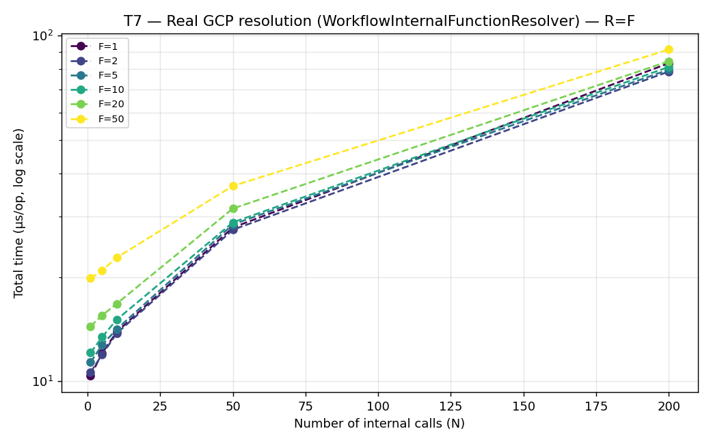

**Resumo.** Gémeo GCP do T6, com URLs de 1ª geração no registo para nunca tocar na API do Cloud
Run. Mesma forma (uma leitura — 10,4 µs em F=1, 19,9 µs em F=50 — mais uma constante por chamada),
mas ~4× mais caro por chamada que o AWS: ~0,35 µs contra ~0,09 µs, ou 81,3 µs contra 29,1 µs em
F=10/N=200. **A diferença é real e não é logging** (ver a nota do T6): o resolver AWS liga uma
chamada concatenando um prefixo ao ARN que já tem, enquanto o GCP faz `URI(url)` e reconstrói
host/path a cada chamada. O resolver de referência do T1/T4 faz esse mesmo parsing e fica entre os
dois, a ~0,22 µs por chamada — o que fecha a explicação.

---

## T8 — Custo de escrita incremental no registo (`FunctionRegistryStore.put`)

> **Objeto:** **escrita** no registo (`FunctionRegistryStore.put`) — não é resolução · **Funções distintas:** — (escreve K funções novas) · **Chamadas (N):** K escritas sucessivas (1–100) · **Registo (R):** R0 inicial (0–1000).

**Tempo total (µs) — K escritas sucessivas, K em linhas / R0 em colunas:**

| K \ R0 | 0 | 10 | 50 | 200 | 1000 |
|---:|---:|---:|---:|---:|---:|
| 1 | 45,5 | 48,2 | 63,8 | 114 | 490 |
| 5 | 224 | 242 | 329 | 529 | 1 945 |
| 10 | 463 | 496 | 640 | 1 041 | 3 751 |
| 50 | 2 517 | 2 706 | 3 650 | 5 363 | 17 942 |
| 100 | 5 914 | 6 693 | 7 594 | 11 515 | 36 195 |

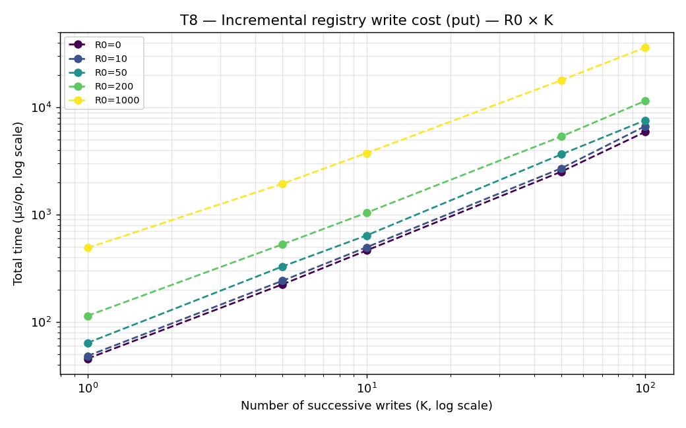

**Resumo.** Cada `put()` relê e reescreve o ficheiro inteiro, por isso registar K funções custa
perto de K vezes uma escrita, e uma escrita custa o que custa reescrever um ficheiro do tamanho
atual. Ambos os fatores se veem. Ao longo de K o custo **por escrita** é quase constante — com
R0=0 vai de 45,5 µs (K=1) a 59,1 µs (K=100), o aumento suave esperado de um ficheiro que ganhou K
entradas durante a execução — logo o total é linear em K, não Θ(K²) como se supunha. Ao longo de R0
o custo por escrita cresce aproximadamente na proporção do ficheiro: 45,5 µs com o registo vazio,
490 µs com R0=1000. Para a escrita, o tamanho do registo não é um termo de segunda ordem como é
para a leitura: multiplica o custo de cada escrita.

---

## T9 — Custo real de miss + deploy no registo (`tryResolveEntry` + `put`)

> **Objeto:** **miss + escrita** no registo (`tryResolveEntry` + `put`) — não é só resolução · **Funções distintas:** — (K funções novas) · **Chamadas (N):** K pares miss+put (1–100) · **Registo (R):** R0 inicial (0–1000).

**Tempo total (µs) — K pares (miss + put) sucessivos, K em linhas / R0 em colunas:**

| K \ R0 | 0 | 10 | 50 | 200 | 1000 |
|---:|---:|---:|---:|---:|---:|
| 1 | 57,2 | 62,7 | 90,2 | 164 | 686 |
| 5 | 298 | 323 | 427 | 769 | 2 901 |
| 10 | 597 | 874 | 973 | 1 557 | 5 751 |
| 50 | 3 265 | 3 510 | 5 051 | 8 144 | 28 694 |
| 100 | 8 369 | 8 307 | 10 516 | 17 689 | 58 572 |

**Resumo.** Mede o custo de resolver (miss) + registar (put) K funções novas, o que os resolvers
reais fazem antes de qualquer chamada à cloud. Face ao T8 (só `put`), o miss acrescenta entre 26% e
62%, porque `tryResolveEntry` lê o ficheiro inteiro mais uma vez antes de a escrita o reescrever. O
agravamento cresce com R0 — ~30% com o registo vazio, ~60% com R0=1000 — que é o que uma leitura
extra de um ficheiro cada vez maior prevê. Um ponto discorda, K=10 com R0=10, e o seu intervalo de
confiança (±732 µs sobre uma média de 874 µs) diz que é ruído.

---

## T10 — Correspondência exata vs. por sufixo no resolver "com cache"

> **Objeto:** resolução de um *workflow real* (objeto `Workflow`), caminho *exact-match* vs *suffix-match* · **Funções distintas:** F=10 distintas (fixo) · **Chamadas (N):** N=50 internas (fixo) · **Registo (R):** R (10–1000).

**Tempo de resolução (µs) — exact match vs. suffix match, F=10 / N=50 fixos:**

| R (registo) | exact match (µs) | suffix match (µs) | razão |
|---:|---:|---:|---:|
| 10 | 22,5 | 28,8 | ~1,28× |
| 20 | 24,2 | 32,6 | ~1,35× |
| 50 | 29,2 | 40,2 | ~1,38× |
| 100 | 38,2 | 58,9 | ~1,54× |
| 200 | 55,0 | 92,6 | ~1,68× |
| 1000 | 201 | 391 | ~1,95× |

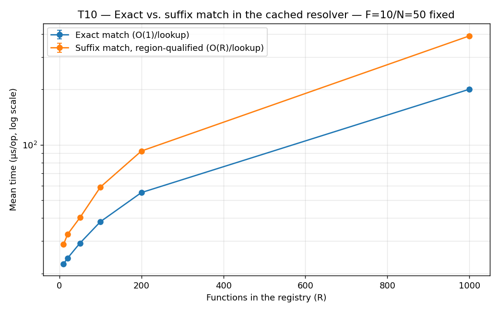

**Resumo.** Testa o caminho por sufixo do resolver "com cache" (desambiguação regional), que falha
o match exato e faz scan O(R) por chamada em memória. A razão cresce de forma regular com R, e
mantém-se barato em absoluto — 391 µs para 50 *lookups* por sufixo sobre um registo de mil entradas.
Reintroduz Θ(N·R), mas sobre um mapa já carregado.

---

## T11 — Resolução do workflow com mistura de chamadas internas/externas (I × E)

> **Objeto:** resolução de um *workflow real* **misto** (internas + externas) · **Funções distintas:** F=10 distintas (fixo, para as I internas) · **Chamadas (N):** N=I+E, I e E variam (0–200 cada) · **Registo (R):** R=F=10 (fixo).

**Tempo de resolução (µs) — `resolveOptimized`, I em linhas / E em colunas, R=F=10 fixos:**

| I \ E | 0 | 1 | 5 | 10 | 50 | 200 |
|---:|---:|---:|---:|---:|---:|---:|
| 0 | 11,3 | 11,3 | 11,5 | 11,5 | 13,9 | 12,7 |
| 1 | 11,5 | 11,7 | 11,8 | 11,8 | 14,4 | 12,7 |
| 5 | 12,8 | 12,6 | 12,6 | 12,7 | 12,9 | 13,7 |
| 10 | 13,7 | 13,8 | 13,8 | 13,8 | 14,0 | 14,7 |
| 50 | 22,4 | 22,4 | 22,7 | 26,3 | 22,8 | 23,2 |
| 200 | 55,8 | 55,9 | 56,2 | 67,1 | 57,4 | 56,8 |

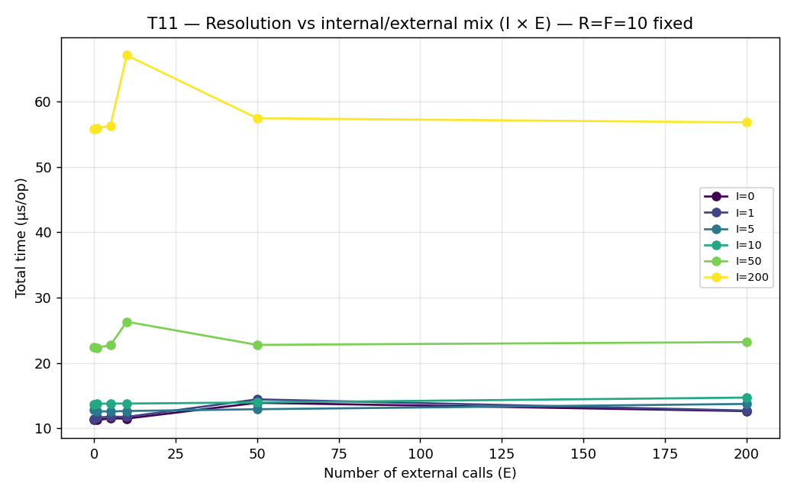

**Resumo.** Isola se o custo depende das chamadas internas (I) ou do total N=I+E. A linha I=0 fica
entre 11 e 14 µs mesmo com E=200: as externas não custam *lookup* no registo. Descer uma coluna de
I=0 a I=200 multiplica o custo por cinco, a ~0,22 µs por chamada interna — o mesmo valor por chamada
do T1. Confirma Θ(I+R), com E a pesar apenas na reconstrução O(N) da árvore.

---

## T12 — Resolução vs tamanho do registo (R), workflow misto I=40/E=10 fixos

> **Objeto:** resolução de um *workflow real* **misto**, variando o registo · **Funções distintas:** F=10 distintas (fixo) · **Chamadas (N):** I=40/E=10 fixas (N=50) · **Registo (R):** R varia (10–1000).

**Tempo de resolução (µs) — `resolveOptimized`, I=40/E=10/F=10 fixos:**

| R (registo) | com cache (µs) |
|---:|---:|
| 10 | 20,4 |
| 20 | 22,2 |
| 50 | 27,3 |
| 100 | 36,2 |
| 200 | 53,7 |
| 1000 | 199 |

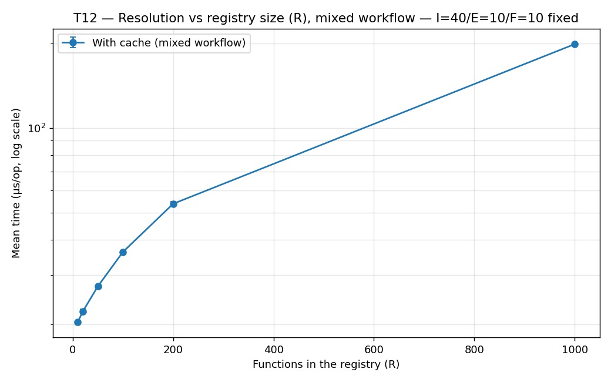

**Resumo.** Gémeo do T5 com workflow misto, variando R. O custo continua a seguir a leitura única,
de forma monótona e sem ruído, mostrando que o efeito de R não depende de quantas chamadas são
internas ou externas.

---

## T13 — Resolução interna vs profundidade de aninhamento

> **Objeto:** resolução de um *workflow real* **aninhado** (Iteration/Parallel) · **Funções distintas:** F=10 distintas (fixo), *round-robin* pelas 20 chamadas · **Chamadas (N):** N=20 internas (fixo); varia a **profundidade** (0–5) · **Registo (R):** R=F=10 (fixo).

T17 mediu este eixo (profundidade de aninhamento, alternando *iteration*/*parallel*) só para a
**renderização**, com workflows 100% externos — nunca tocava o registo. `resolveContext` recursa
explicitamente em `IterationRangeContext`/`ParallelBranchContext`, mas nenhum benchmark de resolução
(T1–T12) alguma vez construiu uma árvore aninhada — todos usam sequências planas de chamadas. O
T13 fecha essa lacuna: mesma estrutura do T17 (20 chamadas-folha fixas, profundidade `depth` a
variar), mas as folhas são chamadas **internas** (10 funções distintas, round-robin, R=F=10).

**Tempo total (µs) — 20 chamadas internas, R=F=10 fixos, profundidade a variar:**

| Profundidade | Tempo (µs) |
|---:|---:|
| 0 (plano) | 15,9 |
| 1 | 15,8 |
| 2 | 69,0 |
| 3 | 19,2 |
| 4 | 17,1 |
| 5 | 15,9 |

**Resumo.** O tempo fica praticamente constante (15,8–19,2 µs) em todas as profundidades — a
recursão do resolver sobre `Iteration`/`Parallel` não acrescenta custo mensurável além do que as 20
folhas já custariam numa lista plana. O ponto em profundidade 2 (69,0 µs) é ruído, como o seu
próprio intervalo de confiança (±40,8 µs) indica. Confirma que a resolução escala com o **número
total de chamadas internas**, não com a forma da árvore.

---

## T14 — Resolução interna vs largura de Parallel

> **Objeto:** resolução de um *workflow real* com um bloco **`Parallel`** · **Funções distintas:** F=10 distintas (fixo), *round-robin* · **Chamadas (N):** N=5×largura internas; varia a **largura** (1–100) · **Registo (R):** R=F=10 (fixo).

Gémeo do T18 (que mediu largura de `Choice`/`Parallel` só para renderização), mas do lado da
resolução. Não há equivalente de largura de `Choice` aqui: um `ConditionalContext` só tem pares
condição/nome-de-destino, nunca `Step`s aninhados — não há nada para o resolver percorrer. Já o
`Parallel` aninha listas reais de `Step`s por *branch*, e `resolveContext` recursa explicitamente
em `ParallelBranchContext` — caminho nunca exercitado pelos workflows planos de T1–T12. O nº
total de chamadas resolvidas é N = 5 × largura.

**Tempo total (µs) — 5 chamadas internas/branch, R=F=10 fixos, largura do Parallel a variar:**

| Nº de branches | N (=5×largura) | Tempo (µs) |
|---:|---:|---:|
| 1 | 5 | 12,5 |
| 2 | 10 | 13,7 |
| 5 | 25 | 17,0 |
| 10 | 50 | 22,4 |
| 20 | 100 | 33,2 |
| 50 | 250 | 65,2 |
| 100 | 500 | 119 |

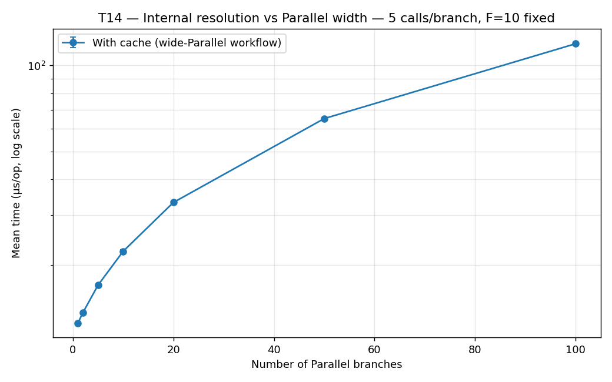

**Resumo.** O tempo cresce linearmente com o número total de chamadas internas N=5×largura
(12,5 µs em N=5 → 119 µs em N=500), a ~0,22 µs por chamada — o mesmo declive dos workflows planos
do T1 e do T11. Estar dentro de um `Parallel` largo não introduz custo extra por *branch*. Confirma,
com o T13, que o custo depende só do nº total de chamadas internas, estejam elas numa lista plana,
aninhadas em profundidade ou espalhadas por muitos *branches*.

---

## S1 — Bundle/ZIP size da Lambda: AWS agnóstico vs nativo

> **Objeto:** **tamanho do bundle ZIP** da Lambda — não é resolução nem escrita · **Funções distintas:** 1 função empacotada · **Chamadas (N):** — · **Registo (R):** —.

A avaliação inicial do QuickFaaS mediu o "ZIP size (KB)" do *bundle* de deployment (agnóstico
10877 KB vs não-agnóstico 10861 KB → ~16 KB de overhead, medidos pelos colegas para GCP/Azure).
Estende-se aqui a mesma métrica ao provider AWS acrescentado nesta tese.

A mesma função (`hello-lambda-fn`) empacotada de duas formas (fat-jar via maven-shade), medida com
`measure_bundle_size.sh`:

| Bundle | Tamanho |
|---|---:|
| AWS agnóstico (QuickFaaS: `MyFunctionClass` + adaptador `AwsHttpTemplate` + `aws-lambda-java-core`) | **14 552 bytes (14,2 KB)** |
| AWS nativo (um único `RequestHandler`, mesma lógica) | **13 647 bytes (13,3 KB)** |
| **delta (overhead da camada agnóstica)** | **905 bytes (0,88 KB)** |

**Resumo.** Mede o overhead de tamanho do bundle Lambda que a camada agnóstica do QuickFaaS
acrescenta face a uma implementação nativa. ~0,88 KB (6,6% de um bundle trivial; <0,1% numa função
real) — negligenciável, como já visto para GCP/Azure. Corrigido um bug de seleção
não-determinística de jar, validado por teste. (Esta medição não é JMH e não foi afetada pela
re-execução.)

---

## Síntese e discussão

1. O custo da unificação é pequeno por chamada e linear (T1): uma leitura do registo (~9,8 µs com
   R=1) mais ~0,22 µs por chamada interna, contra ~0,006 µs por chamada externa.
2. O tamanho do registo (T2) é uma dimensão de custo independente de N: ~10,5 µs fixos de I/O e
   parsing + ~0,17 µs por entrada. Os dois termos igualam-se em R ≈ 60, pelo que num registo
   realista domina o custo fixo — o que se ganha é lendo menos vezes, não tendo um registo menor.
3. A otimização de leitura única (T3) elimina o produto N·R: a resolução passa de **Θ(N·R)** para
   **Θ(N+R)**, com *speedup* de 200× no pior canto medido (36,7 ms → 0,18 ms) — identificar
   (T1/T2) → corrigir → quantificar (T3).
4. Os resolvers reais de auto-deploy (T6 AWS, T7 GCP) têm essa otimização e mostram a mesma forma:
   29,1 µs e 81,3 µs para 200 chamadas com um registo de 10 funções. A diferença entre os dois
   fornecedores é o parsing de `URI` que o resolver GCP faz por chamada e o AWS não.
5. Escrita (T8/T9): o custo por escrita é quase constante em K, logo o total é linear em K, mas
   cresce com o tamanho do registo, porque cada `put` reescreve o ficheiro inteiro. O par
   miss+escrita que precede qualquer deployment acrescenta 26–62%, a crescer com R0.
6. O eixo I/E (T11/T12) confirma que o custo escala com **I** e não com N=I+E, e que o efeito de R
   se mantém quando parte das chamadas é externa.
7. Os eixos estruturais que T17/T18 só tinham medido para renderização foram fechados do lado da
   resolução por T13/T14: nem a profundidade nem a largura de Parallel introduzem custo além do que
   o nº total de chamadas internas já explica.
8. Tamanho (S1): a camada AWS agnóstica acrescenta ao *bundle* apenas ~0,9 KB, em linha com a
   avaliação original do QuickFaaS para GCP/Azure.

**Enquadramento global.** Todos os valores estão entre microssegundos e, no pior caso de escrita,
dezenas de milissegundos (K=100 escritas sucessivas num registo de mil entradas: 36 ms). A resolução
de endpoints não é o gargalo — o custo dominante é o *deployment* na nuvem (segundos). Fica dito o
que estas medições **não** cobrem: são todas locais, com o provider substituído por um duplo, por
isso não incluem a validação ao vivo de cada *hit* nem o varrimento de regiões de um *miss*, que são
idas à rede. O Capítulo 7 da dissertação conta quantas.
