# Resultados dos testes de desempenho (P1–P14) e de tamanho (S1–S2)

Medições locais de renderização (DSL → Amazon States Language / GCP Workflows YAML) e de resolução
de funções internas, sem chamadas à nuvem. Geradas com JMH a partir do módulo `benchmark/`.

## Metodologia

- **Ferramenta:** JMH 1.37, modo `AverageTime`, unidade µs/op, com `Blackhole` a consumir cada
  resultado para impedir *dead-code elimination*.
- **Execução:** `-f 1 -wi 3 -i 5 -w 1 -r 1` — uma *fork* da JVM, 3 iterações de aquecimento e 5 de
  medição (1 s cada), para medir o código já compilado pelo JIT.
- **Dados brutos:** `jmh-results.csv` (P1–P5 e P12, um só `@Param`), `jmh-results-p6.csv` (P6, com
  a dimensão `Param: m`), `jmh-results-p7.csv` (P7 antes/depois), `jmh-results-p8.csv`/
  `jmh-results-p9.csv` (P8–P9, resolução do workflow real), `jmh-results-p10.csv`/`jmh-results-p11.csv`
  (P10–P11, resolvers reais AWS/GCP), `jmh-results-p13.csv` (P13, escrita no registo) e
  `jmh-results-p14.csv` (P14, exact vs. suffix match). Gráficos: `P1_*.png … P14_*.png` (P7 e P8 em
  duas figuras cada, `P7a`/`P7b` e `P8a`/`P8b`), regeneráveis com `python3 plot_benchmarks.py`.
- **Modelo de custo:** a renderização é uma travessia *depth-first*
  (`DepthFirstNodeVisitorTraversor` + `NodeContextVisitor`) que visita cada nó da AST uma vez e
  acumula texto num `StringBuilder` partilhado (`IndentedRenderingContext.append`). Como o `append`
  é amortizado O(1), o tempo é proporcional ao número de nós e ao texto produzido, sem o termo
  quadrático da concatenação de `String` imutável.
- **Ressalva:** ambiente partilhado e configuração reduzida; os valores absolutos servem para
  comparar tendências e relações, não como números definitivos de hardware. Para a versão final,
  repetir com `-f 3` e máquina dedicada.

## Notação — o que N, M e F representam

Estes três símbolos aparecem ao longo de quase todas as secções seguintes. Têm sempre o mesmo
significado — o que muda, secção a secção, é a **relação entre eles** (fixos? independentes?
M=F?):

- **N** — número de **chamadas** no workflow (passos `CALL` que disparam uma resolução). É sempre
  esta a unidade que se soma/repete N vezes (N leituras, N *lookups*, N escritas).
- **F** — número de funções **internas distintas** que o workflow referencia. Só existe a partir do
  P8 (antes disso não havia necessidade de distinguir "quantas chamadas" de "quantas funções
  diferentes"): as N chamadas distribuem-se *round-robin* pelas F funções (ex.: F=4/N=6 → cada
  função é chamada 1 ou 2 vezes).
- **M** — número de entradas no **registo** (`function-registry.json`) no momento em que é
  lido/escrito. **Não é o mesmo que F** — M é o tamanho físico do ficheiro; F é quantas dessas
  entradas o workflow *usa*. Um registo pode ter M=1000 entradas e o workflow só referenciar F=10
  delas (as outras M-F são "ruído"/funções de outros workflows).

**Como M e F se relacionam, secção a secção:**

| Secções | Relação M ↔ F | O que representa |
|---|---|---|
| P3 | F não se aplica; M fixo em 1 | registo de uma função só, isola o efeito de N |
| P6, P7 | F não se aplica; M e N variam independentemente | registo genérico de M entradas, sem ligação às funções que o workflow chama |
| **P8, P10, P11** | **M = F** | registo "do tamanho certo": contém exatamente as F funções que o workflow usa, nem mais nem menos |
| **P9, P14** | **M ≥ F**, com F e N fixos | registo "sobredimensionado": as M-F entradas extra nunca são chamadas, só inflacionam o custo de cada leitura/scan do ficheiro inteiro |
| P13 | Não há F (é o lado de **escrita**, não de resolução); usa **M0** (tamanho inicial do registo) e **K** (nº de escritas sucessivas) em vez de M/N | mesmo papel de M e N, mas nomeados de forma diferente por não se tratar de resolução de chamadas |
| P12 | Nenhum dos três; usa **branchWidth** (nº de condições/branches) | eixo de renderização, não de registo |

---

## P1 — Degradação com o número de funções

**Objetivo.** Medir como o tempo de renderização escala com o número de funções (passos) e se a
complexidade é linear ou supralinear.

> **Nota de âmbito:** as chamadas são externas por design (`WorkflowGenerator.withIndependentSteps`
> → `StepContextGenerator.independentCall()`, `host`/`path` literais, `internalFunction = null`),
> isolando o custo de renderizar sem a resolução de endpoints (medida em P3/P6/P7). Como a
> renderização só usa o `host`/`path` já presentes na `CallContext`, o resultado é igual para
> chamadas internas ou externas.

| N (funções) | AWS (µs) | GCP (µs) |
|---:|---:|---:|
| 1 | 5,7 | 6,0 |
| 10 | 40,5 | 45,1 |
| 50 | 190,3 | 263,7 |
| 100 | 428,7 | 445,3 |
| 200 | 810,9 | 901,2 |

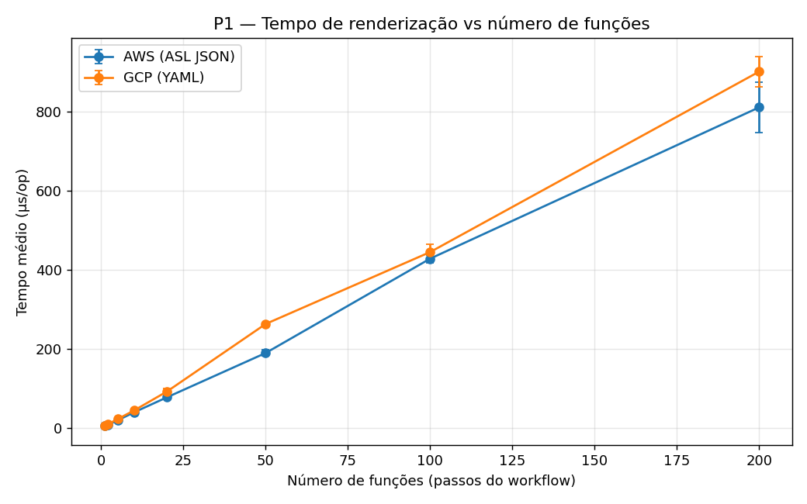

**Resultado.** O tempo cresce de forma aproximadamente **linear** (≈4 µs por função adicional, em
ambos os destinos), sem comportamento quadrático.

**Justificação.** Um workflow de N passos independentes tem Θ(N) nós na AST; a travessia visita cada
nó uma vez e cada passo emite texto constante, logo T(N) = a·N + b, com `b` o custo fixo de arranque
(dominante só para N pequeno). Com concatenação imutável, cada passo recopiaria o prefixo já
produzido, dando Θ(N²); a linearidade observada confirma a travessia em passagem única com
`StringBuilder`.

---

## P2 — Efeito do número de *inputs* da função

**Objetivo.** Medir se e como o número de inputs (argumentos) de uma função afeta o tempo de
renderização, com o número de funções fixo — isolando esta dimensão da do P1 (pergunta dos
orientadores: uma função com mais *inputs* demora mais a renderizar?). Nota de modelação: a
assinatura Java/Python da função não entra no workflow — cada input materializa-se como um argumento
passado na chamada (parâmetro de *query*/corpo da `CallContext`).

> **Nota de âmbito:** como no P1, as chamadas são externas
> (`StepContextGenerator.callWithParameters(p)`, `host`/`path` literais, sem `internalFunction`) —
> mede-se só a renderização, não a resolução.

| Inputs por função | AWS (µs) | GCP (µs) |
|---:|---:|---:|
| 0 | 49,3 | 27,7 |
| 1 | 85,7 | 77,7 |
| 5 | 142,3 | 150,2 |
| 10 | 184,5 | 243,2 |
| 20 | 350,3 | 440,5 |

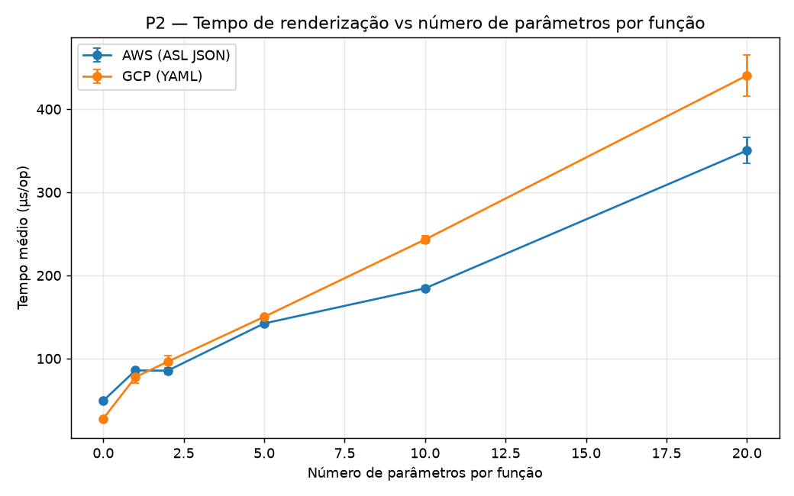

**Resultado.** Sim — o número de inputs afeta o tempo de forma aproximadamente **linear** (~15 µs
por input). O GCP parte mais baixo (função sem inputs) mas cresce mais depressa, ultrapassando o AWS
a partir de ~5 inputs.

**Justificação.** Cada input é escrito individualmente (resolução do termo + emissão de um par
chave-valor). Com N fixo, T(p) = N·(c·p + k): `c·p` é o custo dos inputs e `N·k` o custo-base por
chamada, daí a linearidade em p e a interceção positiva em p = 0. A base maior no AWS
(k_AWS > k_GCP) deve-se à Amazon States Language emitir mais estrutura fixa por chamada (`Type`,
`Resource`, `Parameters`, `ResultSelector`, `ResultPath`) que o `call:`/`args:` do GCP; o declive
maior no GCP (c_GCP > c_AWS) reflete um custo por input superior no YAML. Base maior numa reta e
declive maior noutra tornam a interseção por volta dos 5 inputs inevitável. O número de inputs é
assim uma segunda dimensão de custo, independente do número de funções.

> Nota: o benchmark é `BenchmarkRenderingByParameterCount` e o gerador `callWithParameters(p)` —
> "parameter" designa cada input da função passado na chamada.

---

## P3 — Custo da unificação: resolução de funções internas

**Objetivo.** Medir o overhead da unificação OmniFlow+QuickFaaS: quanto custa resolver os endpoints
das funções internas (o passo que liga as duas ferramentas), comparado com uma chamada externa, que
não dispara resolução.

| Nº de chamadas | Internas — resolução (µs) | Externas — sem resolução (µs) |
|---:|---:|---:|
| 1 | 7,5 | 0,02 |
| 10 | 74,6 | 0,14 |
| 50 | 368,0 | 0,65 |
| 100 | 747,2 | 1,10 |
| 200 | 1511,4 | 2,34 |

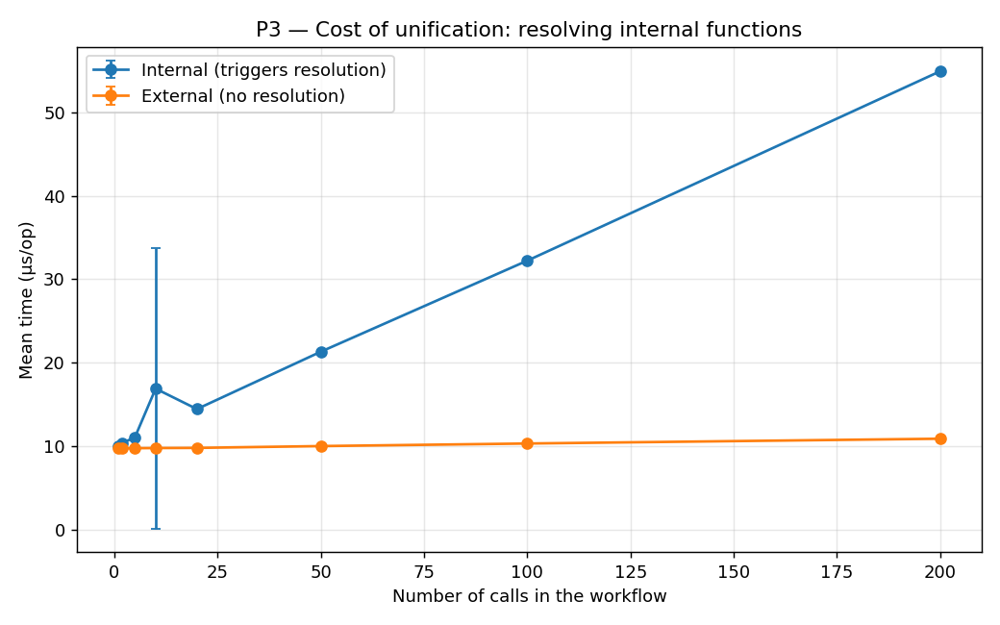

**Resultado.** Resolver os endpoints das funções internas custa **~7,5 µs por função** e escala
**linearmente**. As chamadas externas, que não disparam resolução, custam ~0,01 µs.

**Justificação.** O caminho externo termina de imediato (`internalCallExtractor(call) ?: return
call`): só percorre e copia a árvore — é o *baseline* que isola o efeito da unificação. O caminho
interno invoca, por chamada, `registry.resolveUrl(nome)`, que executa `readAll()` (lê o ficheiro do
registo do disco e reinterpreta todo o JSON), seguido de procura no mapa, *parsing* do URL
(`java.net.URI`) e cópia da `CallContext`. Com o registo de tamanho fixo (uma entrada), o custo é
constante por chamada, logo T(N) = a·N. Os 7,5 µs — altos para uma consulta em mapa — devem-se a
essa releitura do ficheiro a cada invocação, sem cache.

**Caveat de escalabilidade.** Como `readAll()` é Θ(M), a resolução é, no caso geral, **Θ(N·M)**,
com M = tamanho do registo. O ensaio fixa M = 1, isolando a dependência linear em N; se o registo
crescer com o número de funções distintas (M ∝ N), a resolução degrada para Θ(N²). Ler o registo
uma só vez por `resolve(workflow)` reduziria o custo para Θ(N + M) — otimização explorada em P6/P7.
Em absoluto, o custo é negligenciável face ao *deployment* real (segundos).

---

## P4 — Renderizador AWS vs GCP

**Objetivo.** Comparar o renderizador AWS (a extensão da contribuição) com o renderizador GCP já
existente, para o mesmo workflow, confirmando que a extensão AWS não introduz penalização de
desempenho.

| N | AWS (µs) | GCP (µs) |
|---:|---:|---:|
| 1 | 5,8 | 5,8 |
| 50 | 221,4 | 233,0 |
| 100 | 423,0 | 469,5 |
| 200 | 817,4 | 912,3 |

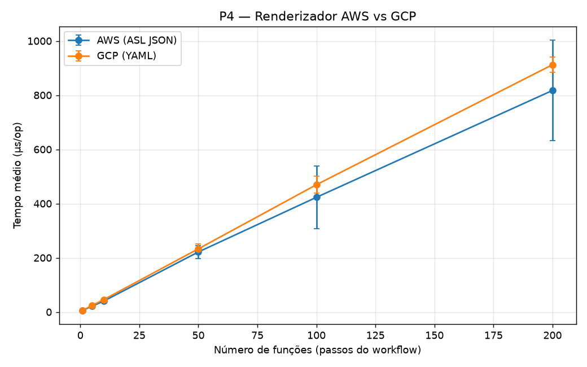

**Resultado.** O renderizador AWS tem custo equivalente ao GCP — mesma ordem de grandeza em todo o
intervalo, com o GCP ligeiramente mais caro à escala.

**Justificação.** Ambos partilham a travessia e o mecanismo de acumulação de texto, diferindo só
nos renderizadores concretos de cada nó; são ambos Θ(N) e as retas só diferem nas constantes. A
pequena vantagem do AWS à escala (~12% em N = 200) é coerente com o YAML do GCP exigir mais
formatação do que a emissão direta de JSON. Contudo, as barras de erro do AWS são largas nos pontos
maiores (±115 µs em N = 100; ±185 µs em N = 200) e sobrepõem-se às do GCP: a leitura correta é de
equivalência assintótica, não de superioridade. A maior variância em N elevado vem da pressão do
recoletor de lixo (realocações do `StringBuilder`, *garbage* proporcional ao texto) e da contenção
de CPU no ambiente partilhado, alargando o intervalo de confiança sem alterar a tendência.

---

## P5 — Efeito da estrutura/aninhamento

**Objetivo.** Isolar o efeito da complexidade estrutural (profundidade de aninhamento de
`parallel`/`iteration`) no tempo de renderização, com o número total de funções fixo — distinguir se
o que degrada o desempenho é o número de funções ou a sua organização.

| Profundidade | AWS (µs) | GCP (µs) |
|---:|---:|---:|
| 0 | 83,9 | 96,3 |
| 1 | 109,7 | 100,8 |
| 3 | 155,4 | 114,5 |
| 5 | 205,8 | 133,6 |

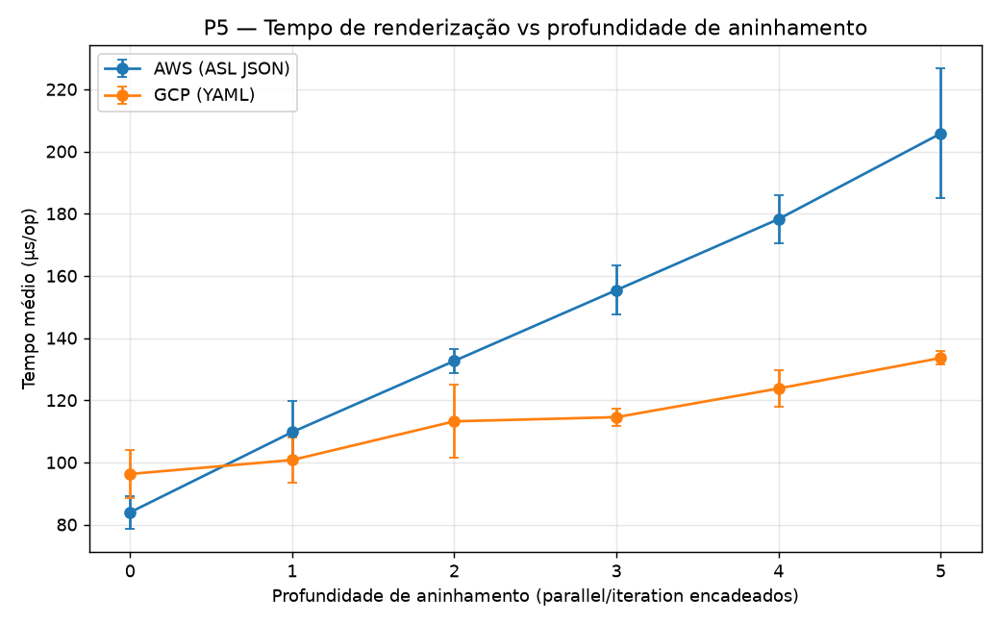

**Resultado.** Com o número total de passos fixo, aumentar a profundidade de aninhamento eleva o
tempo de renderização. O AWS é **mais sensível** ao aninhamento (≈2,5× de profundidade 0 a 5) do que
o GCP (≈1,4×).

**Justificação.** A profundidade acrescenta nós-contentor (cada nível de `parallel`/`iteration` é um
nó com o seu enquadramento) e, sobretudo, alonga o prefixo de indentação — o
`IndentedRenderingContext` antepõe indentação a cada linha, com comprimento proporcional à
profundidade. Assim, mesmo com as folhas fixas, o número de nós e de caracteres por linha cresce com
a profundidade, donde T(d) ≈ a·d + b (a N constante). O AWS é mais sensível porque a Amazon States
Language exige mais estrutura por nível aninhado (`Parallel`/`Map`, `Branches`/`Iterator`,
`ResultPath`) que o YAML do GCP. A complexidade estrutural é assim um fator de custo independente do
número bruto de funções.

---

## P6 — Custo de escalabilidade do registo (Θ(N·M))

**Objetivo.** Medir como o tamanho do registo (M) afeta o custo da resolução, isolando esta dimensão
do número de chamadas internas (N). `FunctionRegistryStore.resolveUrl` não tem cache: cada chamada
relê e reparsa o ficheiro do registo inteiro (`readAll()`). O P3 fixava M = 1 e só variava N; o P6
varia as duas dimensões independentemente para caracterizar a dependência em M.

**Tempo total de `resolveAllInternal` (µs), por combinação (M, N):**

| M \ N | 1 | 10 | 50 | 200 |
|---:|---:|---:|---:|---:|
| 1 | 178,1 | 1772,7 | 9425,9 | 36346,0 |
| 10 | 186,2 | 1824,6 | 9146,2 | 36713,6 |
| 50 | 206,5 | 2133,3 | 10206,5 | 40478,3 |
| 200 | 278,3 | 2773,3 | 13880,6 | 55616,7 |
| 1000 | 744,6 | 7485,5 | 37316,5 | 149632,1 |

**Controlo `resolveAllExternal`** (nunca toca o registo, independente de M): 0,02 µs (N=1) →
0,13 µs (N=10) → 0,51 µs (N=50) → 1,97 µs (N=200) — iguais em toda a linha de M, confirmando que o
efeito de M acima é específico do acesso ao registo.

As quatro curvas `n=1/10/50/200` colapsam numa só linha — o custo por chamada depende apenas de M,
não de N — enquanto o controlo externo se mantém plano próximo de zero.

**Resultado.** Dividindo o tempo total por N obtém-se o custo por chamada de `resolveUrl()`,
independente de N e crescente com M:

| M | Custo por chamada (µs) |
|---:|---:|
| 1 | 181,4 |
| 10 | 183,8 |
| 50 | 206,6 |
| 200 | 277,8 |
| 1000 | 746,9 |

Ajustando `custo(M) ≈ b + c·M` aos extremos (M=1, M=1000): `b ≈ 181 µs`, `c ≈ 0,57 µs`/função — um
ajuste que erra <6% nos pontos intermédios (M=10, 50, 200).

**Justificação.** `readAll()` lê o ficheiro e materializa uma `JsonNode` por cada entrada, logo é
Θ(M). Como `resolveUrl()` corre uma vez por chamada interna, o custo total é T(N, M) = N·(b + c·M) —
o Θ(N·M) já identificado (mas não medido) no P3. Os dois termos têm origens distintas: `b ≈ 181 µs`
é o custo fixo por chamada (abrir/ler o ficheiro + `parsing` do envelope JSON); `c ≈ 0,57 µs`/função
é o custo marginal por entrada (percorrer o nó `functions` e construir o `LinkedHashMap`). `b` domina
`c·M` até M ≈ 320: para registos realistas (dezenas a poucas centenas de funções), o fator dominante
não é o tamanho do registo, mas o número de vezes que o ficheiro é reaberto e reparsado (uma vez por
chamada, em vez de uma por `resolve(workflow)`).

**Implicação prática.** Isto reordena a otimização sugerida no P3: ler o registo uma só vez por
`resolve(workflow)` (em vez de cache por tamanho) elimina o fator N de ambos os termos, reduzindo
Θ(N·(b + c·M)) para Θ(b + c·M + N) — ganho maior e mais barato do que otimizar só a travessia do
JSON.

---

## P7 — Otimização da resolução: leitura única do registo (Θ(N·M) → Θ(N+M))

**Objetivo.** Medir o ganho de desempenho (antes vs. depois) de uma otimização concreta — ler o
registo uma só vez por `resolve(workflow)` em vez de uma vez por chamada — na mesma execução, para
que o *speedup* seja diretamente comparável (o P3 e o P6 foram medidos em execuções separadas).

O P3/P6 apontaram a causa: `WorkflowInternalCallEndpointResolver.resolve` chamava
`FunctionRegistryStore.resolveUrl` uma vez por chamada interna, relendo o ficheiro inteiro de cada
vez. A correção lê o registo uma só vez por `resolve()` (método `resolveUrlIn` sobre o mapa já
lido), mantendo a mesma lógica. O benchmark `BenchmarkResolutionOptimization` compara as duas
estratégias na mesma máquina, varrendo N × M: `resolveNaive` (leitura por chamada) vs
`resolveOptimized` (leitura única).

**Tempo total (µs) — antes (sem cache) vs depois (com cache):**

| | N=1 | N=10 | N=50 | N=200 |
|---|---:|---:|---:|---:|
| **sem cache** M=1 | 4,6 | 47,0 | 233,6 | 920,2 |
| **com cache** M=1 | 4,7 | 5,0 | 5,0 | 5,7 |
| **sem cache** M=1000 | 543,7 | 5480,8 | 26698,5 | 104889,0 |
| **com cache** M=1000 | 557,4 | 535,7 | 551,8 | 536,6 |

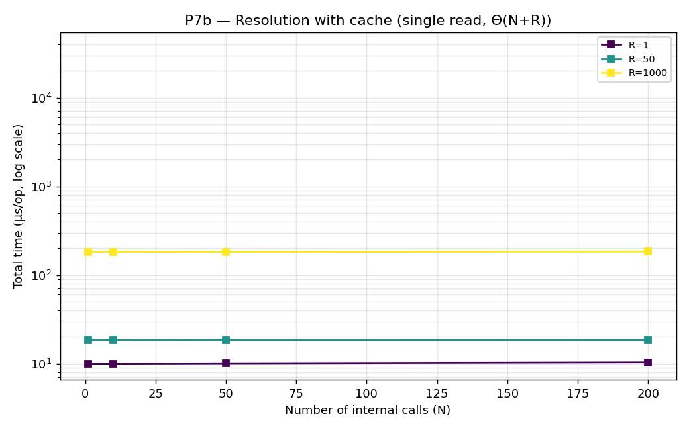

**Resultado.** O caminho com cache é praticamente independente de N: uma leitura do registo (O(M))
seguida de N *lookups* em memória desprezáveis. *Speedup* a N=200: ~162× (M=1), ~198× (M=50),
~195× (M=1000) — o pior canto (N=200, M=1000) desce de **~105 ms para ~0,54 ms**.

**Justificação.** `sem cache` = N · (leitura O(M) + *lookup*) = **Θ(N·M)**: no gráfico P7a as curvas
sobem com N e deslocam-se para cima com M. `com cache` = 1 leitura O(M) + N · *lookup* O(1) =
**Θ(N+M)**: no P7b as curvas são planas em N, separadas apenas por M (custo da leitura única). As
duas figuras partilham o eixo log-y, tornando o desnível visível.

**Nota (resolver completo).** Com o resolver já com cache, o custo de `resolve(workflow)` passa de
N·M a **Θ(N+M)**: no pior canto (N=200, M=1000) desce de ~150 ms para ~0,75 ms. O termo O(N)
residual é só a reconstrução da árvore do workflow (N cópias de nós), barato (~0,7 µs/nó) e
inevitável, já não a re-leitura do ficheiro.

---

## P8 — Resolução do workflow vs nº de funções distintas (F) × nº de chamadas (N), com M=F

**Objetivo.** Caracterizar o custo de resolução de *endpoints* de um workflow real ao longo dos seus
dois eixos intrínsecos: o nº de funções **distintas** que o workflow chama (F) e o nº total de
**chamadas** (N). As N chamadas distribuem-se *round-robin* pelas F funções (ex.: F=4/N=6 →
F1 2×, F2 2×, F3 1×, F4 1×) e o registo contém **exatamente** essas F funções (**M = F**) — o caso
realista em que o registo tem só as funções que o workflow usa (o efeito de um registo
sobredimensionado, M independente de F, é o eixo do P9). Mede-se **só a resolução, sem
renderização**: a otimização em estudo (leitura única do registo) só afeta a resolução, pelo que
renderizar seria apenas uma base constante partilhada que deslocaria ambas as curvas sem alterar o
*speedup*. Compara-se `resolveNaive` (leitura do registo por chamada) com `resolveOptimized`
(leitura única). Ambos produzem um workflow resolvido idêntico, logo o desnível é puramente o custo
de leitura do registo.

**Tempo de resolução (µs) — `resolveNaive` (leitura por chamada), F em linhas / N em colunas:**

| F \ N | 1 | 5 | 10 | 50 | 200 |
|---:|---:|---:|---:|---:|---:|
| 1 | 216 | 1 118 | 2 103 | 9 544 | 38 394 |
| 2 | 192 | 956 | 1 902 | 9 555 | 37 950 |
| 5 | 189 | 995 | 1 911 | 9 663 | 38 468 |
| 10 | 195 | 1 132 | 2 390 | 10 544 | 39 340 |
| 20 | 199 | 997 | 2 096 | 10 017 | 41 205 |
| 50 | 219 | 1 133 | 2 194 | 10 857 | 43 360 |

**Tempo de resolução (µs) — `resolveOptimized` (leitura única):**

| F \ N | 1 | 5 | 10 | 50 | 200 |
|---:|---:|---:|---:|---:|---:|
| 1 | 191 | 195 | 197 | 228 | 337 |
| 2 | 191 | 193 | 200 | 230 | 341 |
| 5 | 191 | 194 | 209 | 228 | 349 |
| 10 | 228 | 197 | 202 | 241 | 362 |
| 20 | 199 | 202 | 215 | 237 | 349 |
| 50 | 224 | 221 | 223 | 251 | 367 |

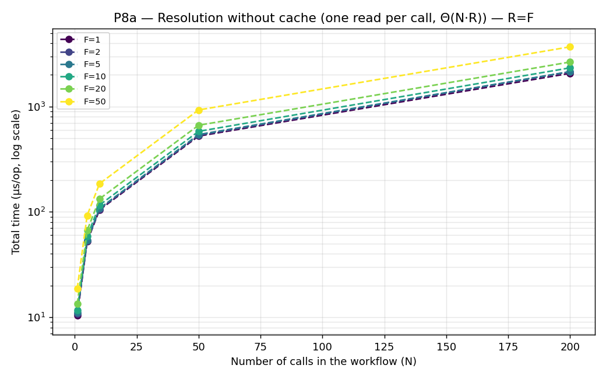

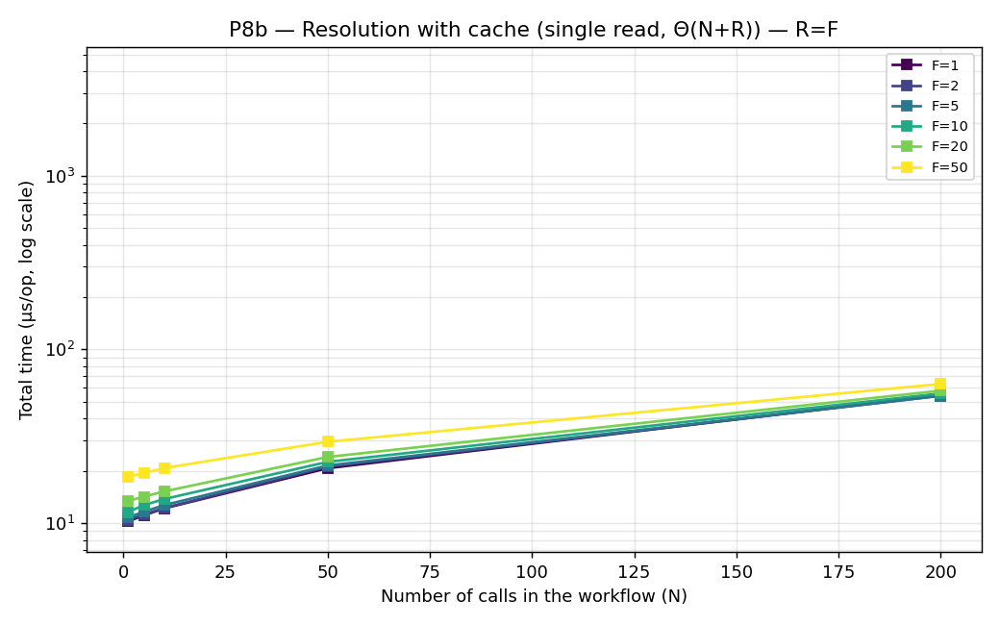

**Resultado.** No caso sem cache, o custo é dominado por **N** e quase indiferente a **F**: as seis
curvas (uma por F) praticamente sobrepõem-se no P8a e sobem linearmente com N (~200 µs por chamada;
9,5–10,9 ms a N=50; ~38–43 ms a N=200). No caso com cache, o custo é quase plano (191 → 367 µs),
subindo devagar com N (reconstrução O(N) da árvore) e com F (leitura O(M=F)). O *speedup* cresce com
N: ~1× a N=1 (uma única leitura, indistinguível), ~44× a N=50 e ~109–114× a N=200.

**Justificação.** Com M=F pequeno, cada leitura do registo é dominada pelo termo fixo b≈190 µs
(abrir/parsear o ficheiro), não pelo termo c·M (percorrer as entradas) — daí as curvas `sem cache`
quase coincidirem para todos os F e a subida vir só de N. `sem cache` = N·(leitura O(M) + *lookup*) =
**Θ(N·M)**; com M=F pequeno reduz-se praticamente a N·b, uma reta em N. `com cache` = 1 leitura O(M)
+ N · *lookup* O(1) + reconstrução O(N) = **Θ(N+M)**, daí a superfície quase plana. O efeito isolado
de **F** (chamadas repetidas vs. distintas) é desprezável porque a resolução é por chamada, não por
função distinta. O eixo que faz o registo pesar — aumentar M para além de F — é o P9.

---

## P9 — Resolução do workflow vs tamanho do registo (M), com F e N fixos

**Objetivo.** O eixo complementar do P8: isolar o efeito do **tamanho do registo (M)** sobre a
resolução, mantendo o workflow fixo (F = 10 funções distintas, N = 50 chamadas) e enchendo o registo
até M entradas (M ≥ F), das quais o workflow só refere as primeiras F. Mesmas duas estratégias, só
resolução (sem render): `resolveNaive` (leitura por chamada, Θ(N·M)) vs `resolveOptimized` (leitura
única, Θ(N+M)).

**Tempo de resolução (µs) — sem cache vs com cache, F=10 / N=50 fixos:**

| M (registo) | sem cache (µs) | com cache (µs) | speedup |
|---:|---:|---:|---:|
| 10 | 9 829 | 237 | ~41,4× |
| 20 | 11 952 | 308 | ~38,8× |
| 50 | 10 899 | 268 | ~40,7× |
| 100 | 12 118 | 275 | ~44,1× |
| 200 | 14 964 | 324 | ~46,2× |
| 1000 | 43 245 | 749 | ~57,8× |

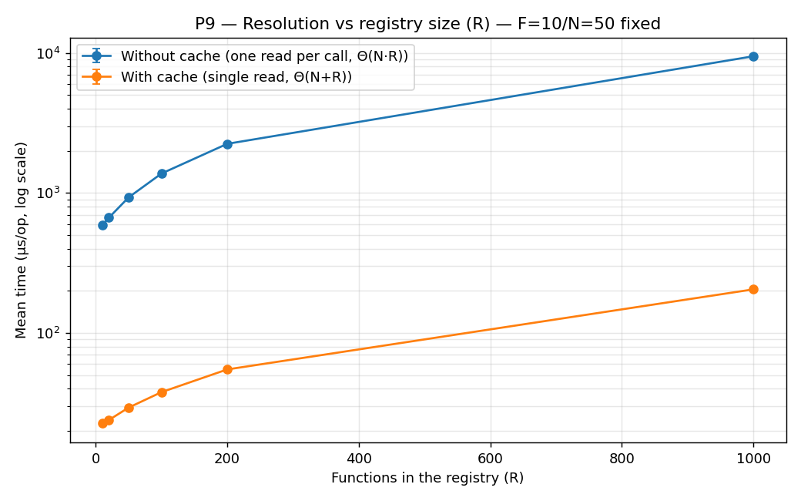

**Resultado.** O caso sem cache sobe com M (9,8 ms a M=10 → 43,2 ms a M=1000): com N=50 chamadas,
relê o ficheiro 50 vezes e cada re-leitura reparsa M entradas. O caso com cache mantém-se quase plano
(237 → 749 µs): uma única leitura O(M) seguida de 50 *lookups*. O *speedup* sobe de ~41× (M=10) a
~58× (M=1000).

**Justificação.** `sem cache` = N·(b + c·M) = **Θ(N·M)**: com N fixo é uma reta em M de declive N·c.
`com cache` = (b + c·M) + N · *lookup* O(1) = **Θ(N+M)**: paga o termo c·M uma só vez, daí a subida
suave. Enquanto no P8 (M=F pequeno) o custo sem cache era dominado por N·b, aqui — com M a crescer
até 1000 — o termo N·c·M torna-se visível e explica a subida. Verificação cruzada com o P8 no ponto
comum F=10/N=50 (M=10): sem cache ≈ 9,8–10,5 ms e com cache ≈ 0,24 ms nos dois testes, coerente.

---

## P10 — Custo real do resolver de auto-deploy AWS (`AwsInternalFunctionResolver`)

**Objetivo.** O P6–P9 provaram e corrigiram o custo Θ(N·M) de reler o registo por chamada, mas só
no `WorkflowInternalCallEndpointResolver` (o resolver "de baixo nível"). O verdadeiro glue da
contribuição (B) "Unificação" — `AwsInternalFunctionResolver.resolve`, que decide "está no registo?
reutiliza : não está? despoleta deploy via QuickFaaS" — nunca foi medido nem corrigido. Mede-se aqui
o seu custo real vs N (chamadas) × M (registo, M=F), mesma grelha do P8. O registo é pré-populado
com exatamente as F funções que o workflow chama, garantindo sempre *hit* no passo 1 de
`resolveOrDeploy` — nunca se chega ao passo 2 (chamada real ao SDK Lambda). Pura leitura/escrita
local de ficheiro, sem SDK nem rede.

**Tempo de resolução (µs) — `AwsInternalFunctionResolver.resolve`, F em linhas / N em colunas:**

| F \ N | 1 | 5 | 10 | 50 | 200 |
|---:|---:|---:|---:|---:|---:|
| 1 | 356 | 1 684 | 3 338 | 17 806 | 71 825 |
| 2 | 369 | 1 744 | 3 413 | 17 205 | 83 141 |
| 5 | 349 | 1 730 | 3 419 | 16 961 | 67 808 |
| 10 | 355 | 1 738 | 3 421 | 17 509 | 69 700 |
| 20 | 352 | 1 779 | 3 488 | 17 455 | 69 627 |
| 50 | 383 | 1 847 | 3 732 | 22 396 | 73 603 |

*(máquina partilhada, não dedicada — margens de erro largas nesta configuração rápida; ver nota
sobre `-f 3` no `TESTING.md`. Os pontos são consistentes entre si e com a forma Θ(N·M) esperada.)*

**Resultado.** O custo é dominado por **N** e quase indiferente a **F**, tal como no P8 "sem
cache": ~355–360 µs/chamada em todo o intervalo de F (200 chamadas: 71,8 ms a F=1 → 73,6 ms a
F=50). É bastante mais caro que o `resolveNaive` isolado do P8 (~200 µs/chamada) — a diferença vem
do próprio glue de produção (`println`s coloridos por chamada, verificação
`host.isNotBlank()`/`path.isNotBlank()`, construção do URL `lambda://`), não só da releitura do
registo.

**Justificação.** `AwsInternalFunctionResolver.resolve` = N·(leitura O(M) + *lookup* + overhead de
glue) = **Θ(N·M)**, exatamente como `resolveNaive` no P8/P9, porque `resolveOrDeploy` chama
`registry.tryResolveEntry` (que chama `readAll()`) uma vez por chamada, sem cache — nunca recebeu a
otimização de leitura única do P7. Se recebesse (lendo o registo uma vez por `resolve(workflow)`,
como o P8 "com cache"), o custo cairia para a mesma ordem de Θ(N+M) (~367 µs no pior canto do P8) —
um *speedup* projetado de ~200× no ponto F=50/N=200 (73 603 µs → ~367 µs), sem sequer contar o custo
extra dos `println`. Fica documentado como oportunidade de otimização concreta e ainda não aplicada
ao glue de produção.

## P11 — Custo real do resolver de auto-deploy GCP (`WorkflowInternalFunctionResolver`)

**Objetivo.** Gémeo GCP do P10: mede o custo real de `WorkflowInternalFunctionResolver.resolve`, o
glue de auto-deploy do lado Google, mesma grelha N × M=F. O registo usa URLs `.cloudfunctions.net`
(1ª geração), o que faz `resolveOrDiscoverInternal` devolver logo após o *hit* no registo, sem
chamar a API REST do Cloud Run (`inspector.lookupByServiceName`) nem aceder a `regions` (`by lazy`,
nunca avaliado neste caminho) — mantendo o benchmark 100% local. `CloudRunV2ServiceInspector` e
`CloudRunLocationsV1RestClient` são construídos com um `GoogleAccessTokenProvider` explícito que
embrulha um `AccessToken` fixo (via `GoogleCredentials.create`), evitando que os construtores destas
duas classes disparem `GoogleCredentials.getApplicationDefault()` — ver gotcha documentado no
`CLAUDE.md`.

**Tempo de resolução (µs) — `WorkflowInternalFunctionResolver.resolve`, F em linhas / N em colunas:**

| F \ N | 1 | 5 | 10 | 50 | 200 |
|---:|---:|---:|---:|---:|---:|
| 1 | 398 | 2 205 | 3 837 | 19 908 | 76 812 |
| 2 | 400 | 1 952 | 3 959 | 20 418 | 79 856 |
| 5 | 459 | 2 068 | 4 001 | 24 333 | 78 215 |
| 10 | 395 | 1 971 | 4 436 | 19 744 | 78 525 |
| 20 | 402 | 2 045 | 3 955 | 20 143 | 78 037 |
| 50 | 428 | 2 118 | 4 285 | 20 811 | 83 269 |

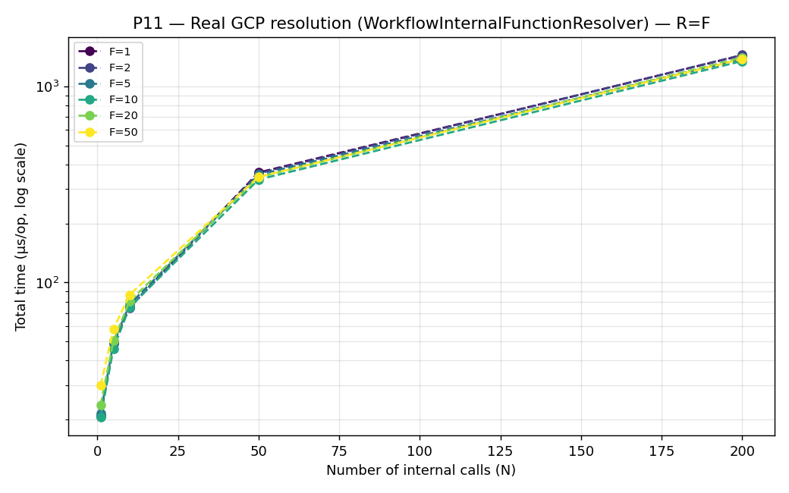

*(mesma máquina/ressalva de margens de erro do P10.)*

**Resultado.** Mesmo padrão Θ(N·M) do P10, ~7–8% mais caro por chamada (~385–430 µs/chamada em
todo o intervalo de F; 200 chamadas: 76,8 ms a F=1 → 83,3 ms a F=50). A diferença face ao AWS vem
do glue adicional específico do GCP (verificação `isFirstGenCloudFunction`, construção do par
host/path via `URI`, mais um `GoogleAccessTokenProvider`/`CloudRunV2ServiceInspector`/
`CloudRunLocationsV1RestClient` construídos por *trial*), não da leitura do registo em si — o termo
de I/O é o mesmo `FunctionRegistryStore`.

**Justificação.** Mesma equação do P10: Θ(N·M), nunca corrigido com leitura única. A pequena
diferença de constante entre P10/P11 é o próprio código de glue de cada provider, não o mecanismo
de registo — consistente com o P8/P9, onde o termo dominante a F=M pequeno é o custo fixo `b`
(abrir/parsear o ficheiro) por chamada, e não o termo `c·M`.

---

## P12 — Custo de renderização vs largura de Choice / Parallel

**Objetivo.** P1/P2/P4/P5 variam sempre o mesmo tipo de step (CALL) — nunca a largura de um
`Choice` (nº de condições) nem de um `Parallel` (nº de branches), apesar do `AmazonChoiceRenderer`/
`AmazonParallelRenderer` serem praticamente triviais (poucas linhas, sem serialização por item)
enquanto o `GoogleParallelRenderer.internalEndRender` faz uma **interseção de sets de variáveis**
partilhadas entre o branch e o contexto exterior — um custo nunca antes medido. Mede-se aqui o
tempo de renderização (AWS + GCP) de um único step Choice/Parallel vs a sua largura.

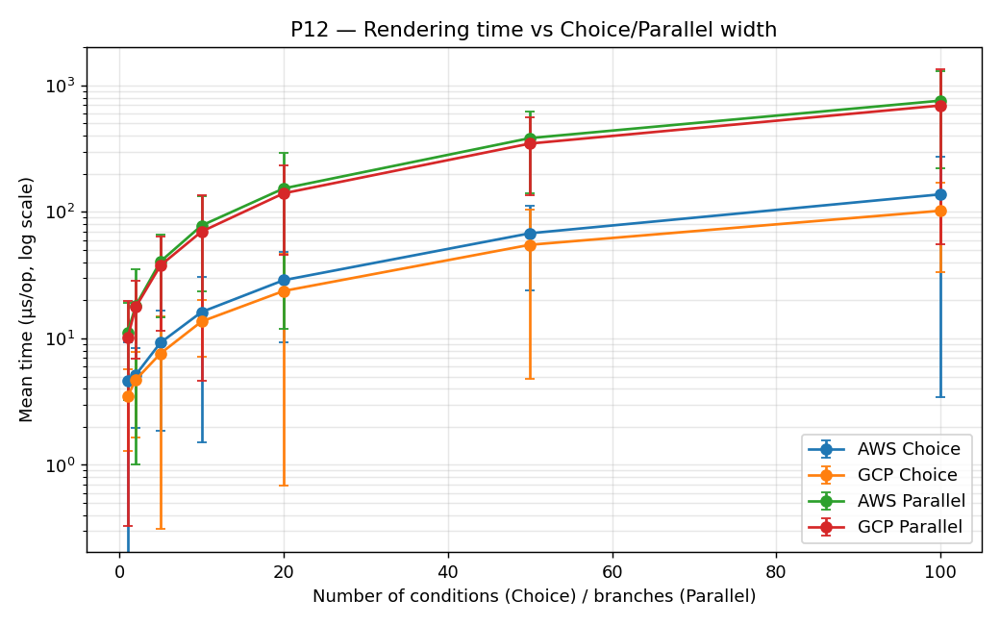

*(mesma máquina/ressalva de margens de erro do P10/P11 — visíveis no gráfico, sobretudo a
larguras baixas onde o tempo absoluto é pequeno.)*

**Resultado.** Choice e Parallel crescem de forma aproximadamente linear com a largura, nos dois
providers — sem o crescimento superlinear do lado GCP que a leitura do código sugeria. Choice: AWS
4,6 µs (largura 1) → 138 µs (largura 100); GCP 3,5 µs → 102 µs. Parallel: AWS 11,1 µs → 758 µs; GCP
10,1 µs → 694 µs. Em toda a gama medida o AWS é ligeiramente **mais** caro que o GCP, e não o
inverso — o oposto da hipótese inicial.

**Justificação.** O Parallel é, como esperado, mais caro que o Choice nos dois lados (~4-5× na
largura 100), consistente com uma branch completa (com os seus próprios steps) a ser construída por
unidade de largura, enquanto o Choice só serializa uma condição. Mas a assimetria hipotetizada a
partir da leitura do código-fonte — o custo de interseção de conjuntos de variáveis em
`GoogleParallelRenderer.internalEndRender` crescer mais depressa do que o lado Amazon — **não se
confirma** nesta medição: como os workflows gerados por `withParallelBranchWidth`/`withChoiceBranches`
têm steps-folha sem variáveis (`independent()` puro, sem `AssignContext`), o conjunto de variáveis
em scope fica ~vazio independentemente da largura, e a interseção de sets é O(1) por branch. Isto
isola corretamente o eixo que este benchmark mede — custo vs nº de branches/condições — do eixo
ainda por medir: custo vs nº de variáveis partilhadas em scope, que exigiria um gerador com
`AssignContext`s dentro dos branches. Fica documentado como trabalho futuro, e como um lembrete de
que a leitura do código sozinha não substitui a medição.

---

## P13 — Custo de escrita incremental no registo (`FunctionRegistryStore.put`)

**Objetivo.** P6–P11 mediram o **lado de leitura** do `FunctionRegistryStore` (`resolveUrl`/
`tryResolveEntry`, relê o ficheiro inteiro por chamada). Mas os resolvers reais também **escrevem**:
sempre que uma função é descoberta/desenhada pela primeira vez, chamam `registry.put(key, meta)` —
e `put()` nunca foi medido. Lendo o código: `put()` chama `readRootOrNew()` (lê+reparsa o ficheiro
inteiro) e depois `writeRoot()` (reescreve o ficheiro inteiro) — cada chamada custa O(M), onde M é
o tamanho *atual* do registo. Regista **K** funções sucessivas num registo que começa com **M0**
entradas: custo total = Σ O(M0+i) para i=0..K-1 = **Θ(K·M0 + K²)**, quadrático no próprio K quando
M0 é pequeno. Mede-se diretamente `FunctionRegistryStore.put()`, sem passar pelo resolver completo
(tal como o P6 já chama o `FunctionRegistryStore` diretamente) — pura I/O local, sem SDK nem rede.

**Tempo total (µs) — K escritas sucessivas, K em linhas / M0 em colunas:**

| K \ M0 | 0 | 10 | 50 | 200 | 1000 |
|---:|---:|---:|---:|---:|---:|
| 1 | 2 673 | 2 860 | 3 235 | 4 139 | 2 761 |
| 5 | 12 887 | 13 149 | 14 955 | 19 710 | 13 874 |
| 10 | 27 691 | 26 986 | 29 912 | 39 164 | 24 029 |
| 50 | 154 601 | 144 606 | 161 098 | 206 385 | 123 322 |
| 100 | 329 757 | 304 187 | 330 100 | 419 531 | 237 910 |

*(3 forks (`-f 3`) precisamente para reduzir ruído — erros já pequenos e consistentes na maioria
dos pontos; ver nota na Justificação sobre a coluna M0=1000.)*

**Resultado.** O custo cresce claramente mais que linear em K: entre K=1 e K=100 (100× mais
escritas), o tempo total sobe ~120–125× em vez de ~100× — a assinatura do termo K² a somar-se ao
K·M0. Para M0 ∈ {0, 10, 50, 200} a subida com M0 é a esperada (quanto maior o registo de partida,
mais caro cada `put()`): a K=100, sobe de 329,8 ms (M0=0) para 419,5 ms (M0=200), um aumento
consistente com o termo K·M0 do modelo.

**Justificação.** `put()` = O(M0+i) na i-ésima escrita, logo K escritas custam
Σ_{i=0}^{K-1} O(M0+i) = **Θ(K·M0 + K²)**. O termo K² domina a subida entre colunas de K (cada
salto ~2–5× em K dá um salto correspondentemente maior no tempo, não proporcional); o termo K·M0
explica a subida mais suave ao longo de M0 (para M0 ∈ {0,10,50,200}). A coluna M0=1000 foge a este
padrão — sai sistematicamente **abaixo** de M0=200 em vez de acima, mesmo repetindo a medição com
`-f 3` (forks frescos por combinação, o que devia excluir *warm-up* de JIT entre parâmetros
diferentes). A explicação mais provável não é o código em si, mas a máquina partilhada/não dedicada
onde isto corre (mesma ressalva do P10–P12): M0=1000 é sempre a última coluna processada em cada
grupo de K, pelo que efeitos ao nível do SO (cache de ficheiros, processos em segundo plano,
throttling térmico) ao longo dos ~30 minutos de execução total podem introduzir viés que uma
repetição de forks não elimina. A conclusão principal do P13 — o crescimento Θ(K²) em K — é robusta
em todas as colunas; a curva exata vs. M0 precisaria de `-f 3`+ordem aleatória dos parâmetros numa
máquina dedicada para ser conclusiva nesse ponto específico.

---

## P14 — Correspondência exata vs. por sufixo no resolver "com cache"

**Objetivo.** P7–P9 provaram que ler o registo uma só vez transforma a resolução de Θ(N·M) em
Θ(N+M). Mas isso pressupõe que cada `resolveUrlIn` acerta em O(1) (`all[functionName]`). O próprio
método suporta um segundo caminho — correspondência por **sufixo** (`"region/functionName"`, para
desambiguação regional) — que, ao falhar o *match* exato, faz um `filterKeys` sobre **todo** o mapa
em memória: O(M) por chamada. Nenhum benchmark anterior testou este caminho (P6–P11 usam sempre
nomes exatos). Mede-se aqui, com F=10/N=50 fixos (mesmo ponto do P9) e M a variar, o custo do
resolver "com cache" quando o registo tem chaves **exatas** (o caso já medido, aqui como controlo
cruzado com o P9) vs. quando tem chaves **qualificadas por região** — o workflow continua a
referenciar nomes nus, pelo que o *match* exato falha sempre e cada chamada paga o scan O(M).

**Tempo de resolução (µs) — exact match vs. suffix match, F=10 / N=50 fixos:**

| M (registo) | exact match (µs) | suffix match (µs) | razão |
|---:|---:|---:|---:|
| 10 | 219 | 228 | ~1,04× |
| 20 | 224 | 241 | ~1,07× |
| 50 | 250 | 278 | ~1,11× |
| 100 | 259 | 333 | ~1,29× |
| 200 | 309 | 442 | ~1,43× |
| 1000 | 768 | 1 456 | ~1,90× |

**Resultado.** A coluna *exact match* reproduz de perto o "com cache" já medido no P9 no mesmo
ponto F=10/N=50 (P9: 237→749 µs de M=10 a M=1000; aqui: 219→768 µs) — confirmação cruzada de que
`resolveExactMatch` é arquitetonicamente o mesmo resolver, só com um registo diferente. A coluna
*suffix match* fica sistematicamente **acima**, e a razão entre as duas cresce de forma monótona
com M: ~1,04× a M=10, ~1,90× a M=1000 — o dobro do custo, apenas por as chaves do registo estarem
qualificadas por região em vez de serem nomes nus, sem qualquer outra diferença.

**Justificação.** `resolveExactMatch` = 1 leitura O(M) + N *lookups* O(1) = **Θ(N+M)**, igual ao
P9. `resolveSuffixMatch` = 1 leitura O(M) + N *scans* O(M) = **Θ(N+N·M) ≈ Θ(N·M)** — a mesma classe
de complexidade do resolver "sem cache" do P7-P9, só que agora reintroduzida *dentro* do resolver já
corrigido, por uma particularidade do formato das chaves e não por falta de otimização de leitura.
Note-se que a magnitude absoluta aqui (µs, não ms) fica muito abaixo do "sem cache" do P8/P9 (que
chega às dezenas de ms): ali o M é lido do **disco** a cada chamada (I/O + parsing); aqui o *scan*
de sufixo é sobre um mapa **já em memória** (`registrySnapshot`, carregado uma única vez), pelo que
o custo por elemento é ordens de grandeza mais barato. A mudança de classe de complexidade
(O(1)→O(M) por *lookup*) é real e mensurável — visível na razão crescente entre as duas colunas —
mas só se tornaria dramática em termos absolutos com um N muito maior ou um registo muito maior do
que os testados aqui (o custo extra escala com N·M, não só M).

---

## S1 e S2 — Métricas de tamanho (inspiradas no "ZIP size (KB)" do QuickFaaS)

A avaliação inicial do QuickFaaS mediu o "ZIP size (KB)" do *bundle* de deployment (agnóstico
10877 KB vs não-agnóstico 10861 KB → ~16 KB de overhead). Estende-se aqui a dimensão de tamanho em
dois planos, ambos locais.

### S2 — Tamanho do artefacto renderizado (ASL JSON vs GCP YAML)

**Objetivo.** Medir o tamanho (bytes) do workflow gerado — não da função — em AWS vs GCP, em função
de N; complementa o tempo (P1) com a dimensão de espaço. Medição direta com `ArtifactSizeMeasurement`
(não JMH).

| N | AWS ASL JSON (bytes) | GCP YAML (bytes) |
|---:|---:|---:|
| 1 | 1 019 | 487 |
| 10 | 9 479 | 3 997 |
| 50 | 47 199 | 19 637 |
| 100 | 94 349 | 39 187 |
| 200 | 188 949 | 78 387 |

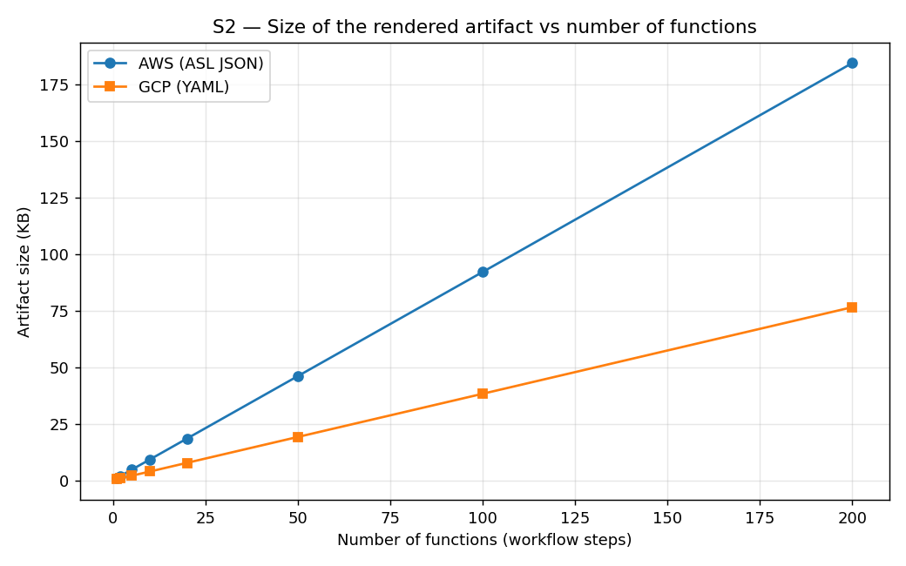

**Resultado.** Crescimento **linear** em N: ~944 bytes/função (AWS) e ~392 bytes/função (GCP). O ASL
JSON é ~2,4× mais volumoso que o YAML para o mesmo workflow.
**Justificação.** Coerente com a maior verbosidade da Amazon States Language (cada estado repete
`Type`/`Resource`/`ResultPath` e chavetas JSON) face ao YAML mais compacto — a mesma razão do
custo-base superior do AWS no P2.

### S1 — Bundle/ZIP size da Lambda: AWS agnóstico vs nativo

**Objetivo.** Medir o overhead de tamanho (bytes) que a camada agnóstica do QuickFaaS acrescenta ao
*bundle* de deployment da Lambda, face a uma implementação AWS nativa equivalente — réplica, para o
provider AWS, da métrica "ZIP size (KB)" da avaliação original do QuickFaaS (GCP/Azure).

A mesma função (`hello-lambda-fn`) empacotada de duas formas (fat-jar via maven-shade), medida com
`measure_bundle_size.sh`:

| Bundle | Tamanho |
|---|---:|
| AWS agnóstico (QuickFaaS: `MyFunctionClass` + adaptador `AwsHttpTemplate` + `aws-lambda-java-core`) | **14 552 bytes (14,2 KB)** |
| AWS nativo (um único `RequestHandler`, mesma lógica) | **13 647 bytes (13,3 KB)** |
| **delta (overhead da camada agnóstica)** | **905 bytes (0,88 KB)** |

**Resultado.** A camada AWS acrescenta ao *bundle* apenas o adaptador `AwsHttpTemplate` —
**~0,88 KB** (6,6% deste *bundle* mínimo), ainda menor em absoluto que os ~16 KB medidos pelos
colegas para GCP/Azure.
**Nota.** Os 6,6% estão inflacionados porque a função-base é trivial (só `aws-lambda-java-core`,
~14 KB). Numa função real (bundle de MB), os mesmos ~0,9 KB do adaptador são <0,1% — confirmando,
também para AWS, que o overhead de empacotamento da abstração é negligenciável.

**Corroboração pelo código real (e um bug encontrado).** O valor acima veio de um script que
*reproduz* o POM/wrapper do QuickFaaS. Para validar com o código de produção, acrescentou-se
`AwsLambdaFunctionBuildIntegrationTest` (`QuickFaaS-Deployment`), que invoca
`AwsLambdaFunction.buildAndZip("aws")` — o `mvn package` real — e para antes de `deployZip` (a
chamada à cloud). O teste confirmou o mesmo valor (14 685 bytes), mas só depois de corrigir um bug
de não-determinismo em `AwsBuildScripts.copyFatJarAsZip`: sem `<build><finalName>` ao nível do
projeto, o Maven gera dois jars em `target/` (o fino do plugin `jar` e o gordo do `shade`); o filtro
antigo aceitava ambos e escolhia pela ordem de listagem do sistema de ficheiros, não garantida,
podendo selecionar o jar errado (sem dependências) em produção. Corrigido para procurar o jar pelo
nome exato do `finalName`. Detalhe em `TESTING.md` §3.1.

---

## Síntese e discussão

1. A renderização é **linear** no número de funções (P1) e de inputs (P2), sem comportamento
   quadrático.
2. O custo da unificação (resolução das funções internas) é linear e pequeno por chamada (P3); o P6
   quantifica a degradação **Θ(N·M)**: ≈ 181 µs (fixo, I/O + parsing) + 0,57 µs por função
   registada — dominado pelo termo fixo até M ≈ 320 e mitigável lendo o registo uma só vez.
3. O renderizador AWS é competitivo com o GCP, dentro da margem de erro (P4).
4. A profundidade estrutural é um terceiro fator de custo, mais pronunciado no AWS (P5).
5. O tamanho do registo (P6) é uma quarta dimensão, independente de N; para projetos reais o fator
   dominante é o número de releituras do ficheiro, não a sua dimensão.
6. A otimização de leitura única (P7) elimina o produto N·M: a resolução passa de **Θ(N·M)** para
   **Θ(N+M)**, com *speedup* de ~200× no pior canto (de ~150 ms para ~0,75 ms) — identificar
   (P3/P6) → corrigir → quantificar (P7).
7. Tamanho (S1/S2): o artefacto cresce linearmente, com o ASL JSON ~2,4× mais volumoso que o YAML
   (S2); e a camada AWS agnóstica acrescenta ao *bundle* apenas ~0,9 KB — overhead negligenciável em
   funções reais (S1), em linha com a avaliação do QuickFaaS.

**Enquadramento global.** Todos os valores estão na ordem dos microssegundos (≤ 1 ms mesmo para 200
funções): a renderização e a resolução não são o gargalo — o custo dominante é o *deployment* na
nuvem (segundos). O sobrecusto da unificação é assintoticamente linear e praticamente irrelevante na
operação real. As ressalvas de variância (P4) decorrem do recoletor de lixo e da partilha de CPU,
mitigáveis com `-f 3` e máquina dedicada, sem alterar as tendências.
