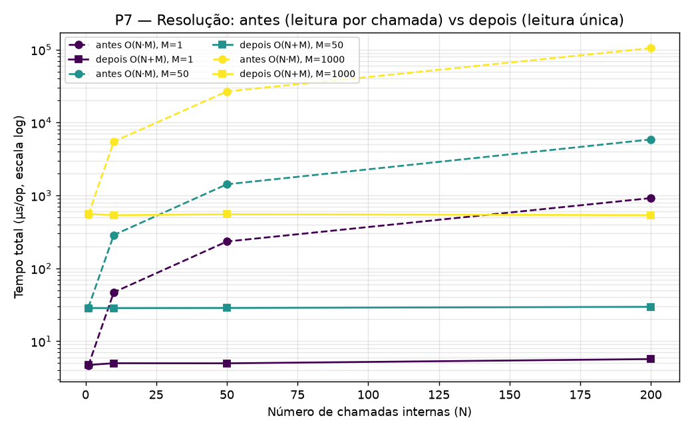

# Resultados dos testes de desempenho (P1–P7) e de tamanho (S1–S2)

Medições **locais** de **renderização** (DSL → Amazon States Language / GCP Workflows YAML) e de
**resolução** de funções internas. Não há chamadas à nuvem. Geradas com JMH a partir do módulo
`benchmark/`.

## Metodologia

- **Ferramenta:** JMH 1.37, modo `AverageTime`, unidade **µs/op** (microssegundos por operação),
  com `Blackhole` a consumir o resultado de cada execução para impedir que o compilador elimine
  código aparentemente inútil (*dead-code elimination*).
- **Configuração da execução:** `-f 1 -wi 3 -i 5 -w 1 -r 1` — uma *fork* da JVM, 3 iterações de
  aquecimento e 5 de medição, de 1 s cada. O aquecimento garante que se mede o código já
  compilado pelo JIT (regime estacionário) e não o interpretador.
- **Dados brutos:** `jmh-results.csv` (P1–P5), `jmh-results-p6.csv` (P6, que acrescenta a
  dimensão `Param: m`) e `jmh-results-p7.csv` (P7 antes/depois + P3/P6 reexecutados com o resolver
  otimizado). **Gráficos:** ficheiros `P1_*.png … P7_*.png`, regeneráveis com
  `python3 plot_benchmarks.py`.
- **Modelo de custo (para as justificações):** a renderização é uma travessia *depth-first*
  (`DepthFirstNodeVisitorTraversor` + `NodeContextVisitor`) que visita **uma vez** cada nó da
  árvore de objetos do workflow (AST) e acumula texto num `StringBuilder` partilhado
  (`IndentedRenderingContext.append(...)`). Como o `append` tem custo **amortizado O(1)**, o tempo
  total é proporcional ao número de nós e ao tamanho do texto produzido — sem o termo quadrático
  que a concatenação de `String` imutável introduziria.
- **Ressalva:** execução em ambiente partilhado e com configuração reduzida; os valores absolutos
  servem para comparar **tendências** e **relações**, não como números definitivos de hardware.
  Para a versão final recomenda-se repetir com `-f 3` e máquina dedicada.

---

## P1 — Degradação com o número de funções

| N (funções) | AWS (µs) | GCP (µs) |
|---:|---:|---:|
| 1 | 5,7 | 6,0 |
| 10 | 40,5 | 45,1 |
| 50 | 190,3 | 263,7 |
| 100 | 428,7 | 445,3 |
| 200 | 810,9 | 901,2 |

**Resultado.** O tempo de renderização cresce de forma **aproximadamente linear** com o número de
funções (≈4 µs por função adicional, em ambos os destinos), sem sinais de comportamento
quadrático.

**Justificação.** Um workflow de N passos independentes contém Θ(N) nós na AST. A travessia
visita cada nó exatamente uma vez e cada passo emite uma quantidade **limitada e constante** de
texto, pelo que o tempo total obedece a T(N) = a·N + b, em que `b` é o custo fixo de arranque
(criação do contexto e despacho inicial), dominante apenas para N pequeno. O custo marginal medido
mantém-se constante em todo o intervalo, o que **confirma empiricamente** a ausência de termo
super-linear: se o texto fosse acumulado por concatenação imutável, cada novo passo recopiaria o
prefixo já produzido e o custo seria Θ(N²) — o que não se observa. A linearidade valida a escolha
de uma travessia em passagem única com acumulação por `StringBuilder`.

---

## P2 — Efeito do número de *inputs* da função

Pergunta dos orientadores: **uma função que recebe mais *inputs* demora mais a renderizar?** Nota
de modelação: no workflow renderizado não entra a assinatura Java/Python da função — cada **input
da função materializa-se como um argumento passado na chamada** (parâmetro de *query*/corpo da
`CallContext`). Portanto varia-se aqui o número de inputs por chamada, com o número de funções fixo.

| Inputs por função | AWS (µs) | GCP (µs) |
|---:|---:|---:|
| 0 | 49,3 | 27,7 |
| 1 | 85,7 | 77,7 |
| 5 | 142,3 | 150,2 |
| 10 | 184,5 | 243,2 |
| 20 | 350,3 | 440,5 |

**Resultado.** **Sim** — o número de inputs afeta o tempo de renderização de forma
**aproximadamente linear** (~15 µs por input adicional). O GCP parte de um valor mais baixo (função
sem inputs) mas cresce mais depressa, ultrapassando o AWS a partir de ~5 inputs.

**Justificação.** Cada input é escrito individualmente na chamada (resolução do termo + emissão de
um par chave-valor no argumento). Com N funções fixo, o trabalho descreve-se por T(p) = N·(c·p + k):
o termo `c·p` é o custo dos inputs e `N·k` é o custo-base por chamada (a estrutura do estado sem
inputs). Daqui resulta a **linearidade em p** e a **interceção positiva em p = 0**. A **base maior
no AWS** (k_AWS > k_GCP) explica-se pelo facto de a Amazon States Language emitir, por chamada, mais
estrutura fixa (`Type`, `Resource`, `Parameters`, `ResultSelector`, `ResultPath`) do que o
`call:`/`args:` do GCP. O **declive maior no GCP** (c_GCP > c_AWS) reflete um custo por input
superior na serialização YAML. Como uma reta tem base maior e a outra declive maior, a
**interseção** por volta dos 5 inputs é uma consequência matemática inevitável. Confirma-se que o
número de inputs da função constitui uma segunda dimensão de custo, independente do número de
funções.

> Nota de implementação: o benchmark chama-se `BenchmarkRenderingByParameterCount` e o gerador
> `callWithParameters(p)` — "parameter" aqui designa cada **input da função** passado na chamada.

---

## P3 — Custo da unificação: resolução de funções internas

| Nº de chamadas | Internas — resolução (µs) | Externas — sem resolução (µs) |
|---:|---:|---:|
| 1 | 7,5 | 0,02 |
| 10 | 74,6 | 0,14 |
| 50 | 368,0 | 0,65 |
| 100 | 747,2 | 1,10 |
| 200 | 1511,4 | 2,34 |

**Resultado (a métrica central da contribuição).** Resolver os endpoints das funções internas — o
passo que liga as duas ferramentas — custa **~7,5 µs por função interna** e escala
**linearmente**. As chamadas externas, que não disparam resolução, são praticamente gratuitas
(~0,01 µs).

**Justificação.** O caminho **externo** termina de imediato (`internalCallExtractor(call) ?: return
call`): apenas percorre a árvore e faz uma cópia estrutural, com custo ínfimo — é o *baseline* que
isola o efeito da unificação. O caminho **interno** invoca, por cada chamada,
`registry.resolveUrl(nome)`, que executa `readAll()` — isto é, **lê o ficheiro do registo do disco
e reinterpreta o respetivo JSON na íntegra** — seguido de procura no mapa, *parsing* do URL
(`java.net.URI`) e cópia da `CallContext`. Como o registo do ensaio tem **tamanho fixo (uma
entrada)**, esse custo é **constante por chamada** (~7,5 µs), donde T(N) = a·N — a reta
perfeitamente linear observada. O valor relativamente elevado de 7,5 µs (alto para uma simples
consulta em mapa) deve-se precisamente a essa **releitura e reinterpretação do ficheiro em cada
invocação**, sem cache em memória.

**Caveat de escalabilidade.** Dado que `readAll()` é Θ(M) (interpreta todo o registo) e o caminho
alternativo varre as M entradas, a resolução é, no caso geral, **Θ(N·M)**, em que M é o tamanho do
registo. O ensaio fixa M = 1, isolando a dependência em N como linear; **num cenário real em que o
registo cresça com o número de funções distintas (M ∝ N), a resolução degradaria para Θ(N²)**.
Trata-se de uma oportunidade de otimização concreta — ler o registo **uma só vez** por
`resolve(workflow)` (ou mantê-lo em memória) reduziria o custo para Θ(N + M). Ainda assim, em termos
absolutos o custo é negligenciável face ao tempo de *deployment* real (segundos).

---

## P4 — Renderizador AWS vs GCP

| N | AWS (µs) | GCP (µs) |
|---:|---:|---:|
| 1 | 5,8 | 5,8 |
| 50 | 221,4 | 233,0 |
| 100 | 423,0 | 469,5 |
| 200 | 817,4 | 912,3 |

**Resultado.** O renderizador AWS (a contribuição) tem custo equivalente ao renderizador GCP já
existente — mesma ordem de grandeza em todo o intervalo, com o GCP ligeiramente mais caro à escala.

**Justificação.** Ambos partilham a mesma travessia e o mesmo mecanismo de acumulação de texto,
diferindo apenas nos renderizadores concretos de cada nó; logo, ambos pertencem à classe Θ(N) e as
retas só podem diferir nas constantes. A pequena vantagem do AWS à escala (~12% em N = 200) é
coerente com o facto de a serialização YAML do GCP envolver mais formatação do que a emissão direta
de JSON. **Contudo**, as barras de erro são largas nos pontos maiores do AWS (±115 µs em N = 100;
±185 µs em N = 200) e **sobrepõem-se** às do GCP: a leitura academicamente correta é de
**equivalência assintótica**, não de superioridade de um renderizador. A maior variância em N
elevado explica-se pela pressão do recoletor de lixo (realocações do `StringBuilder` e *garbage*
transitório proporcional ao tamanho do texto) e pela contenção de CPU em ambiente partilhado —
fatores que alargam o intervalo de confiança sem alterar a tendência.

---

## P5 — Efeito da estrutura/aninhamento

| Profundidade | AWS (µs) | GCP (µs) |
|---:|---:|---:|
| 0 | 83,9 | 96,3 |
| 1 | 109,7 | 100,8 |
| 3 | 155,4 | 114,5 |
| 5 | 205,8 | 133,6 |

**Resultado.** Mantendo fixo o número total de passos, **aumentar a profundidade de aninhamento**
(blocos `parallel`/`iteration` encadeados) aumenta o tempo de renderização. O AWS é
**mais sensível** ao aninhamento (≈2,5× de profundidade 0 a 5) do que o GCP (≈1,4×).

**Justificação.** A profundidade introduz **nós-contentor** adicionais na árvore (cada nível de
`parallel`/`iteration` é um nó com o seu próprio enquadramento de saída) e, sobretudo, **alonga o
prefixo de indentação**: o `IndentedRenderingContext` antepõe a indentação a cada linha, e o seu
comprimento é proporcional à profundidade. Assim, mesmo com o número de folhas fixo, tanto o número
de nós como o número de caracteres emitidos por linha crescem com a profundidade, donde T(d) ≈ a·d
+ b (a N constante). O AWS é mais sensível porque a Amazon States Language representa cada nível
aninhado com mais estrutura obrigatória (estados `Parallel`/`Map`, `Branches`/`Iterator`,
`ResultPath`, etc.) do que o YAML do GCP, gerando mais nós e mais texto por nível. Confirma-se que a
**complexidade estrutural** é um fator de custo independente do número bruto de funções.

---

## P6 — Custo de escalabilidade do registo (Θ(N·M))

`FunctionRegistryStore.resolveUrl` não tem cache em memória: cada chamada relê e reparsa o
ficheiro do registo **inteiro** (`readAll()`). O P3 já isolava a dependência em N (nº de chamadas
internas) mas fixava o registo numa única entrada (M = 1), deixando por medir a dependência em M
(nº de funções já registadas). O P6 varia as duas dimensões de forma independente.

**Tempo total de `resolveAllInternal` (µs), por combinação (M, N):**

| M \ N | 1 | 10 | 50 | 200 |
|---:|---:|---:|---:|---:|
| 1 | 178,1 | 1772,7 | 9425,9 | 36346,0 |
| 10 | 186,2 | 1824,6 | 9146,2 | 36713,6 |
| 50 | 206,5 | 2133,3 | 10206,5 | 40478,3 |
| 200 | 278,3 | 2773,3 | 13880,6 | 55616,7 |
| 1000 | 744,6 | 7485,5 | 37316,5 | 149632,1 |

**Controlo `resolveAllExternal`** (nunca toca o registo, independente de M): 0,02 µs (N=1) →
0,13 µs (N=10) → 0,51 µs (N=50) → 1,97 µs (N=200) — os mesmos valores em toda a linha de M,
confirmando que qualquer efeito de M observado acima é especificamente do acesso ao registo.

As quatro curvas `n=1/10/50/200` colapsam visualmente numa só linha — a confirmação direta de que
o custo por chamada depende apenas de M, não de N — enquanto o controlo externo se mantém plano
próximo de zero em toda a escala logarítmica.

**Resultado.** Dividindo o tempo total por N obtém-se o **custo por chamada** de `resolveUrl()`,
que se revela **independente de N** (as quatro colunas do gráfico normalizado colapsam
praticamente na mesma curva) e **crescente com M**:

| M | Custo por chamada (µs) |
|---:|---:|
| 1 | 181,4 |
| 10 | 183,8 |
| 50 | 206,6 |
| 200 | 277,8 |
| 1000 | 746,9 |

Ajustando um modelo linear `custo(M) ≈ b + c·M` aos extremos (M=1, M=1000): `b ≈ 181 µs`,
`c ≈ 0,57 µs`/função registada — um ajuste que erra <6% nos pontos intermédios (M=10, 50, 200),
compatível com o comportamento esperado.

**Justificação.** `readAll()` lê o ficheiro do disco e materializa uma `JsonNode` para **cada**
entrada do registo, pelo que o seu custo é Θ(M). Como `resolveUrl()` é invocado uma vez por chamada
interna, o custo total de resolução é T(N, M) = N · (b + c·M) — precisamente o Θ(N·M) já
identificado (mas não medido) no P3. Os dois termos têm origens distintas: `b ≈ 181 µs` é o custo
**fixo por chamada** (abrir e ler o ficheiro do disco + `parsing` do envelope JSON), praticamente
independente do conteúdo; `c ≈ 0,57 µs`/função é o custo **marginal por entrada** (percorrer o nó
`functions` e construir o `LinkedHashMap` de saída). Note-se que `b` domina `c·M` até M ≈ 320 —
ou seja, para registos de dimensão realista (dezenas a poucas centenas de funções internas por
projeto), o fator dominante **não é o tamanho do registo, mas sim o número de vezes que o ficheiro
é reaberto e reparsado** (uma vez por chamada, em vez de uma vez por `resolve(workflow)`).

**Implicação prática.** Isto reordena a prioridade de otimização sugerida no P3: ler o registo
**uma só vez por `resolve(workflow)`** (em vez de cache-ar por tamanho do registo) elimina o fator
N de ambos os termos, reduzindo o custo de Θ(N·(b + c·M)) para Θ(b + c·M + N) — um ganho maior, e
mais barato de implementar, do que otimizar apenas a travessia do JSON para registos grandes.

---

## P7 — Otimização da resolução: leitura única do registo (Θ(N·M) → Θ(N+M))

O P3 e o P6 identificaram a causa: `WorkflowInternalCallEndpointResolver.resolve` chamava
`FunctionRegistryStore.resolveUrl` **uma vez por chamada interna**, e cada `resolveUrl` relia e
reparava o ficheiro do registo inteiro. A correção lê o registo **uma só vez** por `resolve()`
(método puro `resolveUrlIn` sobre o mapa já lido), preservando exatamente a lógica de resolução.

O benchmark `BenchmarkResolutionOptimization` compara as duas estratégias **na mesma execução e
máquina** (evitando a incomparabilidade P3↔P6): `resolveNaive` (leitura por chamada) vs
`resolveOptimized` (leitura única), varrendo N × M.

**Tempo total (µs) — antes (naive) vs depois (optimized):**

| | N=1 | N=10 | N=50 | N=200 |
|---|---:|---:|---:|---:|
| **naive** M=1 | 4,6 | 47,0 | 233,6 | 920,2 |
| **optimized** M=1 | 4,7 | 5,0 | 5,0 | 5,7 |
| **naive** M=1000 | 543,7 | 5480,8 | 26698,5 | 104889,0 |
| **optimized** M=1000 | 557,4 | 535,7 | 551,8 | 536,6 |

**Resultado.** O caminho otimizado é **praticamente independente de N**: uma só leitura do registo
(O(M)) seguida de N *lookups* em memória (~0,005 µs cada, desprezáveis). O tempo passa a depender
essencialmente de M. *Speedup* a N=200: **~162× (M=1)**, **~198× (M=50)**, **~195× (M=1000)** — o
pior canto (N=200, M=1000) baixa de **~105 ms para ~0,54 ms**.

**Justificação.** `naive` = N · (leitura O(M) + *lookup*) = **Θ(N·M)** (as curvas tracejadas sobem
com N e deslocam-se para cima com M). `optimized` = 1 leitura O(M) + N · *lookup* O(1) =
**Θ(N+M)** (as curvas sólidas são planas em N, deslocando-se com M apenas pela leitura única).

**Nota (resolver completo).** Reexecutando P3 e P6 com o resolver já otimizado, o custo de
`resolve(workflow)` deixa de crescer com N·M e passa a **Θ(N+M)**: no pior canto medido (N=200,
M=1000) desce de **~150 ms para ~0,75 ms**. O termo residual O(N) que subsiste é apenas a
**reconstrução da árvore** do workflow (N cópias de nós) — inevitável e barato (~0,7 µs/nó), já não
a re-leitura do ficheiro.

---

## S1 e S2 — Métricas de tamanho (inspiradas no "ZIP size (KB)" do QuickFaaS)

A avaliação do QuickFaaS inicial mediu o **"ZIP size (KB)"** do *bundle* de deployment (agnóstico
10877 KB vs não-agnóstico 10861 KB → ~16 KB de overhead). Estende-se aqui a dimensão de **tamanho**
em dois planos, ambos locais.

### S2 — Tamanho do artefacto renderizado (ASL JSON vs GCP YAML)
Bytes do **workflow gerado** (não da função) em função de N, com
`ArtifactSizeMeasurement` (medição direta, não JMH).

| N | AWS ASL JSON (bytes) | GCP YAML (bytes) |
|---:|---:|---:|
| 1 | 1 019 | 487 |
| 10 | 9 479 | 3 997 |
| 50 | 47 199 | 19 637 |
| 100 | 94 349 | 39 187 |
| 200 | 188 949 | 78 387 |

**Resultado.** Crescimento **linear** em N: ~944 bytes/função (AWS) e ~392 bytes/função (GCP). O
artefacto **ASL JSON é ~2,4× mais volumoso** que o YAML do GCP para o mesmo workflow.
**Justificação.** Coerente com a maior verbosidade estrutural da Amazon States Language (cada estado
repete `Type`/`Resource`/`ResultPath`/etc. e chavetas JSON) face à sintaxe mais compacta do YAML —
a mesma razão do custo-base superior do AWS observado no P2.

### S1 — Bundle/ZIP size da Lambda: AWS agnóstico vs nativo
Réplica da métrica dos colegas, aplicada ao provider AWS. A mesma função (`hello-lambda-fn`)
empacotada de duas formas (fat-jar via maven-shade), medida com `measure_bundle_size.sh`:

| Bundle | Tamanho |
|---|---:|
| AWS agnóstico (QuickFaaS: `MyFunctionClass` + adaptador `AwsHttpTemplate` + `aws-lambda-java-core`) | **14 552 bytes (14,2 KB)** |
| AWS nativo (um único `RequestHandler`, mesma lógica) | **13 647 bytes (13,3 KB)** |
| **delta (overhead da camada agnóstica)** | **905 bytes (0,88 KB)** |

**Resultado.** A camada AWS do QuickFaaS acrescenta ao *bundle* apenas o **adaptador
`AwsHttpTemplate`** — **~0,88 KB** (6,6% deste *bundle* mínimo). Em **valor absoluto** é ainda
**menor** que os ~16 KB medidos pelos colegas para GCP/Azure.
**Nota.** A percentagem (6,6%) está inflacionada porque a função-base é trivial (só
`aws-lambda-java-core`, ~14 KB). Numa função real com dependências (bundle de MB), os mesmos ~0,9 KB
do adaptador representam **<0,1%** — confirmando, também para AWS, a conclusão do QuickFaaS de que o
overhead de empacotamento da abstração é **negligenciável**.

---

## Síntese e discussão

1. A renderização é **linear** no número de funções (P1) e no número de parâmetros (P2): escala de
   forma previsível, sem comportamento quadrático.
2. O **custo da unificação** (resolução das funções internas) é **linear e pequeno** por chamada
   (P3), mas o P6 confirma e quantifica a degradação **Θ(N·M)**: custo por chamada ≈ 181 µs
   (fixo, I/O + parsing) + 0,57 µs por função registada — dominado pelo termo fixo até M ≈ 320,
   e facilmente mitigável lendo o registo uma só vez por `resolve(workflow)`.
3. O renderizador **AWS** é **competitivo** com o GCP, dentro da margem de erro (P4).
4. A **profundidade estrutural** acrescenta um terceiro fator de custo, mais pronunciado no AWS (P5).
5. O **tamanho do registo** (P6) é uma quarta dimensão de custo, independente de N; o fator
   dominante para projetos reais é o **número de releituras** do ficheiro, não a sua dimensão.
6. A **otimização de leitura única** (P7) elimina o produto N·M: a resolução passa de **Θ(N·M)**
   para **Θ(N+M)**, com *speedup* de ~200× no pior canto medido (de ~150 ms para ~0,75 ms) —
   identificar (P3/P6) → corrigir → quantificar (P7).
7. **Tamanho** (S1/S2): o artefacto renderizado cresce linearmente, com o ASL JSON ~2,4× mais
   volumoso que o YAML (S2); e a camada AWS agnóstica acrescenta ao *bundle* apenas ~0,9 KB (o
   adaptador), overhead negligenciável em funções reais (S1) — em linha com a avaliação do QuickFaaS.

**Enquadramento global.** Todos os valores se situam na ordem dos microssegundos (≤ 1 ms mesmo para
200 funções), pelo que a renderização e a resolução **não constituem o gargalo** do sistema — o
custo dominante é o *deployment* na nuvem (segundos). Conclui-se que o sobrecusto introduzido pela
unificação das duas ferramentas é **assintoticamente linear e praticamente irrelevante** na
operação real. As ressalvas de variância (P4) decorrem do recoletor de lixo e da partilha de CPU,
mitigáveis com `-f 3` e máquina dedicada — sem que isso altere as tendências aqui descritas.
