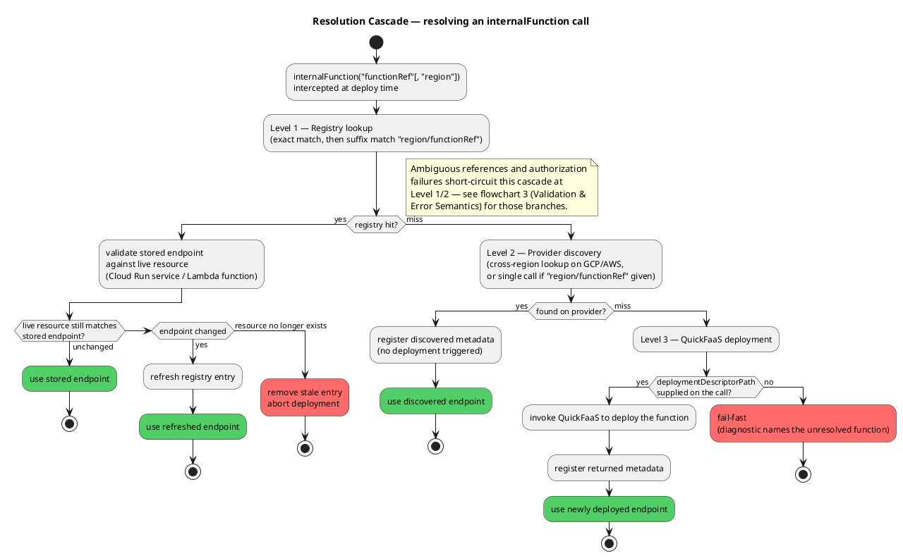
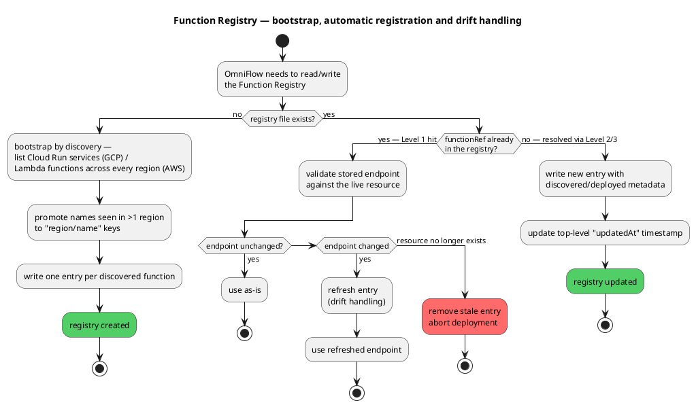
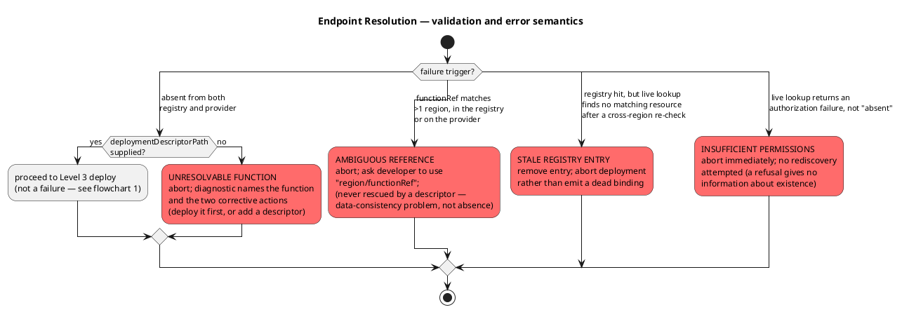
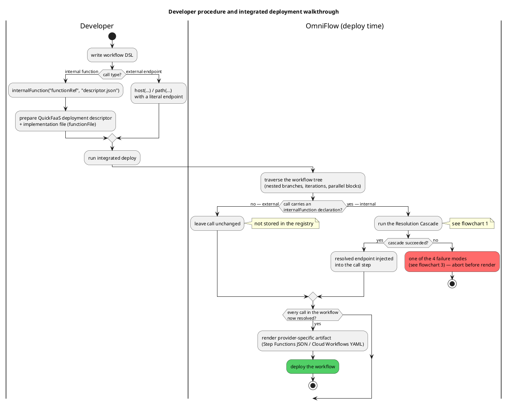

# Flowcharts de Decisão — Resolution Cascade, Registry e Developer Workflow

Fontes PlantUML para os 4 flowcharts recomendados para enriquecer a dissertação (ver
`thesis/chapter3.tex` e `thesis/chapter4.tex`). Ao contrário dos diagramas em
`aws-lambda-implementation-diagrams.md` (arquitectura, classes, sequência), estes são *activity
diagrams* focados na lógica de decisão em si — os ramos condicionais que hoje só existem em prosa.

Renderizar com a extensão PlantUML do VS Code, `plantuml.com/plantuml`, ou
`java -jar plantuml.jar resolution-flowcharts.md` (requer Graphviz).

---

## 1. Resolution Cascade

Ilustra `thesis/chapter3.tex` §3.1 "The Resolution Cascade" e
`thesis/chapter4.tex` §4.1 "Deployment-Time Endpoint Resolution" — o algoritmo de 3 níveis que
resolve um `internalFunction` call, parando no primeiro nível que tiver sucesso. Os ramos de
`ambiguous reference` e `insufficient permissions` são omitidos aqui por clareza e detalhados no
flowchart 3 (Validation & Error Semantics).

---

## 2. Registry Bootstrap, Creation and Drift

Ilustra `thesis/chapter4.tex` §4.1 "Creation, Bootstrap and Updates" — hoje uma lista de 4 bullets
que descreve, na prática, 3 decisões distintas disparadas por eventos diferentes.

---

## 3. Validation & Error Semantics

Ilustra `thesis/chapter4.tex` §4.1 "Validation and Error Semantics" — os 4 modos de falha,
cada um com condição de despoletamento e recuperabilidade distintas. Note que só
`UNRESOLVABLE FUNCTION` é recuperável fornecendo um `deploymentDescriptorPath`.

---

## 4. Developer Procedure — Integrated Deployment Walkthrough

Ilustra `thesis/chapter3.tex` §3.3 "Developer Procedure for Deploying a Workflow" e
§3.3.1 "Walkthrough of an Integrated Deployment". Usa swimlanes para separar o que o developer
prepara do que o OmniFlow resolve automaticamente em tempo de deploy — reforçando o argumento de
que a integração elimina passos manuais.

